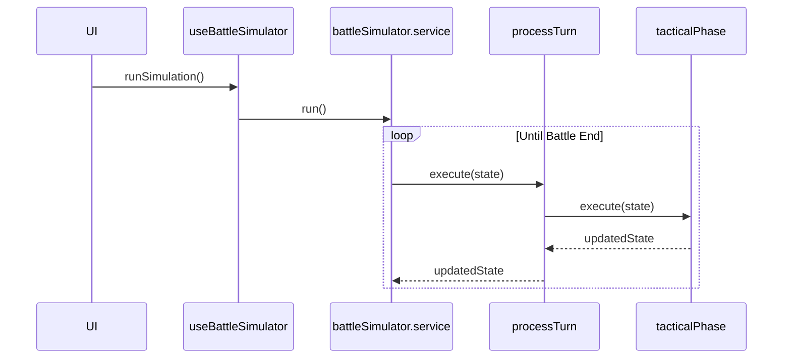
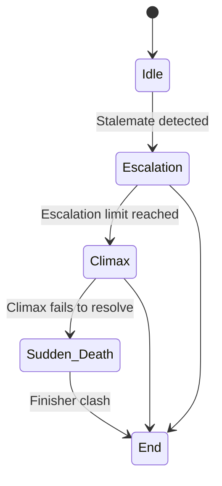

# Engine Deep Dive

This document provides a detailed view of the core battle engine's internal logic, data flows, and key implementation points. It is intended for developers working directly on the simulation and AI systems.

## System Diagrams & Visualizations

> **July 9th, 2025 Overhaul:**
> - Dramatic/finisher/last-resort move pools expanded for all characters.
> - Move selection logic guarantees dramatic moves in escalation/desperation/climax.
> - Penalty logic ensures dramatic moves are always available.
> - Narrative pools expanded to 8–10 unique lines per phase/character, with fallback to contextual lines.
> - Global anti-repetition and cadence logic: at least one dialogue/scene line every 2 turns in dramatic phases.
> - Forced endings always output unique, cinematic lines.

### Turn Processing Flow (Activity Diagram)

```mermaid
graph TD
    A[Start Turn] --> B(Update Real-Time Analytics);
    B --> C{End-Game Check?<br/>(KO / Decisive Win / Sudden Death Trigger)};
    C -- Yes --> D[End Battle];
    C -- No --> E{Escalation Check?<br/>(Stalemate / Repetition)};
    E -- Escalate --> F[Set Escalation/Risk Flags & Enter Escalation Phase];
    F --> G{Tactical Move Phase};
    E -- No --> G;
    G -- Sudden Death? --> H[Force Finisher Move!];
    G -- Escalation? --> I[Force Aggressive Move / Charge Power];
    G -- Desperation? --> J[Only Desperation/Finisher Moves Allowed];
    G -- Normal --> K[Execute AI-Chosen Tactical Move];
    H --> L{Resolve Move & Apply Damage};
    I --> L;
    J --> L;
    K --> L;
    L --> M{End-of-Turn Effects<br/>(Status Ticks / Effect Fusion)};
    M -- KO? --> D;
    M -- No --> N[Switch Active Player & Increment Turn];
    N --> A;

    style D fill:#c00,stroke:#333,stroke-width:2px,color:#fff;
```

### AI Decision Pipeline (Flowchart)

```mermaid
graph TD
    subgraph AI Decision
        A[Start AI Turn] --> B(Calculate Risk & Stalemate Counters);
        B --> C{Get Available Moves<br/>(Hard-filtered by Chi, Cooldowns, Uses & Collateral)};
        C -- No Moves Available --> D[Choose "Gather Power" / Skip Turn];
        C -- Moves Available --> E{Determine Tactical Priority<br/>(Attack, Defend, Pierce, Gamble...)};
        E --> F[Score Available Moves Based on Priority];
        F --> G[Adjust Scores by Character Identity];
        G --> H[Select Best Move];
        H --> I[End AI Turn: Execute Move];
        D --> I;
    end
```

### Turn Processing Call Stack (Sequence Diagram)



### Battle Arc State Machine



---

## Key Logic Locator

| Core Logic         | File & Function Location                                 |
|--------------------|---------------------------------------------------------|
| Damage Calculation | tacticalPhase.service.ts → applyMoveEffects()           |
| Stalemate Detection| arc.service.ts → checkForStalemate()                    |
| AI Move Scoring    | enhancedMoveScoring.ts → scoreMove()                    |
| Cooldown Ticks     | useBattleSimulator.controller.ts → endTurn() loop        |
| Engine-Level Forced Ending | escalationPhase.service.ts → handleEscalationPhase()   |
| Escalation/Desperation Phase Logic | escalationDetection.service.ts, escalationApplication.service.ts, desperationSystem.service.ts, escalationPhase.service.ts |
| Contract-Bound AI Move Selection | advancedAIController.ts → selectAIMove()   |
| Log Hygiene & Safety | mechanicLogUtils.ts → logTechnical(), logStory()      |
| Forced Ending/Narrative Guarantee | advancedAIController.ts, moveSelection.ts, desperationSystem.service.ts, finisherSystem.service.ts, escalationPhase.service.ts, processTurn.ts, mechanicLogUtils.ts, UnifiedBattleLog.tsx, battle-log-pipeline.test.ts |
| Anti-Repetition/Cadence Logic | antiRepetition.utility.ts, useNarrativeLine.ts, narrativePoolManager.ts |

> **Note:** This table is manually curated. If you refactor core logic, please update this table.

---

## Dynamically Used Modules

| File | Consuming System | Usage Mechanism |
|------|------------------|----------------|
| src/features/battle-simulation/services/battle-simulation/services/battle/desperationSystem.service.ts | BattleEngine | Dynamic registry lookup |
| src/features/battle-simulation/services/battle/arc.service.ts | BattleEngine | Dynamic registry lookup |
| src/features/battle-simulation/services/battle/criticalSystem.service.ts | BattleEngine | Dynamic registry lookup |
| src/features/battle-simulation/services/battle/desperationMoveCreation.service.ts | BattleEngine | Dynamic registry lookup |
| src/features/battle-simulation/services/battle/desperationMoves.ts | BattleEngine | Dynamic registry lookup |
| src/features/battle-simulation/services/battle/disruptionWindow.service.ts | BattleEngine | Dynamic registry lookup |
| src/features/battle-simulation/services/battle/effectFusion.service.ts | BattleEngine | Dynamic registry lookup |
| src/features/battle-simulation/services/battle/endPhase.service.ts | BattleEngine | Dynamic registry lookup |
| src/features/battle-simulation/services/battle/escalationPhase.service.ts | BattleEngine | Dynamic registry lookup |
| src/features/battle-simulation/services/battle/logIdGenerator.service.ts | BattleEngine | Dynamic registry lookup |
| src/features/battle-simulation/services/ai/advancedAIController.ts | AI Engine | Dynamic registry lookup |
| src/features/battle-simulation/services/ai/battleAwareness.ts | AI Engine | Dynamic registry lookup |
| src/features/battle-simulation/services/ai/behaviorTreeEngine.ts | AI Engine | Dynamic registry lookup |
| src/features/battle-simulation/services/ai/chooseAbility.ts | AI Engine | Dynamic registry lookup |
| src/features/battle-simulation/services/ai/narrative.ts | AI Engine | Dynamic registry lookup |
| src/features/battle-simulation/services/ai/tacticalAI.service.ts | AI Engine | Dynamic registry lookup |
| src/features/battle-simulation/services/ai/tacticalNarrative.ts | AI Engine | Dynamic registry lookup |
| src/features/battle-simulation/services/narrative/enhancedNarrativeSystem.ts | Narrative Engine | Dynamic registry lookup |
| src/features/battle-simulation/services/narrative/enhancedRepetitionManager.ts | Narrative Engine | Dynamic registry lookup |
| src/features/battle-simulation/services/narrative/enhancedStateManager.ts | Narrative Engine | Dynamic registry lookup |
| src/features/battle-simulation/services/narrative/enhancedStateNarratives.ts | Narrative Engine | Dynamic registry lookup |
| src/features/battle-simulation/services/narrative/enhancedTemplateGenerator.ts | Narrative Engine | Dynamic registry lookup |
| src/features/battle-simulation/services/narrative/index.ts | Narrative Engine | Dynamic registry lookup |
| src/features/battle-simulation/services/utils/mechanicLogUtils.ts | BattleEngine/utilities | Dynamic registry lookup |
| src/features/battle-simulation/services/utils/moveUtils.ts | BattleEngine/utilities | Dynamic registry lookup |
| src/features/battle-simulation/hooks/useNarrativeLine.ts | Narrative Engine/UI | Dynamic registry lookup or React hook |
| src/features/battle-simulation/services/narrative/utils/antiRepetition.utility.ts | Narrative Engine | Dynamic registry lookup |
| src/features/battle-simulation/services/narrative/utils/fallbackGenerator.utility.ts | Narrative Engine | Dynamic registry lookup |
| src/features/battle-simulation/services/narrative/utils/narrativeKey.utility.ts | Narrative Engine | Dynamic registry lookup |
| src/features/battle-simulation/services/narrative/utils/pronoun.utility.ts | Narrative Engine | Dynamic registry lookup |
| src/features/battle-simulation/services/battleSimulator.service.ts | BattleEngine | Dynamic registry lookup |
| src/features/battle-simulation/services/battle/reportGenerator.service.ts | BattleEngine | Dynamic registry lookup |
| src/features/battle-simulation/services/battle/finisherSystem.service.ts | BattleEngine | Dynamic registry lookup |
| src/features/battle-simulation/services/battle/genericMove.service.ts | BattleEngine | Dynamic registry lookup |
| src/features/battle-simulation/services/battle/moveRegistry.service.ts | BattleEngine | Dynamic registry lookup |
| src/features/battle-simulation/services/battle/moveRouter.service.ts | BattleEngine | Dynamic registry lookup |
| src/features/battle-simulation/services/battle/phases/desperationPhase.service.ts | BattleEngine | Dynamic registry lookup |

---

## July 9th, 2025 Milestone: Engine Complete, Narrative Upgrade Next

- The simulation loop is now chunked/yielding for browser-friendliness and real-time React updates.
- KO, max turns, and draw are strictly enforced with clear logging.
- All major events are logged, but output is still debug-style (not yet cinematic). No special narrative lines for finishers, charge releases, or KOs—just mechanical logs.
- The groundwork for a cinematic narrative layer is complete and ready for integration.

---

