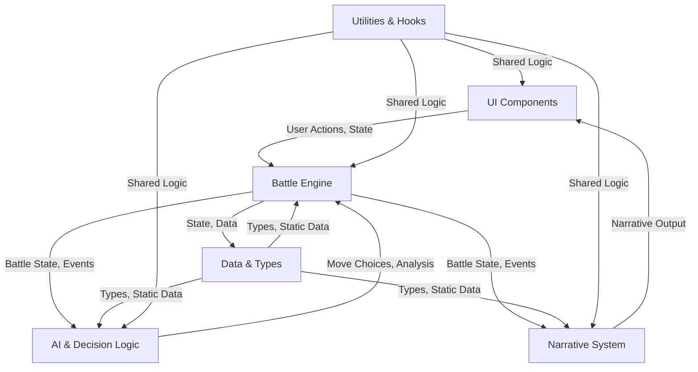
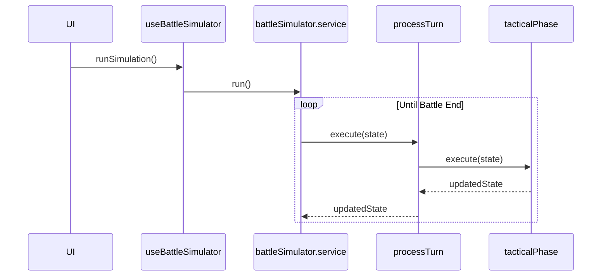
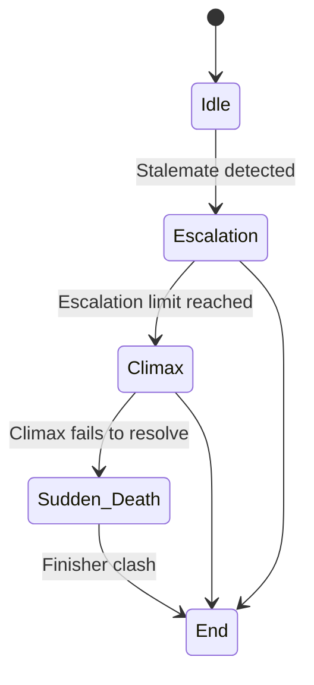
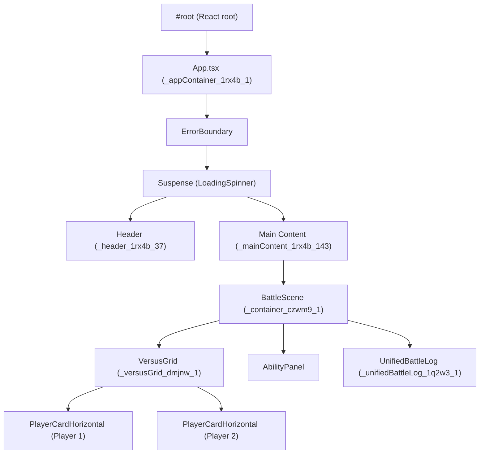

# System Architecture: Avatar Battle Arena

---

## Quick Links
- [Project README](../README.md)
- [System Architecture](./SYSTEM%20ARCHITECTURE.MD)
- [Narrative Context Matrix](./NARRATIVE_CONTEXT_MATRIX.md)
- [Changelog](../CHANGELOG.md)
- [Cursor Effectiveness Checklist](./cursor-effectiveness.md)
- [Main App Entry (App.tsx)](../src/App.tsx)
- [React Entry Point (main.tsx)](../src/main.tsx)
- [Docs Refresh Script Instructions](../scripts/README.md)

---

## Table of Contents
1. [Document Conventions](#document-conventions)
2. [System Health Dashboard](#system-health-dashboard)
3. [Architectural Tenets](#architectural-tenets)
4. [System Overview](#system-overview)
5. [System Diagrams & Visualizations](#system-diagrams--visualizations)
6. [UI DOM Architecture & Insights](#ui-dom-architecture--insights)
7. [Folder & File Overview](#folder--file-overview)
8. [Key Logic Locator](#key-logic-locator)
9. [Codebase Cookbooks: How to Extend the System](#codebase-cookbooks-how-to-extend-the-system)
10. [Core Policies](#core-policies)
11. [Documentation: Policy & Automation](#documentation-policy--automation)
12. [Testing & Deployment](#testing--deployment)
13. [Onboarding/Quick Start](#onboardingquick-start)
14. [Architecture Decision Records (ADRs)](#architecture-decision-records-adrs)
15. [FAQ & Common Pitfalls](#faq--common-pitfalls)
16. [Troubleshooting Playbook](#troubleshooting-playbook)
17. [Recent Changes](#recent-changes)
18. [Glossary of Terms](#glossary-of-terms)

---

## 1. Document Conventions
- **Headings:** All major sections use `##`, subsections use `###`.
- **Code/Commands:** Use markdown code blocks for all commands and code snippets.
- **Terminology:** See the [Glossary of Terms](#glossary-of-terms) for all domain-specific and architectural terms.

---

## 2. System Health Dashboard
| Metric            | Status                                                                                                   |
|-------------------|----------------------------------------------------------------------------------------------------------|
| **CI Pipeline**   |                                    |
| **Test Coverage** |                                   |
| **Code Quality**  |                                |
| **Bundle Size**   |                                    |
| **Dependencies**  |                                                             |
| **Type Coverage** |                       |

---

## 3. Architectural Tenets
1. **Correctness Over Performance:** The simulation must be narratively and mechanically correct first. Optimize only after correctness is proven.
2. **Prevent Stalemates At All Costs:** Every mechanic must ultimately drive the battle towards a conclusion. Infinite loops are the cardinal sin. This is enforced by an engine-level forced ending and phase-based escalation/desperation logic.
3. **The AI is a Character, Not a Bot:** AI decisions must be explainable through personality and context. Black-box logic is forbidden. All AI is now contract-bound and phase-driven, with strict move pool enforcement in escalation/desperation.
4. **Readability is a Feature:** Clear, SRP-compliant code is more maintainable than clever, dense code. If it requires a 10-minute explanation, refactor it.
5. **Documentation is Not an Afterthought:** This document is part of the definition of done. If it's not documented here, the feature isn't finished.
6. **Log Hygiene and Type Safety:** All logs are created via robust helpers (`logTechnical`, `logStory`), never null, and strictly typed. All escalation/desperation/AI/phase logic is type-safe and documented.

---

## 4. System Overview
The Avatar Battle Arena is a next-gen, turn-based battle simulator built on several key architectural pillars:
- **Strict TypeScript:** `any` is forbidden. All types are explicit for maximum safety and developer clarity. All escalation/desperation/AI/phase logic is now fully type-safe.
- **Service-Oriented Modularity (SRP):** The Single Responsibility Principle is applied at every level. Services are focused, testable, and independent.
- **Phase-Based Combat Loop:** The battle engine processes turns through a clean, predictable pipeline (e.g., `validateBattleEndPhase → escalationPhase → tacticalMovePhase`), making the combat flow easy to trace and extend. Escalation and desperation are now strictly phase-based, with no legacy flag checks.
- **Deadlock-Proof AI:** The AI features robust anti-stalemate logic, using risk tolerance, tactical counters, and desperation gambles to actively break deadlocks. AI move selection is now contract-bound and phase-driven, with strict move pool enforcement in escalation/desperation.
- **Consequence-Driven Escalation:** The battle arc state machine controls fight pacing. Stalemates trigger escalating consequences, culminating in a guaranteed, decisive Sudden Death phase. All escalation/desperation logic is robust, type-safe, and future-proof.
- **Plug-and-Play Content:** All finisher logic, moves, characters, and narrative are data-driven. Adding or changing content is a pure data/registry operation—no engine code changes are required.
- **Log Hygiene:** All logs are created via robust helpers, never null, and strictly typed. No log entry is ever null or malformed.

### High-Level Architecture Diagram


---

## 5. System Diagrams & Visualizations
### 5.1. Turn Processing Flow (Activity Diagram)
```mermaid
graph TD
    A[Start Turn] --> B(Update Real-Time Analytics);
    B --> C{End-Game Check?<br/>(KO / Decisive Win / Sudden Death Trigger)};
    C -- Yes --> D[End Battle];
    C -- No --> E{Escalation Check?<br/>(Stalemate / Repetition)};
    E -- Escalate --> F[Set Escalation/Risk Flags & Enter Escalation Phase];
    F --> G{Tactical Move Phase};
    E -- No --> G;
    G -- Sudden Death? --> H[Force Finisher Move!];
    G -- Escalation? --> I[Force Aggressive Move / Charge Power];
    G -- Desperation? --> J[Only Desperation/Finisher Moves Allowed];
    G -- Normal --> J[Execute AI-Chosen Tactical Move];
    H --> K{Resolve Move & Apply Damage};
    I --> K;
    J --> K;
    K --> L{End-of-Turn Effects<br/>(Status Ticks / Effect Fusion)};
    L -- KO? --> D;
    L -- No --> M[Switch Active Player & Increment Turn];
    M --> A;

    style D fill:#c00,stroke:#333,stroke-width:2px,color:#fff;
```

### 5.2. AI Decision Pipeline (Flowchart)
```mermaid
graph TD
    subgraph AI Decision
        A[Start AI Turn] --> B(Calculate Risk & Stalemate Counters);
        B --> C{Get Available Moves<br/>(Hard-filtered by Chi, Cooldowns, Uses & Collateral)};
        C -- No Moves Available --> D[Choose "Gather Power" / Skip Turn];
        C -- Moves Available --> E{Determine Tactical Priority<br/>(Attack, Defend, Pierce, Gamble...)};
        E --> F[Score Available Moves Based on Priority];
        F --> G[Adjust Scores by Character Identity];
        G --> H[Select Best Move];
        H --> I[End AI Turn: Execute Move];
        D --> I;
    end
```

### 5.3. Turn Processing Call Stack (Sequence Diagram)


### 5.4. Battle Arc State Machine


---

## 6. UI DOM Architecture & Insights
### 6.1. High-Level React/DOM Tree


### 6.2. CSS, Theming, and Accessibility
- **CSS Modules:** All UI components use locally-scoped CSS modules to prevent class name collisions.
- **CSS Variables:** Theming is controlled by CSS variables in `styles/variables.css` for colors, spacing, and fonts.
- **Layout:** Flexbox and grid are used for main layouts. All spacing uses explicit gap or padding values from variables.
- **Accessibility:** Root-level UI is wrapped in ErrorBoundary and Suspense with accessible fallbacks. All interactive elements have ARIA labels and are keyboard accessible.
- **Defensive UI:** Log rendering is guarded against undefined/null data, with warnings logged and placeholders shown for malformed data.

### 6.3. Key CSS Variables
| Variable                | Value                    | Usage Context                |
|-------------------------|-------------------------|------------------------------|
| --font-heading          | 'Poppins', sans-serif   | Headings, titles             |
| --font-mono             | 'JetBrains Mono', monospace | Code, technical log     |
| --background-color-dark | #0F172A                 | Main app background          |
| --text-color-primary    | #F8FAFC                 | Main text color              |
| --border-color-soft     | #475569                 | Soft borders, dividers       |
| --player-1-color        | #3B82F6                 | Player 1 highlights, borders |
| --player-2-color        | #EF4444                 | Player 2 highlights, borders |
| --highlight-color       | #F59E0B                 | Highlights, buttons, accents |
| --spacing-medium        | 16px                    | Medium gaps, padding         |

---

## 7. Folder & File Overview

| Path | Description | Category | Tags | Status | Last Modified | Owner | Used By | Calls |
|------|-------------|----------|------|--------|--------------|-------|---------|-------|
| _Placeholder_ | _This table will be auto-generated by the docs refresh script._ | | | | | |

> **Note:** All escalation/desperation/AI/phase files are now strictly phase-based, type-safe, and robust. See ALL_FILES_INDEX.md for the full, always-up-to-date file listing.

---

## 8. Key Logic Locator
This table maps core gameplay logic to its exact location.

| Core Logic         | File & Function Location                                 |
|--------------------|---------------------------------------------------------|
| Damage Calculation | tacticalPhase.service.ts → applyMoveEffects()           |
| Stalemate Detection| arc.service.ts → checkForStalemate()                    |
| AI Move Scoring    | enhancedMoveScoring.ts → scoreMove()                    |
| Cooldown Ticks     | useBattleSimulator.controller.ts → endTurn() loop        |
| Engine-Level Forced Ending | escalationPhase.service.ts → handleEscalationPhase()   |
| Escalation/Desperation Phase Logic | escalationDetection.service.ts, escalationApplication.service.ts, desperationSystem.service.ts, escalationPhase.service.ts |
| Contract-Bound AI Move Selection | advancedAIController.ts → selectAIMove()   |
| Log Hygiene & Safety | mechanicLogUtils.ts → logTechnical(), logStory()      |

> **Note:** This table is manually curated. If you refactor core logic, please update this table.

---

## 8.1. Dynamically Used Modules

| File | Consuming System | Usage Mechanism |
|------|------------------|----------------|
| src/features/battle-simulation/services/battle-simulation/services/battle/desperationSystem.service.ts | BattleEngine | Dynamic registry lookup |
| src/features/battle-simulation/services/battle/arc.service.ts | BattleEngine | Dynamic registry lookup |
| src/features/battle-simulation/services/battle/criticalSystem.service.ts | BattleEngine | Dynamic registry lookup |
| src/features/battle-simulation/services/battle/desperationMoveCreation.service.ts | BattleEngine | Dynamic registry lookup |
| src/features/battle-simulation/services/battle/desperationMoves.ts | BattleEngine | Dynamic registry lookup |
| src/features/battle-simulation/services/battle/disruptionWindow.service.ts | BattleEngine | Dynamic registry lookup |
| src/features/battle-simulation/services/battle/effectFusion.service.ts | BattleEngine | Dynamic registry lookup |
| src/features/battle-simulation/services/battle/endPhase.service.ts | BattleEngine | Dynamic registry lookup |
| src/features/battle-simulation/services/battle/escalationPhase.service.ts | BattleEngine | Dynamic registry lookup |
| src/features/battle-simulation/services/battle/logIdGenerator.service.ts | BattleEngine | Dynamic registry lookup |
| src/features/battle-simulation/services/ai/advancedAIController.ts | AI Engine | Dynamic registry lookup |
| src/features/battle-simulation/services/ai/battleAwareness.ts | AI Engine | Dynamic registry lookup |
| src/features/battle-simulation/services/ai/behaviorTreeEngine.ts | AI Engine | Dynamic registry lookup |
| src/features/battle-simulation/services/ai/chooseAbility.ts | AI Engine | Dynamic registry lookup |
| src/features/battle-simulation/services/ai/narrative.ts | AI Engine | Dynamic registry lookup |
| src/features/battle-simulation/services/ai/tacticalAI.service.ts | AI Engine | Dynamic registry lookup |
| src/features/battle-simulation/services/ai/tacticalNarrative.ts | AI Engine | Dynamic registry lookup |
| src/features/battle-simulation/services/narrative/enhancedNarrativeSystem.ts | Narrative Engine | Dynamic registry lookup |
| src/features/battle-simulation/services/narrative/enhancedRepetitionManager.ts | Narrative Engine | Dynamic registry lookup |
| src/features/battle-simulation/services/narrative/enhancedStateManager.ts | Narrative Engine | Dynamic registry lookup |
| src/features/battle-simulation/services/narrative/enhancedStateNarratives.ts | Narrative Engine | Dynamic registry lookup |
| src/features/battle-simulation/services/narrative/enhancedTemplateGenerator.ts | Narrative Engine | Dynamic registry lookup |
| src/features/battle-simulation/services/narrative/index.ts | Narrative Engine | Dynamic registry lookup |
| src/features/battle-simulation/services/utils/mechanicLogUtils.ts | BattleEngine/utilities | Dynamic registry lookup |
| src/features/battle-simulation/services/utils/moveUtils.ts | BattleEngine/utilities | Dynamic registry lookup |
| src/features/battle-simulation/hooks/useNarrativeLine.ts | Narrative Engine/UI | Dynamic registry lookup or React hook |
| src/features/battle-simulation/services/narrative/utils/antiRepetition.utility.ts | Narrative Engine | Dynamic registry lookup |
| src/features/battle-simulation/services/narrative/utils/fallbackGenerator.utility.ts | Narrative Engine | Dynamic registry lookup |
| src/features/battle-simulation/services/narrative/utils/narrativeKey.utility.ts | Narrative Engine | Dynamic registry lookup |
| src/features/battle-simulation/services/narrative/utils/pronoun.utility.ts | Narrative Engine | Dynamic registry lookup |
| src/features/battle-simulation/services/battleSimulator.service.ts | BattleEngine | Dynamic registry lookup |
| src/features/battle-simulation/services/battle/reportGenerator.service.ts | BattleEngine | Dynamic registry lookup |
| src/features/battle-simulation/services/battle/finisherSystem.service.ts | BattleEngine | Dynamic registry lookup |
| src/features/battle-simulation/services/battle/genericMove.service.ts | BattleEngine | Dynamic registry lookup |
| src/features/battle-simulation/services/battle/moveRegistry.service.ts | BattleEngine | Dynamic registry lookup |
| src/features/battle-simulation/services/battle/moveRouter.service.ts | BattleEngine | Dynamic registry lookup |
| src/features/battle-simulation/services/battle/phases/desperationPhase.service.ts | BattleEngine | Dynamic registry lookup |

---

## 9. Codebase Cookbooks: How to Extend the System
This section provides step-by-step instructions for adding new content. Following these guides ensures the system remains scalable and maintainable.

### How to Add a New Character (e.g., Zuko)
Adding a new character is a data-only operation. You do not need to modify any core engine files.

1. **Define Moves:**
    - Open `src/features/battle-simulation/data/moves.ts`.
    - Add new `Move` objects for the character's abilities (e.g., `zuko_fire_whip`). Ensure each `id` is unique.
2. **Define Character Data:**
    - Open `src/features/character-selection/data/characterData.ts`.
    - Add a new `Character` object to the `availableCharacters` array.
    - In the `abilities` array, list the unique `id`s of the moves you defined in step 1.
    - Set the `aiRulesetId` and `narrativeId` to a unique key (e.g., `'zuko'`).
3. **Create AI Rules:**
    - Create `src/features/battle-simulation/services/ai/rules/zukoRules.ts`.
    - Define and export an array of `AIRule` objects for Zuko's behavior.
4. **Register AI Rules:**
    - Open `src/features/battle-simulation/services/ai/rules/aiRuleRegistry.service.ts`.
    - Import `zukoAIRules` and register it in the constructor: `this.register('zuko', zukoAIRules);`
5. **Create Narrative Pool:**
    - Create `src/features/battle-simulation/services/narrative/pools/zuko.narrative.ts`.
    - Define and export a `CharacterNarrativePool` object with Zuko's dialogue.
6. **Register Narrative Pool:**
    - Open `src/features/battle-simulation/services/narrative/pools/narrativePoolRegistry.service.ts`.
    - Import `zukoNarrativePool` and register it: `this.register('zuko', zukoNarrativePool);`
7. **Add Assets:**
    - Add character images (e.g., `zuko.jpg`) to the `/public/assets/` directory.

### How to Add a New Location
1. **Add Location Data:**
    - Open `src/features/location-selection/data/locationData.ts`.
    - Add a new `Location` object to the `availableLocations` array.
2. **Add Asset:**
    - Add the location image to `/public/assets/`.

### How to Add a New Move
1. **Define the Move:**
    - Open `src/features/battle-simulation/data/moves.ts`.
    - Add a new `Move` object to the `ALL_MOVES` array.
2. **Assign to Character(s):**
    - Open `src/features/character-selection/data/characterData.ts`.
    - Add the new move's `id` to the `abilities` array of any character who should use it.

---

## 10. Core Policies
### 10.1. Plug-and-Play Compliance Policy (MANDATORY)
- All new features, content, and mechanics must be implemented in a strictly plug-and-play fashion.
- No hard-coded references to specific entities (characters, moves, etc.) are allowed in core logic.
- All extensible entities must be registered via explicit registries and referenced by ID.
- Adding new content must never require changes to core engine, AI, or narrative code.
- Any PR or commit that violates this policy must be rejected or refactored before merge.

### 10.2. Logging Architecture Policy
- All battle log entries are strictly separated:
    - `type: 'NARRATIVE'` — Player-facing story lines, created via the `logStory` utility.
    - `type: 'INFO'` — Technical/developer logs, created via the `logTechnical` utility.
- All engine sub-phases must return log entries to be appended only in `processTurn`.
- UI components must filter logs by type.

### 10.3. Test/Mock Data Policy
- All test data should be isolated and clearly marked. Mock data should accurately reflect the shape of real data types.

### 10.4. Security, Privacy, and Dependency Management
- Regularly audit dependencies for vulnerabilities.
- No sensitive data should ever be stored in the codebase or logs.
- Follow a clear versioning and change management process for all updates.

---

## 11. Documentation: Policy & Automation

### 11.1. Documentation Update Policy (Critical)
> **Best Practice & Policy:** Whenever a file's implementation, responsibility, or integration changes (including refactors, logging, or SRP updates), the corresponding file description, tags, and criticality in this document MUST be updated in the same batch. This ensures the documentation always reflects the true state of the codebase and prevents architectural drift.

### 11.2. Automation & Self-Updating Architecture
- **Structured Comments:** Critical files should contain structured comments:
```typescript
// @docs
// @description: The heart of the battle engine...
// @criticality: 🩸 High Risk
// @owner: AustroMelee
// @tags: core-logic, turn
```
- **Refresh Script:** A script (`npm run docs:refresh`) scans the codebase for `@docs` tags and automatically regenerates tables like the Folder & File Overview.
- **Code-Level Cross-Referencing:** The script also parses imports/exports to generate "Used By" and "Calls" lists, providing a live map of dependencies.
- **Result:** Zero drift between code and documentation and frictionless, accurate updates.

### 11.3. Legendary File Index Automation (ALL_FILES_INDEX.md)
- **Canonical File Map:** `docs/ALL_FILES_INDEX.md` is the single source of truth for all files in the codebase. It is always up-to-date, generated by automation, and must never be hand-edited.
- **Automation Script:** The file is generated by `scripts/auto-crossref.cjs` (run via `node scripts/auto-crossref.cjs` or as part of `npm run docs:refresh`).
- **Columns:**
  - **Path:** Relative to repo root.
  - **Description:** Pulled from `@fileoverview`, `@description`, or top-level comments. If missing, inferred from filename or left blank.
  - **Category:** From `@category` or inferred from directory (e.g., `/ai/` → "AI Engine").
  - **Tags:** From `@tags` or inferred from directory (e.g., `/narrative/` → "narrative").
  - **Status:**
    - 🟢 = Healthy (no TODO/FIXME, not stale)
    - 🟡 = TODO/FIXME present in file
    - 🟠 = Stale (not modified in >6 months)
    - 🔴 = Error/Outdated (future: CI integration)
  - **Last Modified:** Short commit hash, hyperlinked to the commit on GitHub for instant traceability.
  - **Owner:** From `@owner` tag if present, else last commit author.
- **Orphaned/Dead Code Detection:**
  - The script analyzes the import graph to flag files not imported anywhere (except entry points). These are listed in a dedicated "Potential Dead Code / Unused Files" section, but also appear in the main table.
- **Category & Tag Inference:**
  - If no `@category` or `@tags` are present, the script infers them from the file's directory structure.
- **File Counts:**
  - Each category section displays the number of files it contains.
- **Traceability:**
  - Every file row is traceable to its last change and owner. The top of the file links to the latest commit diff.
- **CI/Pre-commit Enforcement:**
  - The index must be updated in every commit that adds, removes, or modifies files. This is enforced by pre-commit/CI hooks. If the index is not updated, the commit/PR fails unless a `--skip-index` flag is set (with justification).
- **Source of Truth:**
  - The index is used for onboarding, audits, maintenance, and as a reference for all contributors and automation.
- **Extensibility:**
  - The script is designed to be extended for future features: CI/lint status badges, stale file warnings, search/filter UI, and more.

> **Reference:** For the full, always-up-to-date file listing, see [ALL_FILES_INDEX.md](./ALL_FILES_INDEX.md). For script details, see [scripts/auto-crossref.cjs](../scripts/auto-crossref.cjs).

### 11.4. Escalation/Desperation/AI/Phase Logic:
- **All such logic must be documented, strictly phase-based, and type-safe.** Any changes must be reflected in this document and in ALL_FILES_INDEX.md.

---

## 12. Testing & Deployment
*(This section is a placeholder for detailed strategies)*
- **12.1. Testing Strategy:** Includes unit, integration, and end-to-end tests.
- **12.2. CI/CD and Deployment:** Automated pipeline for testing, building, and deploying.

---

## 13. Onboarding/Quick Start
*(This section is a placeholder for new developer instructions)*

---

## 14. Architecture Decision Records (ADRs)
*(This section is a placeholder for linking to ADR files)*

---

## 15. FAQ & Common Pitfalls
*(This section is a placeholder for frequently asked questions)*

---

## 16. Troubleshooting Playbook
*(This section is a placeholder for debugging common issues)*

---

## 17. Recent Changes
### Phase 4: Escalation/Desperation/AI/Phase Logic Refactor (July 2025)
- All escalation and desperation mechanics are now strictly phase-based, with no legacy flag checks.
- AI move selection is contract-bound and phase-driven, with strict move pool enforcement in escalation/desperation.
- All log creation and handling is robust, type-safe, and never null.
- All escalation/desperation/AI/phase files are now fully type-safe and future-proof.
- Batch cleanup of all type/lint errors and unused variables/imports.
- Node.js scripts and documentation automation are robust and error-free.

### Phase 3: Plug-and-Play Refactor Completion (July 2025)
- All moves, AI rules, and narrative pools are now loaded via registries.
- Adding new content is now a pure data/registry operation, fully decoupling the engine from content.

### Phase 2.2: AAA Narrative Logging & SRP Finalization (July 2025)
- All logs are now created via `logStory` or `logTechnical` utilities.
- `logStory` now centralizes all narrative log hygiene: anti-repetition, null filtering, capitalization, and generic fallbacks.
- Engine-level forced ending: A `forcedEnding` flag is set if both fighters reach maximum escalation, guaranteeing no infinite loops.
- `.cursorcontext` compliance: Pre-commit and CI hooks enforce type, lint, and doc sync.

### Phase 2.1: Critical Stability Update - Log Separation (July 2025)
- Log Separation Enforced: Battle log entries are now strictly separated into NARRATIVE and INFO types.
- Engine Refactor: All services now return log entries to be appended only in `processTurn`, enforcing a pure, one-way data flow.

---

## 18. Glossary of Terms
*(This section is a placeholder for key terminology)*
- **SRP:** Single Responsibility Principle.
- **ADR:** Architecture Decision Record.
- **Registry:** A central service that loads and provides access to data-driven content (e.g., moves, AI rules).

---

## Onboarding: Unused/Legacy File Policy

- All orphaned/unused files are listed in [UNUSED_FILES_REPORT.md](../UNUSED_FILES_REPORT.md), auto-generated by CI.
- Every flagged file must have a rationale or legacy tag in its header.
- Do not use or resurrect files flagged as @legacy or listed in the report without consulting the project architect.
- See the decision log and changelog links in the report for context.
- Before merging, confirm the checklist:
  - [ ] Not imported anywhere (static/dynamic analysis)
  - [ ] No runtime references or dynamic loading
  - [ ] Superseded file is live and covered by tests
  - [ ] Changelog/GitHub issue updated
  - [ ] Team notified