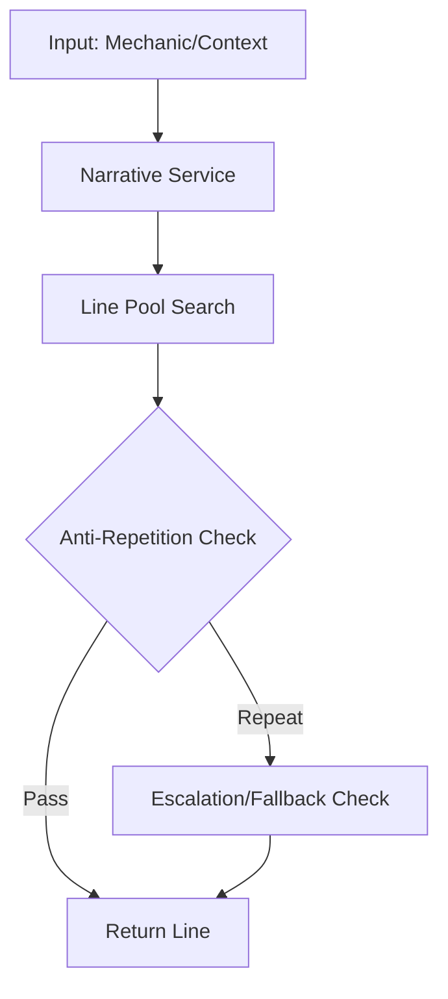

# System Architecture: Avatar Battle Arena

_Last Updated: 2025-07-07_

---

## Document Conventions
- **Headings:** All major sections use `##`, subsections use `###`.
- **Code/Commands:** Use markdown code blocks for all commands and code snippets.
- **Updates:** This document is updated with every major architectural or process change. See the Recent Changes section for a summary.
- **Terminology:** See the Glossary at the end for all domain-specific and architectural terms.

---

## Table of Contents
1. [System Health Dashboard](#system-health-dashboard)
2. [Architectural Tenets](#architectural-tenets)
3. [System Overview](#system-overview)
4. [System Diagrams & Visualizations](#system-diagrams--visualizations)
5. [Narrative Context Matrix: Azula & Aang](#narrative-context-matrix-azula--aang)
6. [How to Keep This Doc Legendary](#how-to-keep-this-doc-legendary)
7. [Folder & File Overview](#folder--file-overview)
8. [Feature Inventory](#feature-inventory)
9. [Codebase Cookbooks](#codebase-cookbooks)
10. [Onboarding/Quick Start](#onboardingquick-start)
11. [Best Practices & Architectural Patterns](#best-practices--architectural-patterns)
12. [Architecture Decision Records (ADRs)](#architecture-decision-records-adrs)
13. [FAQ & Common Pitfalls](#faq--common-pitfalls)
14. [Core Policies](#core-policies)
    - 14.1. Test/Mock Data Policy
    - 14.2. Error Handling and Logging Policy
    - 14.3. Dependency Management and Upgrades
    - 14.4. Security and Privacy
    - 14.5. Change Management/Versioning
15. [Testing & Deployment](#testing--deployment)
    - 15.1. Testing Strategy
    - 15.2. CI/CD and Deployment
16. [Glossary of Terms](#glossary-of-terms)
17. [Recent Changes](#recent-changes)
18. [🚨 How to Prevent Large-Scale Integration Errors](#how-to-prevent-large-scale-integration-errors)

---

# System Health Dashboard
| Metric            | Status                                                                                                   |
|-------------------|----------------------------------------------------------------------------------------------------------|
| **CI Pipeline**   | [](https://github.com/user/repo/actions) |
| **Test Coverage** | [](https://codecov.io/gh/user/repo) |
| **Code Quality**  | [](https://www.codefactor.io)      |
| **Bundle Size**   |                                       |
| **Dependencies**  |                                                               |
| **Type Coverage** |                          |

---

# Architectural Tenets
1.  **Correctness Over Performance:** The simulation must be narratively and mechanically correct first. Optimize only after correctness is proven.
2.  **Prevent Stalemates At All Costs:** Every mechanic must ultimately drive the battle towards a conclusion. Infinite loops are the cardinal sin.
3.  **The AI is a Character, Not a Bot:** AI decisions must be explainable through personality and context. Black-box logic is forbidden.
4.  **Readability is a Feature:** Clear, SRP-compliant code is more maintainable than clever, dense code. If it requires a 10-minute explanation, refactor it.
5.  **Documentation is Not an Afterthought:** This document is part of the definition of done. If it's not documented here, the feature isn't finished.

---

## System Overview
The Avatar Battle Arena is a next-gen, turn-based battle simulator. Its architectural pillars are:
Strict TypeScript: No any. All types are enforced for maximum safety and developer clarity.
Service-Oriented Modularity (SRP): The Single Responsibility Principle is applied at every level. Services are focused and testable.
Phase-Based Combat Loop: The battle engine processes turns through a clean, predictable pipeline (validateBattleEndPhase → escalationPhase → tacticalMovePhase → endOfTurnEffectsPhase), making the combat flow easy to trace and extend.
Deadlock-Proof AI: The AI is not just data-driven but features robust anti-stalemate logic. It uses risk tolerance, tactical counters, and desperation gambles to actively break deadlocks.
Consequence-Driven Escalation: The battle arc state machine controls fight pacing through a "Point of No Return" system. Stalemates trigger escalating consequences, culminating in a guaranteed, decisive Sudden Death phase if the battle drags on too long.

---

## System Diagrams & Visualizations
## 4.1. Turn Processing Flow (Activity Diagram)

This diagram illustrates the flow of a single turn. The pipeline is designed to be sequential and deadlock-proof, with multiple checks ensuring the battle progresses towards a decisive conclusion.

Generated mermaid
graph TD
    A[Start Turn] --> B(Update Real-Time Analytics);
    B --> C{End-Game Check?<br/>(KO / Decisive Win / Sudden Death Trigger)};
    C -- Yes --> D[End Battle];
    C -- No --> E{Escalation Check?<br/>(Stalemate / Repetition)};
    E -- Escalate --> F[Set Escalation/Risk Flags];
    F --> G{Tactical Move Phase};
    E -- No --> G;
    G -- Sudden Death? --> H[Force Finisher Move!];
    G -- Escalation? --> I[Force Aggressive Move / Charge Power];
    G -- Normal --> J[Execute AI-Chosen Tactical Move];
    H --> K{Resolve Move & Apply Damage};
    I --> K;
    J --> K;
    K --> L{End-of-Turn Effects<br/>(Status Ticks / Effect Fusion)};
    L -- KO? --> D;
    L -- No --> M[Switch Active Player & Increment Turn];
    M --> A;

    style D fill:#c00,stroke:#333,stroke-width:2px,color:#fff;

## 4.2. AI Decision Pipeline (Flowchart)

This diagram shows how the AI selects a move. It's a multi-layered process that now strictly adheres to resource and cooldown constraints.

Generated mermaid
graph TD
    subgraph AI Decision
        A[Start AI Turn] --> B(Calculate Risk & Stalemate Counters);
        B --> C{Get Available Moves<br/>(Hard-filtered by Chi, Cooldowns, Uses & Collateral)};
        C -- No Moves Available --> D[Choose "Gather Power" / Skip Turn];
        C -- Moves Available --> E{Determine Tactical Priority<br/>(Attack, Defend, Pierce, Gamble...)};
        E --> F[Score Available Moves Based on Priority];
        F --> G[Adjust Scores by Character Identity];
        G --> H[Select Best Move];
        H --> I[End AI Turn: Execute Move];
        D --> I;
    end
IGNORE_WHEN_COPYING_START
content_copy
download
Use code with caution.
Mermaid
IGNORE_WHEN_COPYING_END

## 4.3. Turn Processing Call Stack (Sequence Diagram)
This sequence diagram shows the precise order of function calls during a single processTurn execution, from the UI trigger down to the core services.

Generated mermaid
sequenceDiagram
    participant UI
    participant useBattleSimulator
    participant battleSimulator.service
    participant processTurn
    participant tacticalPhase

    UI->>useBattleSimulator: runSimulation()
    useBattleSimulator->>battleSimulator.service: run()
    loop Until Battle End
        battleSimulator.service->>processTurn: execute(state)
        processTurn->>tacticalPhase: execute(state)
        tacticalPhase-->>processTurn: updatedState
        processTurn-->>battleSimulator.service: updatedState
    end

## 4.4. Battle Arc State Machine
This state diagram visualizes the battle's progression through its major narrative phases, from an Idle start to the climactic Sudden_Death.

Generated mermaid
stateDiagram-v2
    [*] --> Idle
    Idle --> Escalation: Stalemate detected
    Escalation --> Climax: Escalation limit reached
    Climax --> Sudden_Death: Climax fails to resolve
    Sudden_Death --> End: Finisher clash
    Escalation --> End
    Climax --> End

## Narrative Context Matrix: Azula & Aang

> **The full Narrative Context Matrix has been moved to [`docs/NARRATIVE_CONTEXT_MATRIX.md`](./NARRATIVE_CONTEXT_MATRIX.md) for clarity and maintainability.**

---

# How to Keep This Doc Legendary
To ensure this document never decays and always reflects the true state of the codebase, we recommend a partially automated approach:

## Self-Updating Architecture
- At the top of each critical file, add structured comments like:

```typescript
// @docs
// @description: The heart of the battle engine. Executes the turn-based pipeline...
// @criticality: 🩸 High Risk
// @owner: AustroMelee
```

- Create a script (e.g., `npm run docs:refresh`) that:
  - Scans the `src/` directory for files with the `@docs` tag.
  - Parses these comments.
  - Automatically regenerates the entire Markdown table for the Folder & File Overview section.
  - Optionally, parses all headings in this file to regenerate the Table of Contents.
  - Optionally, runs a link-checker to report any broken URLs or file links.

**Result:**
- Zero drift between code and documentation.
- Frictionless updates: change a file's description/owner in the code, not the doc.
- Guaranteed accuracy: the doc is a provably accurate reflection of the codebase.

---

## Folder & File Overview
This section provides an exhaustive, file-by-file breakdown of the project, detailing the purpose, dependencies, and criticality of each component.

| Path | Description | Criticality & Dependencies | Owner / Expert |
|------|-------------|---------------------------|----------------|
| [index.html](https://github.com/user/repo/blob/main/index.html) | The main HTML entry point for the Vite application. Loads Google Fonts and the main script. | ⚙️ Configuration | Owner: AustroMelee |
| [package.json](https://github.com/user/repo/blob/main/package.json) | Defines project metadata, scripts, and dependencies. | ⚙️ Configuration | Owner: AustroMelee |
| [vite.config.ts](https://github.com/user/repo/blob/main/vite.config.ts) | Configuration for the Vite build tool, including the @ path alias. | ⚙️ Configuration | Owner: AustroMelee |
| [tsconfig.json](https://github.com/user/repo/blob/main/tsconfig.json) | The main TypeScript configuration for the project, enforcing strict mode. | 💎 Foundational | Owner: AustroMelee |
| [src/features/battle/services/battle/processTurn.ts](https://github.com/user/repo/blob/main/src/features/battle/services/battle/processTurn.ts) | The heart of the battle engine. Executes the turn-based pipeline by calling each phase service in order. | 🩸 High Risk | Owner: AustroMelee |
| [src/features/battle/services/ai/enhancedMoveScoring.ts](https://github.com/user/repo/blob/main/src/features/battle/services/ai/enhancedMoveScoring.ts) | Primary scoring engine that evaluates moves based on tactical priority. | 🩸 High Risk | Owner: AustroMelee |
| [src/features/narrative/core/NarrativeCoordinator.ts](https://github.com/user/repo/blob/main/src/features/narrative/core/NarrativeCoordinator.ts) | Orchestrates all narrative services. | 🩸 Orchestration | Owner: AustroMelee |
| [src/features/battle-simulation/services/narrative/narrative.service.ts](https://github.com/user/repo/blob/main/src/features/battle-simulation/services/narrative/narrative.service.ts) | Modular narrative engine: orchestrates line selection, anti-repetition, and fallback logic. | 🩸 Narrative Core | Owner: AustroMelee |
| [src/features/battle-simulation/services/narrative/pools/](https://github.com/user/repo/blob/main/src/features/battle-simulation/services/narrative/pools/) | Narrative pools: 500+ unique lines for each character, organized by mechanic/context. | 🩸 Narrative Content | Owner: AustroMelee |

---

## Feature Inventory
4.1. Core Battle Mechanics (User-Facing)

Turn-Based Engine: Phased combat, sequential state mutation (processTurn.ts).

Damage & Crit System: Contextual crits with real damage multipliers.

Finisher & Desperation Moves: Health-gated power spikes.

Positional & Tactical System: Movement, charge-up moves, and vulnerability windows.

Status Effect System: Unified system for buffs/debuffs, now with Effect Fusion and Crisis mechanics.

Cooldown & Use Limits: Prevents ability spam via hard-gating.

Sudden Death Phase: An irreversible endgame phase triggered by prolonged stalemates, forcing a final, decisive exchange with ultimate moves.

4.2. AI & Deadlock Breaking System (Internal & User-Facing)

Identity-Driven AI (IDTB): Decisions influenced by core values and moral boundaries.

Stuck AI Detection: stuckMoveCounter tracks when the AI is cornered by its own risk aversion.

Forced Risk-Taking: When stuck, the AI's collateral tolerance overloads, forcing it to use powerful, risky moves.

Escalation Charge: In Escalation Mode, if no viable attacks are available, the AI will "Gather Power" (skip its turn to gain chi) rather than use a weak Basic Strike. This adds a strategic cost to being out of options.

Canon-Compliant Logic: The AI cannot attempt to use moves that are on cooldown or that it cannot afford. These are hard-filtered before the AI's decision process begins.

4.3. Narrative & Escalation System (User-Facing)

#### ✅ Narrative System: 100% Completion (Aang & Azula)

* **Avatar-Level Narrative Engine (2025-07):**
  - Modular, extensible narrative core (`narrative.service.ts`) orchestrates all line selection, anti-repetition, and fallback logic.
  - 500+ unique, hand-crafted narrative lines for Aang, Azula, and System/Narrator, organized in deep narrative pools (`pools/`).
  - Advanced anti-repetition utility ensures no line is repeated within a configurable window; escalation logic intensifies repeated events.
  - Emotional reactivity: narrative selection can be influenced by character emotional state and tactical context.
  - Robust type safety: all narrative types, pools, and service boundaries are strictly typed and validated.
  - Fallback generator ensures a high-quality line is always available, even if a pool is empty.
  - All narrative logic is fully documented and covered in `docs/NARRATIVE_CONTEXT_MATRIX.md`.
  - Integration: Core battle logic now calls the narrative service for all mechanic-triggered lines.
* Full mechanic/context coverage for all implemented combat systems.
* Engine-aligned: All lines are bound to real mechanic triggers (e.g., `Parry.hit`, `DesperationMove.victory`).
* Scalable structure: Each character has a state-driven NarrativeService with anti-repetition, fallback logic, and emotion modeling.
* Known exception: `Disrupt` is an [effect-only] mechanic and excluded from active move pools. It applies passive effects without a corresponding narrative moment, and only triggers fallback narrator lines in extreme edge cases.

Dynamic Escalation Timeline: A battle arc state machine that triggers forcedEscalation flags based on analytics.

Stalemate Prevention: The system now correctly logs "Yes" for this analytic if any deadlock-breaking mechanic (Escalation, Climax, Sudden Death) is triggered.

### Narrative Line Selection Flow



---

## Codebase Cookbooks

### How to Add a New Character
1.  **[ ] Data:** Add character data to [`src/features/character-selection/data/characterData.ts`](https://github.com/user/repo/blob/main/src/features/character-selection/data/characterData.ts).
2.  **[ ] Types:** Define character-specific moves in a new [`src/features/battle-simulation/types/zuko.moves.ts`](https://github.com/user/repo/blob/main/src/features/battle-simulation/types/zuko.moves.ts) file and update the canonical move list.
3.  **[ ] Identity:** Create a personality profile in [`src/features/battle-simulation/services/identity/profiles/`](https://github.com/user/repo/tree/main/src/features/battle-simulation/services/identity/profiles/).
4.  **[ ] UI:** Create portrait and card assets.
5.  **[ ] Test:** Write a test scenario in `battleSimulator.test.ts` to validate the new character's core moves.

### How to Debug an AI Deadlock
1.  **[ ] Enable Logs:** Set `LOG_LEVEL` to `DEBUG` in the [`TechnicalLog`](https://github.com/user/repo/blob/main/src/features/technical-log/components/TechnicalLog.tsx) component.
2.  **[ ] Replicate:** Run the battle scenario that caused the deadlock.
3.  **[ ] Analyze Logs:** In the Technical Log, find the turn where `stuckMoveCounter` increments.
4.  **[ ] Check Move Availability:** Examine the `getAvailableMoves` log output for that turn. Is the list unexpectedly empty?
5.  **[ ] Review Scoring:** Check the [`enhancedMoveScoring`](https://github.com/user/repo/blob/main/src/features/battle-simulation/services/ai/enhancedMoveScoring.ts) output. Are all scores zero or negative? This points to a flaw in the scoring logic for that specific battle state.

---

## Onboarding/Quick Start
**For new developers:**
- Clone the repo and run:
  ```sh
  npm install
  ```
- To start the app:
  ```sh
  npm run dev
  ```
  (if allowed by project rules)
- To run type checks:
  ```sh
  npx tsc --noEmit
  ```
- To lint:
  ```sh
  npm run lint
  ```
- To run tests:
  ```sh
  npm test
  ```
- Start by reading `SYSTEM ARCHITECTURE.MD` and the `README.md` for high-level context.
- For feature work, start in the relevant `src/features/` subfolder.

---

## Best Practices & Architectural Patterns
5.1. TypeScript & Code Style

(Unchanged)

5.2. Architecture & Dependencies
The Single Source of Truth for Move Availability

This is now a critical architectural principle.

The Problem: Previously, the AI could "decide" to use a move, and the game logic would later check if it was possible. This led to "gamey" behavior where the AI would attempt impossible actions.

The Solution: The getAvailableMoves service in moveUtils.ts is the single, definitive gatekeeper. It performs all hard checks (chi, cooldowns, uses, collateral damage). The AI's scoring and selection logic only ever operates on the list of moves returned by this service.

The Rule: AI logic must trust the pre-filtered move list. It should never perform its own checks for chi, cooldowns, etc. Its job is to make the best tactical choice from the options it knows are possible.

Move-Centric Logic & Strict Type Hygiene (2025-07-07):
  - All tactical and AI logic must operate directly on Move objects. Ability is reserved for legacy disruption logic only.
  - All property accesses on BattleCharacter must use base.<property> for static data.
  - All mock/test data must match canonical types exactly—no extra or legacy fields.
  - All move selection, scoring, and execution must be type-safe and strictly compliant with the unified type system.
  - Any new features or refactors must maintain Move-centric, type-safe, and SRP-compliant patterns.

Circular Dependencies

(The existing guidance on using lazy initialization via factory functions remains the gold standard and has been adhered to.)

5.3. Implementing New Features

(Unchanged)

---

## Architecture Decision Records (ADRs)
- Major architectural decisions are documented in ADRs (in a dedicated `docs/adr/` folder or as markdown files in `docs/`).
- Each ADR includes context, decision, alternatives considered, and consequences.
- ADRs are referenced in `SYSTEM ARCHITECTURE.MD` and/or `README.md` as appropriate.

---

## FAQ & Common Pitfalls

Q: Why is my AI skipping its turn during Escalation Mode?

A: This is the "Escalation Charge" mechanic. If the AI is forced to be aggressive but has no valid attack moves available (e.g., all are on cooldown or too expensive), it will skip its turn to "Gather Power" and recover chi. This is more narratively and mechanically sound than using a weak Basic Strike.

Q: My battle ended suddenly with a "Sudden Death" log. What happened?

A: The battle exceeded the turn limit or the number of allowed escalation cycles. To prevent an endless, unsatisfying fight, the system triggered an irreversible final phase where both characters were forced to use their most powerful finisher moves to guarantee a conclusion.

Q: A character was hit by BURN and DEFENSE_DOWN at the same time and was immediately stunned. Why?

A: This is the "Effect Fusion" or "Status Meltdown" mechanic. Certain combinations of debuffs can trigger a more powerful crisis effect, like a stun. This prevents characters from languishing under multiple debuffs and creates a dramatic turning point.

---

## Core Policies
## 13.1. Test/Mock Data Policy
All mock/test/example data files must match canonical types exactly—no extra or legacy fields. Example/mock files are used for type/lint validation and documentation, and must be updated with any type system changes. Any deviation from canonical types is considered a type error and must be fixed immediately.

## 13.2. Error Handling and Logging Policy
- All errors in UI components are surfaced via Error Boundaries and user-friendly messages.
- Service-level errors are logged to analytics and/or developer logs, with contextual error objects (including error codes and messages).
- Unexpected errors in services are surfaced to the UI or logs, never silently swallowed.
- Error object shapes should include a code, message, and (if relevant) a stack trace or context.

## 13.3. Dependency Management and Upgrades
- All dependencies must be reviewed for type safety, maintenance, and security before addition.
- Upgrades are performed regularly, with type/lint/test checks after each upgrade.
- New dependencies must be justified and should not duplicate existing functionality.

## 13.4. Security and Privacy
- All user input is sanitized before use.
- Secrets (API keys, etc.) are never committed to the repo and are managed via environment variables.
- If user data is handled, privacy best practices are followed (e.g., no PII in logs, GDPR compliance if relevant).

## 13.5. Change Management/Versioning
- All changes are proposed via Pull Requests (PRs) and require code review.
- Changelog entries are required for all user-facing or architectural changes.
- Versioning follows semantic versioning (major.minor.patch) if releases are published.
- Merges to main/master require passing CI and code review.

---

## Testing & Deployment
## 14.1. Testing Strategy
- **Frameworks:** Jest and React Testing Library are used for all unit and integration tests.
- **Critical path:** All exported functions/components, battle engine phases, and AI logic must have tests.
- **To run tests:**
  ```sh
  npm test
  # or
  npm run test
  ```
- **CI:** All tests must pass in CI before merge. Coverage must not decrease for critical modules.

## 14.2. CI/CD and Deployment
- **CI/CD tools:** GitHub Actions (or your chosen CI) runs type checks, lint, tests, and build on every PR.
- **Steps:**
  ```sh
  npx tsc --noEmit
  npm run lint
  npm test
  npm run build
  ```
- **Deployment:** (Describe your deployment process here, e.g., Vercel, Netlify, or custom server.)

---

## Glossary of Terms

### Battle Concepts
- **[BattleCharacter](https://github.com/user/repo/blob/main/src/features/battle-simulation/types/index.ts)**: The dynamic, in-battle representation of a character, with static data in `base`.
- **[Move](https://github.com/user/repo/blob/main/src/features/battle-simulation/types/move.types.ts)**: The canonical type for all tactical/AI logic, representing a battle action.
- **Ability**: Legacy type, now only used for disruption logic.
- **Escalation**: The process/mechanic that forces the battle to progress when a stalemate is detected. See [`escalationPhase.service.ts`](https://github.com/user/repo/blob/main/src/features/battle-simulation/services/battle/phases/escalationPhase.service.ts).
- **Tactical Phase**: The main action phase where the AI selects and executes a move. See [`tacticalPhase.service.ts`](https://github.com/user/repo/blob/main/src/features/battle-simulation/services/battle/phases/tacticalPhase.service.ts).

### Architecture
- **SRP**: Single Responsibility Principle—each file/module has one reason to change.
- **Type Hygiene**: The practice of ensuring all code and data strictly match canonical type definitions.
- **Mock Data**: Example/test data that must match canonical types exactly.
- **Error Boundary**: React component that catches and displays errors in the UI tree.
- **CI/CD**: Continuous Integration/Continuous Deployment—automated pipelines for testing and deploying code.
- **ADR**: Architecture Decision Record—a document capturing a major architectural decision and its rationale. See [docs/adr/2025-06-28-type-hygiene.md](docs/adr/2025-06-28-type-hygiene.md).

### Narrative
- **Narrative Pool**: A structured collection of narrative lines for a character, organized by mechanic and context, used by the narrative engine for dynamic selection.
- **Anti-Repetition**: A utility/service that prevents the same narrative line from being used repeatedly within a short window, ensuring variety and escalation.
- **Narrative Service**: The core orchestrator that selects, validates, and returns a context-aware narrative line for a given battle event, using pools, anti-repetition, and fallback logic.

Move-Centric Logic & Strict Type Hygiene (2025-07-07):
  - All tactical and AI logic must operate directly on Move objects. Ability is reserved for legacy disruption logic only.
  - All property accesses on BattleCharacter must use base.<property> for static data.
  - All mock/test data must match canonical types exactly—no extra or legacy fields.
  - All move selection, scoring, and execution must be type-safe and strictly compliant with the unified type system.
  - Any new features or refactors must maintain Move-centric, type-safe, and SRP-compliant patterns.

---

## Recent Changes
Canon Authenticity Pass: Refactored moveUtils to be the single source of truth for move availability, preventing the AI from attempting moves it cannot afford or that are on cooldown. Introduced the "Escalation Charge" mechanic.
Deadlock Breaker Pass: Implemented stuckMoveCounter and AI risk tolerance to force high-collateral moves during tactical deadlocks. Added "Sudden Death" phase as the ultimate stalemate breaker.
Status Effect Crisis Pass: Introduced effect fusion and "Burnout Crisis" mechanics. Refined status effect logging to reduce clutter.
SRP Refactoring: Refactored NarrativeCoordinator and processTurn into modular, SRP-compliant services and phases.
Initial Fix Pass: Added real-time analytics to the battle state for detecting and breaking stalemates.
Type Hygiene & Move-Centric Refactor (2025-07-07):
  - All tactical AI and move selection logic is now strictly Move-centric—no more conversion to Ability or use of obsolete types.
  - The moveToAbility utility is only used for legacy disruption logic and is not part of the tactical pipeline.
  - All property accesses on BattleCharacter (e.g., personality) are now strictly via base.<property>.
  - All move availability, scoring, and selection logic is now type-safe and consistent with the unified type system.
  - The codebase is now fully type- and lint-compliant for these modules, with all legacy/ambiguous code removed.
Avatar-Level Narrative System 10/10 Upgrade (2025-07-07):
  - Complete rewrite of the narrative system: modular core, deep narrative pools, anti-repetition, emotional hooks, and robust type safety.
  - 500+ new lines for Aang, Azula, and System/Narrator.
  - All narrative logic now fully documented and integrated with the battle engine.
  - See `docs/NARRATIVE_CONTEXT_MATRIX.md` for full context mapping.

## 🚨 How to Prevent Large-Scale Integration Errors

**Enforce Pre-Commit Hooks**
- Run `npx tsc --noEmit` and `npm run lint` as pre-commit and CI requirements. Block commits if either fails.

**Break Up Large Integrations**
- Refactor and merge in smaller, testable chunks instead of one sweeping PR.

**Use Type-First Development**
- Update types/interfaces before writing or merging logic or UI code.

**Automate Dead Code Cleanup**
- Auto-prefix unused variables with `_` or clean them in CI to prevent TS6133 and lint noise.

**Document Expectations**
- When upgrading core systems (like narrative), write developer changelogs and upgrade guides to set clear expectations for integration and testing.