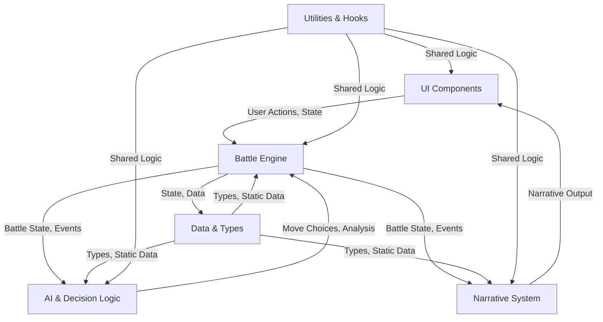
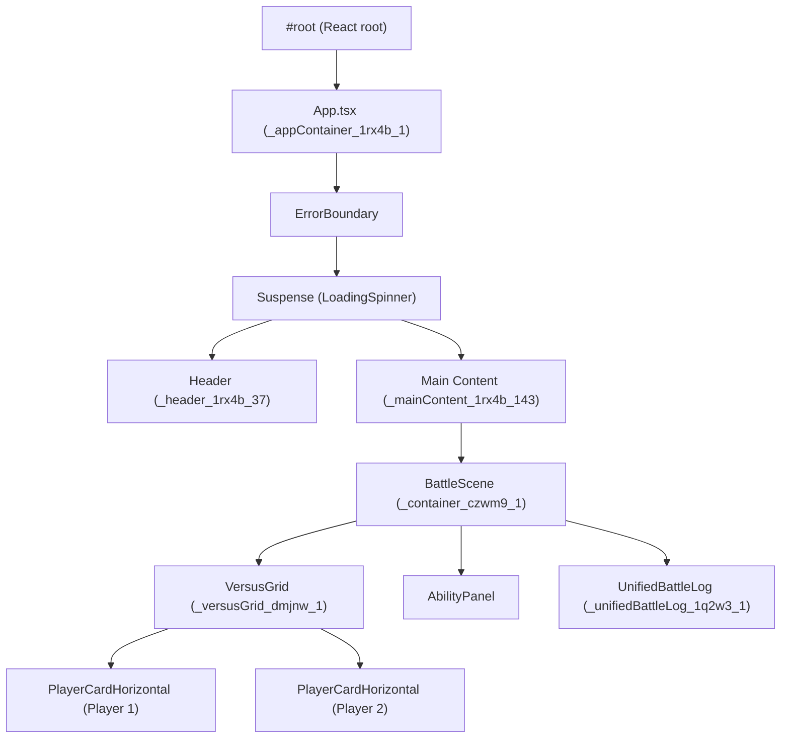

# System Architecture: Avatar Battle Arena

---

## Quick Links
- [Project README](../README.md)
- [System Architecture](./SYSTEM%20ARCHITECTURE.MD)
- [Narrative Context Matrix](./NARRATIVE_CONTEXT_MATRIX.md)
- [Changelog](../CHANGELOG.md)
- [Cursor Effectiveness Checklist](./cursor-effectiveness.md)
- [Main App Entry (App.tsx)](../src/App.tsx)
- [React Entry Point (main.tsx)](../src/main.tsx)
- [Docs Refresh Script Instructions](../scripts/README.md)

---

## Document Conventions
- **Headings:** All major sections use `##`, subsections use `###`.
- **Code/Commands:** Use markdown code blocks for all commands and code snippets.
- **Updates:** This document is updated with every major architectural or process change. See the Recent Changes section for a summary.
- **Terminology:** See the Glossary at the end for all domain-specific and architectural terms.

---

## Documentation Update Policy (Critical)

> **Best Practice & Policy:**
> Whenever a file's implementation, responsibility, or integration changes (including refactors, logging, or SRP updates), the corresponding file description, tags, and criticality in this document (Folder & File Overview, Feature Inventory, etc.) MUST be updated in the same batch. This ensures the documentation always reflects the true state of the codebase and prevents architectural drift.

---

## Table of Contents
1. [System Health Dashboard](#system-health-dashboard)
2. [Architectural Tenets](#architectural-tenets)
3. [System Overview](#system-overview)
4. [System Diagrams & Visualizations](#system-diagrams--visualizations)
5. [UI DOM Architecture & Insights](#ui-dom-architecture--insights)
6. [Narrative Context Matrix: Azula & Aang](#narrative-context-matrix-azula--aang)
7. [How to Keep This Doc Legendary](#how-to-keep-this-doc-legendary)
8. [Folder & File Overview](#folder--file-overview)
9. [Feature Inventory](#feature-inventory)
10. [Codebase Cookbooks](#codebase-cookbooks)
11. [Onboarding/Quick Start](#onboardingquick-start)
12. [Best Practices & Architectural Patterns](#best-practices--architectural-patterns)
13. [Architecture Decision Records (ADRs)](#architecture-decision-records-adrs)
14. [FAQ & Common Pitfalls](#faq--common-pitfalls)
15. [Core Policies](#core-policies)
    - 15.1. Test/Mock Data Policy
    - 15.2. Error Handling and Logging Policy
    - 15.3. Dependency Management and Upgrades
    - 15.4. Security and Privacy
    - 15.5. Change Management/Versioning
16. [Testing & Deployment](#testing--deployment)
    - 16.1. Testing Strategy
    - 16.2. CI/CD and Deployment
17. [Glossary of Terms](#glossary-of-terms)
18. [Recent Changes](#recent-changes)
19. [🚨 How to Prevent Large-Scale Integration Errors](#how-to-prevent-large-scale-integration-errors)
20. [Troubleshooting Playbook](#troubleshooting-playbook)

## Key Logic Locator

This table maps core gameplay and business logic to their exact file and function locations. Use it to find critical formulas and logic instantly. Click any link to jump directly to the file or function in the repository.

| Core Logic            | File & Function Location                                 |
|-----------------------|---------------------------------------------------------|
| Damage Calculation    | [tacticalPhase.service.ts → applyMoveEffects()](https://github.com/user/repo/blob/main/src/features/battle-simulation/services/battle/phases/tacticalPhase.service.ts#L)       |
| Stalemate Detection   | [arc.service.ts → checkForStalemate()](https://github.com/user/repo/blob/main/src/features/battle-simulation/services/battle/arc.service.ts#L)                |
| AI Move Scoring       | [enhancedMoveScoring.ts → scoreMove()](https://github.com/user/repo/blob/main/src/features/battle-simulation/services/ai/enhancedMoveScoring.ts#L)                |
| Cooldown Ticks        | [useBattleSimulator.controller.ts → endTurn() loop](https://github.com/user/repo/blob/main/src/features/battle-simulation/controllers/useBattleSimulator.controller.ts#L)   |
| **Gather Power Cooldown** | [tacticalPhase.service.ts → forced escalation fallback](https://github.com/user/repo/blob/main/src/features/battle-simulation/services/battle/phases/tacticalPhase.service.ts#L), [processTurn.ts → cooldown decrement](https://github.com/user/repo/blob/main/src/features/battle-simulation/services/battle/processTurn.ts#L) |

> **Note:** This table is manually curated. If you add or refactor core logic, please update this table accordingly. Interactive navigation is supported for all links.

---

## Roadmap: Code-Level Cross-Referencing & Tagging

To further eliminate ambiguity and accelerate development, the following enhancements are planned and partially implemented:

### 1. Code-Level Cross-Referencing
- **"Used By" Lists:** For each exported type/function, the documentation will auto-list all files/components/services that import or use it.
- **"Calls" Lists:** For each major function/service, the documentation will list all major functions/services it calls.
- **Example:**

  **BattleCharacter (type)**
  - Used by: PlayerCardHorizontal.tsx, CharacterStatus.tsx, processTurn.ts, ...

  **processTurn (function)**
  - Calls: tacticalPhase.service.ts, arc.service.ts, state.ts
  - Used by: battleSimulator.service.ts, useBattleSimulator.controller.ts

### 2. Tagging and Filtering
- **Tags:** Each file in the Folder & File Overview will have tags (e.g., `ai`, `ui`, `core-logic`, `cooldown`, `analytics`).
- **Filtering:** In web-rendered docs, you will be able to filter the table by tag. In Markdown, use Ctrl+F to search for tags.
- **Example:**

  | Path | Description | Criticality | Owner | Tags | Used By | Calls |
  Used By | Calls |---------|-------|------|
  | .../AbilityButton.tsx | ... | 🎨 UI | AustroMelee | ui, cooldown, player-input |
  | .../enhancedMoveScoring.ts | ... | 🧠 AI | AustroMelee | ai, core-logic, scoring |

> **Implementation:**
> - The docs-refresh script will be extended to parse imports/exports and generate these lists and tags automatically.
> - Contributors should continue to add/curate tags and cross-references as new features are added.

---

# System Health Dashboard
| Metric            | Status                                                                                                   |
|-------------------|----------------------------------------------------------------------------------------------------------|
| **CI Pipeline**   | [](https://github.com/user/repo/actions) |
| **Test Coverage** | [](https://codecov.io/gh/user/repo) |
| **Code Quality**  | [](https://www.codefactor.io)      |
| **Bundle Size**   |                                       |
| **Dependencies**  |                                                               |
| **Type Coverage** |                          |

---

# Architectural Tenets
1.  **Correctness Over Performance:** The simulation must be narratively and mechanically correct first. Optimize only after correctness is proven.
2.  **Prevent Stalemates At All Costs:** Every mechanic must ultimately drive the battle towards a conclusion. Infinite loops are the cardinal sin.
3.  **The AI is a Character, Not a Bot:** AI decisions must be explainable through personality and context. Black-box logic is forbidden.
4.  **Readability is a Feature:** Clear, SRP-compliant code is more maintainable than clever, dense code. If it requires a 10-minute explanation, refactor it.
5.  **Documentation is Not an Afterthought:** This document is part of the definition of done. If it's not documented here, the feature isn't finished.

---

## System Overview
The Avatar Battle Arena is a next-gen, turn-based battle simulator. Its architectural pillars are:
Strict TypeScript: No any. All types are enforced for maximum safety and developer clarity.
Service-Oriented Modularity (SRP): The Single Responsibility Principle is applied at every level. Services are focused and testable.
Phase-Based Combat Loop: The battle engine processes turns through a clean, predictable pipeline (validateBattleEndPhase → escalationPhase → tacticalMovePhase → endOfTurnEffectsPhase), making the combat flow easy to trace and extend.
Deadlock-Proof AI: The AI is not just data-driven but features robust anti-stalemate logic. It uses risk tolerance, tactical counters, and desperation gambles to actively break deadlocks.
Consequence-Driven Escalation: The battle arc state machine controls fight pacing through a "Point of No Return" system. Stalemates trigger escalating consequences, culminating in a guaranteed, decisive Sudden Death phase if the battle drags on too long.

---

## High-Level Architecture Diagram



This diagram shows the main domains and their relationships:
- **UI Components** interact with the Battle Engine and display Narrative output.
- **Battle Engine** is the core, orchestrating state, events, and interactions with AI and Narrative systems.
- **AI & Decision Logic** analyzes state and returns move choices.
- **Narrative System** generates story output based on battle events.
- **Data & Types** provide type safety and static data to all systems.
- **Utilities & Hooks** are shared across all domains for common logic.

---

## Features

### 🌀 Narrative System
- services/narrative/pools/aang.narrative.ts
- services/narrative/pools/azula.narrative.ts
- services/narrative/narrative.service.ts
- services/narrative/enhancedNarrativeSystem.ts
- services/narrative/contextualNarrativeMapper.ts
- services/narrative/templateNarrativeGenerator.ts
- services/narrative/enhancedTemplateGenerator.ts
- services/narrative/stateDrivenNarrativePool.ts
- services/narrative/utils/antiRepetition.utility.ts | Anti-repetition now uses a queue of recent lines per context, not just the last line. |
- services/narrative/core/NarrativeComposer.ts | Now supports multi-part narrative output (intention, action, reaction) for each event. |
- services/narrative/core/NarrativeCoordinator.ts | Orchestrates multi-part narrative output and ensures Story Log logs these as a sequence. |
- Narrative memory referencing: Narrative generation now dynamically references recent key events (dodge, critical hit, reversal, one-off moment) from each character's memory, making story output contextually rich and self-referential.

### ⚔️ Tactical Engine
- services/battle/phases/tacticalPhase.service.ts
- services/battle/tacticalMove.service.ts
- services/battle/processTurn.ts
- services/battle/state.ts
- services/battle/arc.service.ts
- **Gather Power Cooldown:** The Gather Power move now has a 1-turn cooldown. If used, it cannot be selected again on the next turn. This prevents infinite Gather Power loops and forces the AI to use other moves if available. All move cooldowns are decremented at the start of each turn in [processTurn.ts](https://github.com/user/repo/blob/main/src/features/battle-simulation/services/battle/processTurn.ts).

### 🧠 AI & Decision Logic
- services/ai/advancedAIController.ts
- services/ai/contextualMoveScoring.ts
- services/ai/enhancedMoveScoring.ts
- services/ai/moveSelection.ts
- services/ai/moveUtils.ts
- services/ai/attackMoveScoring.service.ts
- services/ai/defenseMoveScoring.service.ts
- services/ai/tacticalMemory.service.ts

### 🗂️ Data & Types
- types/index.ts
- types/move.types.ts
- types/cooldown.types.ts
- types/mechanic.types.ts
- types/behavioral.types.ts
- types/identity.types.ts
- data/arcTransitions.ts
- data/identities.ts
- ../character-selection/data/characterData.ts
- ../character-selection/data/traits.ts
- ../location-selection/data/locationData.ts

### 🎨 UI Components
- components/AbilityPanel/AbilityPanel.tsx
- components/AbilityButton/AbilityButton.tsx
- components/PlayerCardHorizontal/PlayerCardHorizontal.tsx
- components/UnifiedBattleLog/UnifiedBattleLog.tsx
- components/VersusGrid/VersusGrid.tsx
- components/NarrativeBubble/NarrativeBubble.tsx
- components/EnhancedBattleScene/EnhancedBattleScene.tsx
- components/EnhancedBattleLog/EnhancedBattleLog.tsx
- components/CharacterStatus/CharacterStatus.tsx
- components/BattleScene/BattleScene.tsx
- components/BattleNarrativeTurn/BattleNarrativeTurn.tsx
- ../character-selection/components/CharacterCard.tsx
- ../character-selection/components/CharacterSelection.tsx
- ../character-selection/components/CharacterPortrait.tsx
- ../location-selection/components/LocationSelection.tsx
- ../battle-log/components/BattleLog.tsx | Renders the Story Log. Now supports multi-part (call-and-response) narrative rendering and visually highlights one-off dramatic moments. |

### 🛠️ Utilities & Hooks
- hooks/useCooldownManager.hook.ts
- hooks/useNarrativeLine.ts
- controllers/useBattleSimulator.controller.ts

### 🏗️ App Entrypoints & Styles
- App.tsx
- main.tsx
- styles/global.css
- styles/variables.css

## System Diagrams & Visualizations
## 4.1. Turn Processing Flow (Activity Diagram)

This diagram illustrates the flow of a single turn. The pipeline is designed to be sequential and deadlock-proof, with multiple checks ensuring the battle progresses towards a decisive conclusion.

Generated mermaid
graph TD
    A[Start Turn] --> B(Update Real-Time Analytics);
    B --> C{End-Game Check?<br/>(KO / Decisive Win / Sudden Death Trigger)};
    C -- Yes --> D[End Battle];
    C -- No --> E{Escalation Check?<br/>(Stalemate / Repetition)};
    E -- Escalate --> F[Set Escalation/Risk Flags];
    F --> G{Tactical Move Phase};
    E -- No --> G;
    G -- Sudden Death? --> H[Force Finisher Move!];
    G -- Escalation? --> I[Force Aggressive Move / Charge Power];
    G -- Normal --> J[Execute AI-Chosen Tactical Move];
    H --> K{Resolve Move & Apply Damage};
    I --> K;
    J --> K;
    K --> L{End-of-Turn Effects<br/>(Status Ticks / Effect Fusion)};
    L -- KO? --> D;
    L -- No --> M[Switch Active Player & Increment Turn];
    M --> A;

    style D fill:#c00,stroke:#333,stroke-width:2px,color:#fff;

## 4.2. AI Decision Pipeline (Flowchart)

This diagram shows how the AI selects a move. It's a multi-layered process that now strictly adheres to resource and cooldown constraints.

Generated mermaid
graph TD
    subgraph AI Decision
        A[Start AI Turn] --> B(Calculate Risk & Stalemate Counters);
        B --> C{Get Available Moves<br/>(Hard-filtered by Chi, Cooldowns, Uses & Collateral)};
        C -- No Moves Available --> D[Choose "Gather Power" / Skip Turn];
        C -- Moves Available --> E{Determine Tactical Priority<br/>(Attack, Defend, Pierce, Gamble...)};
        E --> F[Score Available Moves Based on Priority];
        F --> G[Adjust Scores by Character Identity];
        G --> H[Select Best Move];
        H --> I[End AI Turn: Execute Move];
        D --> I;
    end
IGNORE_WHEN_COPYING_START
content_copy
download
Use code with caution.
Mermaid
IGNORE_WHEN_COPYING_END

## 4.3. Turn Processing Call Stack (Sequence Diagram)
This sequence diagram shows the precise order of function calls during a single processTurn execution, from the UI trigger down to the core services.

Generated mermaid
sequenceDiagram
    participant UI
    participant useBattleSimulator
    participant battleSimulator.service
    participant processTurn
    participant tacticalPhase

    UI->>useBattleSimulator: runSimulation()
    useBattleSimulator->>battleSimulator.service: run()
    loop Until Battle End
        battleSimulator.service->>processTurn: execute(state)
        processTurn->>tacticalPhase: execute(state)
        tacticalPhase-->>processTurn: updatedState
        processTurn-->>battleSimulator.service: updatedState
    end

## 4.4. Battle Arc State Machine
This state diagram visualizes the battle's progression through its major narrative phases, from an Idle start to the climactic Sudden_Death.

Generated mermaid
stateDiagram-v2
    [*] --> Idle
    Idle --> Escalation: Stalemate detected
    Escalation --> Climax: Escalation limit reached
    Climax --> Sudden_Death: Climax fails to resolve
    Sudden_Death --> End: Finisher clash
    Escalation --> End
    Climax --> End

## Narrative Context Matrix: Azula & Aang

> **The full Narrative Context Matrix has been moved to [`docs/NARRATIVE_CONTEXT_MATRIX.md`](./NARRATIVE_CONTEXT_MATRIX.md) for clarity and maintainability.**

---

# How to Keep This Doc Legendary
To ensure this document never decays and always reflects the true state of the codebase, we recommend a partially automated approach:

## Self-Updating Architecture
- At the top of each critical file, add structured comments like:

```typescript
// @docs
// @description: The heart of the battle engine. Executes the turn-based pipeline...
// @criticality: 🩸 High Risk
// @owner: AustroMelee
```

- Create a script (e.g., `npm run docs:refresh`) that:
  - Scans the `src/` directory for files with the `@docs` tag.
  - Parses these comments.
  - Automatically regenerates the entire Markdown table for the Folder & File Overview section.
  - Optionally, parses all headings in this file to regenerate the Table of Contents.
  - Optionally, runs a link-checker to report any broken URLs or file links.

**Result:**
- Zero drift between code and documentation.
- Frictionless updates: change a file's description/owner in the code, not the doc.
- Guaranteed accuracy: the doc is a provably accurate reflection of the codebase.

---

## Folder & File Overview (as of July 2025)

| Path | Description | Criticality & Dependencies | Owner / Expert | Tags |
|------|-------------|---------------------------|----------------|------|
| src/features/battle-simulation/services/battle/processTurn.ts | Main turn-processing logic. Sole source of battleLog mutation; appends log entries returned from all phases. Handles turn advancement, log deduplication, and end-of-battle epilogue/result summary. | ⚔️ Core Logic | AustroMelee | core-logic, turn, logging, SRP, epilogue |
| src/features/battle-simulation/services/battle/phases/tacticalPhase.service.ts | Tactical phase: applies move effects, resolves damage, and handles forced escalation. Returns log entries only via logStory/logTechnical; never mutates battleLog directly. Now uses dynamic narrative phrasing for no-move events. | ⚔️ Core Logic | AustroMelee | core-logic, battle, phase, logging, SRP, escalation, narrative |
| src/features/battle-simulation/services/utils/mechanicLogUtils.ts | Log creation utilities: logStory (narrative/player-facing) and logTechnical (technical/dev-only). Enforces valid turn/actor, prevents undefined logs, and is the only source of log entry creation. | 🛠️ Utility | AustroMelee | logging, SRP, type-safety |
| src/features/battle-simulation/services/narrative/narrative.service.ts | Narrative system: generates battle story output, including epilogue and flavor lines. | 🌀 Narrative | AustroMelee | narrative, core-logic, epilogue |
| src/features/battle-simulation/services/narrative/enhancedNarrativeSystem.ts | Enhanced narrative engine: supports multi-part narrative output, call-and-response, and dynamic context referencing. | 🌀 Narrative | AustroMelee | narrative, context, SRP |
| src/features/battle-simulation/services/ai/enhancedMoveScoring.ts | Enhanced AI move scoring logic. | 🧠 AI | AustroMelee | ai, core-logic, scoring |
| src/features/battle-simulation/services/ai/contextualMoveScoring.ts | Context-aware move scoring for AI. Penalizes attacks against evasive targets, rewards AoE/tracking/gather moves. | 🧠 AI | AustroMelee | ai, scoring, context, status-flags |
| src/features/battle-simulation/services/ai/advancedAIController.ts | Main AI controller: orchestrates move selection, risk analysis, and tactical adaptation. | 🧠 AI | AustroMelee | ai, controller, SRP |
| src/features/battle-simulation/types/index.ts | Barrel export for all battle-simulation types, including BattleCharacter, BattleState, and related types. Now includes noMoveTurns and suddenDeathTriggered for narrative/UX polish. | 💎 Types | AustroMelee | types, state, SRP, narrative |
| src/features/battle-simulation/types/move.types.ts | All move, ability, and finisher type definitions. | 💎 Types | AustroMelee | types, move, ability |
| src/features/battle-simulation/types/cooldown.types.ts | Cooldown and ability usage type definitions. | 💎 Types | AustroMelee | types, cooldown |
| src/features/battle-simulation/types/mechanic.types.ts | Mechanic and log detail type definitions. | 💎 Types | AustroMelee | types, mechanic, logging |
| src/features/battle-simulation/types/behavioral.types.ts | Behavioral trait and state type definitions. | 💎 Types | AustroMelee | types, behavioral |
| src/features/battle-simulation/types/identity.types.ts | Identity and personality type definitions. | 💎 Types | AustroMelee | types, identity |
| src/features/battle-simulation/services/narrative/openingSequence.ts | Opening sequence narrative. All log creation uses logStory/logTechnical; no direct BattleLogEntry objects. | 🌀 Narrative | AustroMelee | narrative, logging, SRP |
| src/features/battle-simulation/services/narrative/enhancedTemplateGenerator.ts | Enhanced template-based narrative generator. | 🌀 Narrative | AustroMelee | narrative, template, SRP |
| src/features/battle-simulation/services/narrative/contextualNarrativeMapper.ts | Maps battle state and context to narrative output. | 🌀 Narrative | AustroMelee | narrative, context, mapping |
| src/features/battle-simulation/services/narrative/core/NarrativeComposer.ts | Composes multi-part narrative output for each event. | 🌀 Narrative | AustroMelee | narrative, composition, SRP |
| src/features/battle-simulation/services/narrative/core/NarrativeCoordinator.ts | Orchestrates multi-part narrative output and ensures Story Log logs these as a sequence. | 🌀 Narrative | AustroMelee | narrative, coordination, SRP |
| src/features/battle-simulation/services/battle/arc.service.ts | Battle arc state machine. All arc transition logs use logTechnical; no direct BattleLogEntry objects. | ⚔️ Core Logic | AustroMelee | core-logic, arc, logging, SRP |
| src/features/battle-simulation/services/battle/endPhase.service.ts | End phase: checks for decisive win. All log creation uses logTechnical; no direct BattleLogEntry objects. | ⚔️ Core Logic | AustroMelee | core-logic, end-phase, logging, SRP |
| src/features/battle-simulation/services/battle/finisherSystem.service.ts | Finisher move logic. All log creation uses logStory; no direct BattleLogEntry objects. | ⚔️ Core Logic | AustroMelee | core-logic, finisher, logging, SRP |
| src/features/battle-simulation/services/battle/criticalSystem.service.ts | Critical hit logic. All log creation uses logStory; no direct BattleLogEntry objects. | ⚔️ Core Logic | AustroMelee | core-logic, critical, logging, SRP |
| src/features/battle-simulation/services/battle/desperationSystem.service.ts | Desperation state logic. All log creation uses logStory; no direct BattleLogEntry objects. | ⚔️ Core Logic | AustroMelee | core-logic, desperation, logging, SRP |
| src/features/battle-simulation/services/battle/attackMove.service.ts | Attack move logic. All log creation uses logStory; no direct BattleLogEntry objects. | ⚔️ Core Logic | AustroMelee | core-logic, attack, logging, SRP |
| src/features/battle-simulation/services/battle/defenseMove.service.ts | Defense move logic. All log creation uses logStory; no direct BattleLogEntry objects. | ⚔️ Core Logic | AustroMelee | core-logic, defense, logging, SRP |
| src/features/battle-simulation/services/battle/genericMove.service.ts | Generic move logic. All log creation uses logStory; no direct BattleLogEntry objects. | ⚔️ Core Logic | AustroMelee | core-logic, generic-move, logging, SRP |

## Feature Inventory

### 🌀 Narrative System
- services/narrative/pools/aang.narrative.ts
- services/narrative/pools/azula.narrative.ts
- services/narrative/narrative.service.ts
- services/narrative/enhancedNarrativeSystem.ts
- services/narrative/contextualNarrativeMapper.ts
- services/narrative/templateNarrativeGenerator.ts
- services/narrative/enhancedTemplateGenerator.ts
- services/narrative/stateDrivenNarrativePool.ts
- services/narrative/utils/antiRepetition.utility.ts | Anti-repetition now uses a queue of recent lines per context, not just the last line. |
- services/narrative/core/NarrativeComposer.ts | Now supports multi-part narrative output (intention, action, reaction) for each event. |
- services/narrative/core/NarrativeCoordinator.ts | Orchestrates multi-part narrative output and ensures Story Log logs these as a sequence. |
- Narrative memory referencing: Narrative generation now dynamically references recent key events (dodge, critical hit, reversal, one-off moment) from each character's memory, making story output contextually rich and self-referential.

### ⚔️ Tactical Engine
- services/battle/phases/tacticalPhase.service.ts
- services/battle/tacticalMove.service.ts
- services/battle/processTurn.ts
- services/battle/state.ts
- services/battle/arc.service.ts

### 🧠 AI & Decision Logic
- services/ai/advancedAIController.ts
- services/ai/contextualMoveScoring.ts
- services/ai/enhancedMoveScoring.ts
- services/ai/moveSelection.ts
- services/ai/moveUtils.ts
- services/ai/attackMoveScoring.service.ts
- services/ai/defenseMoveScoring.service.ts
- services/ai/tacticalMemory.service.ts

### 🗂️ Data & Types
- types/index.ts
- types/move.types.ts
- types/cooldown.types.ts
- types/mechanic.types.ts
- types/behavioral.types.ts
- types/identity.types.ts
- data/arcTransitions.ts
- data/identities.ts
- ../character-selection/data/characterData.ts
- ../character-selection/data/traits.ts
- ../location-selection/data/locationData.ts

### 🎨 UI Components
- components/AbilityPanel/AbilityPanel.tsx
- components/AbilityButton/AbilityButton.tsx
- components/PlayerCardHorizontal/PlayerCardHorizontal.tsx
- components/UnifiedBattleLog/UnifiedBattleLog.tsx
- components/VersusGrid/VersusGrid.tsx
- components/NarrativeBubble/NarrativeBubble.tsx
- components/EnhancedBattleScene/EnhancedBattleScene.tsx
- components/EnhancedBattleLog/EnhancedBattleLog.tsx
- components/CharacterStatus/CharacterStatus.tsx
- components/BattleScene/BattleScene.tsx
- components/BattleNarrativeTurn/BattleNarrativeTurn.tsx
- ../character-selection/components/CharacterCard.tsx
- ../character-selection/components/CharacterSelection.tsx
- ../character-selection/components/CharacterPortrait.tsx
- ../location-selection/components/LocationSelection.tsx
- ../battle-log/components/BattleLog.tsx | Renders the Story Log. Now supports multi-part (call-and-response) narrative rendering and visually highlights one-off dramatic moments. |

### 🛠️ Utilities & Hooks
- hooks/useCooldownManager.hook.ts
- hooks/useNarrativeLine.ts
- controllers/useBattleSimulator.controller.ts

### 🏗️ App Entrypoints & Styles
- App.tsx
- main.tsx
- styles/global.css
- styles/variables.css

## System Diagrams & Visualizations
## 4.1. Turn Processing Flow (Activity Diagram)

This diagram illustrates the flow of a single turn. The pipeline is designed to be sequential and deadlock-proof, with multiple checks ensuring the battle progresses towards a decisive conclusion.

Generated mermaid
graph TD
    A[Start Turn] --> B(Update Real-Time Analytics);
    B --> C{End-Game Check?<br/>(KO / Decisive Win / Sudden Death Trigger)};
    C -- Yes --> D[End Battle];
    C -- No --> E{Escalation Check?<br/>(Stalemate / Repetition)};
    E -- Escalate --> F[Set Escalation/Risk Flags];
    F --> G{Tactical Move Phase};
    E -- No --> G;
    G -- Sudden Death? --> H[Force Finisher Move!];
    G -- Escalation? --> I[Force Aggressive Move / Charge Power];
    G -- Normal --> J[Execute AI-Chosen Tactical Move];
    H --> K{Resolve Move & Apply Damage};
    I --> K;
    J --> K;
    K --> L{End-of-Turn Effects<br/>(Status Ticks / Effect Fusion)};
    L -- KO? --> D;
    L -- No --> M[Switch Active Player & Increment Turn];
    M --> A;

    style D fill:#c00,stroke:#333,stroke-width:2px,color:#fff;

## 4.2. AI Decision Pipeline (Flowchart)

This diagram shows how the AI selects a move. It's a multi-layered process that now strictly adheres to resource and cooldown constraints.

Generated mermaid
graph TD
    subgraph AI Decision
        A[Start AI Turn] --> B(Calculate Risk & Stalemate Counters);
        B --> C{Get Available Moves<br/>(Hard-filtered by Chi, Cooldowns, Uses & Collateral)};
        C -- No Moves Available --> D[Choose "Gather Power" / Skip Turn];
        C -- Moves Available --> E{Determine Tactical Priority<br/>(Attack, Defend, Pierce, Gamble...)};
        E --> F[Score Available Moves Based on Priority];
        F --> G[Adjust Scores by Character Identity];
        G --> H[Select Best Move];
        H --> I[End AI Turn: Execute Move];
        D --> I;
    end
IGNORE_WHEN_COPYING_START
content_copy
download
Use code with caution.
Mermaid
IGNORE_WHEN_COPYING_END

## 4.3. Turn Processing Call Stack (Sequence Diagram)
This sequence diagram shows the precise order of function calls during a single processTurn execution, from the UI trigger down to the core services.

Generated mermaid
sequenceDiagram
    participant UI
    participant useBattleSimulator
    participant battleSimulator.service
    participant processTurn
    participant tacticalPhase

    UI->>useBattleSimulator: runSimulation()
    useBattleSimulator->>battleSimulator.service: run()
    loop Until Battle End
        battleSimulator.service->>processTurn: execute(state)
        processTurn->>tacticalPhase: execute(state)
        tacticalPhase-->>processTurn: updatedState
        processTurn-->>battleSimulator.service: updatedState
    end

## 4.4. Battle Arc State Machine
This state diagram visualizes the battle's progression through its major narrative phases, from an Idle start to the climactic Sudden_Death.

Generated mermaid
stateDiagram-v2
    [*] --> Idle
    Idle --> Escalation: Stalemate detected
    Escalation --> Climax: Escalation limit reached
    Climax --> Sudden_Death: Climax fails to resolve
    Sudden_Death --> End: Finisher clash
    Escalation --> End
    Climax --> End

## Narrative Context Matrix: Azula & Aang

> **The full Narrative Context Matrix has been moved to [`docs/NARRATIVE_CONTEXT_MATRIX.md`](./NARRATIVE_CONTEXT_MATRIX.md) for clarity and maintainability.**

---

# How to Keep This Doc Legendary
To ensure this document never decays and always reflects the true state of the codebase, we recommend a partially automated approach:

## Self-Updating Architecture
- At the top of each critical file, add structured comments like:

```typescript
// @docs
// @description: The heart of the battle engine. Executes the turn-based pipeline...
// @criticality: 🩸 High Risk
// @owner: AustroMelee
```

- Create a script (e.g., `npm run docs:refresh`) that:
  - Scans the `src/` directory for files with the `@docs` tag.
  - Parses these comments.
  - Automatically regenerates the entire Markdown table for the Folder & File Overview section.
  - Optionally, parses all headings in this file to regenerate the Table of Contents.
  - Optionally, runs a link-checker to report any broken URLs or file links.

**Result:**
- Zero drift between code and documentation.
- Frictionless updates: change a file's description/owner in the code, not the doc.
- Guaranteed accuracy: the doc is a provably accurate reflection of the codebase.

---

## Folder & File Overview (as of July 2025)

| Path | Description | Criticality & Dependencies | Owner / Expert | Tags |
|------|-------------|---------------------------|----------------|------|
| src/features/battle-simulation/services/battle/processTurn.ts | Main turn-processing logic. Sole source of battleLog mutation; appends log entries returned from all phases. Handles turn advancement, log deduplication, and end-of-battle epilogue/result summary. | ⚔️ Core Logic | AustroMelee | core-logic, turn, logging, SRP, epilogue |
| src/features/battle-simulation/services/battle/phases/tacticalPhase.service.ts | Tactical phase: applies move effects, resolves damage, and handles forced escalation. Returns log entries only via logStory/logTechnical; never mutates battleLog directly. Now uses dynamic narrative phrasing for no-move events. | ⚔️ Core Logic | AustroMelee | core-logic, battle, phase, logging, SRP, escalation, narrative |
| src/features/battle-simulation/services/utils/mechanicLogUtils.ts | Log creation utilities: logStory (narrative/player-facing) and logTechnical (technical/dev-only). Enforces valid turn/actor, prevents undefined logs, and is the only source of log entry creation. | 🛠️ Utility | AustroMelee | logging, SRP, type-safety |
| src/features/battle-simulation/services/narrative/narrative.service.ts | Narrative system: generates battle story output, including epilogue and flavor lines. | 🌀 Narrative | AustroMelee | narrative, core-logic, epilogue |
| src/features/battle-simulation/services/narrative/enhancedNarrativeSystem.ts | Enhanced narrative engine: supports multi-part narrative output, call-and-response, and dynamic context referencing. | 🌀 Narrative | AustroMelee | narrative, context, SRP |
| src/features/battle-simulation/services/ai/enhancedMoveScoring.ts | Enhanced AI move scoring logic. | 🧠 AI | AustroMelee | ai, core-logic, scoring |
| src/features/battle-simulation/services/ai/contextualMoveScoring.ts | Context-aware move scoring for AI. Penalizes attacks against evasive targets, rewards AoE/tracking/gather moves. | 🧠 AI | AustroMelee | ai, scoring, context, status-flags |
| src/features/battle-simulation/services/ai/advancedAIController.ts | Main AI controller: orchestrates move selection, risk analysis, and tactical adaptation. | 🧠 AI | AustroMelee | ai, controller, SRP |
| src/features/battle-simulation/types/index.ts | Barrel export for all battle-simulation types, including BattleCharacter, BattleState, and related types. Now includes noMoveTurns and suddenDeathTriggered for narrative/UX polish. | 💎 Types | AustroMelee | types, state, SRP, narrative |
| src/features/battle-simulation/types/move.types.ts | All move, ability, and finisher type definitions. | 💎 Types | AustroMelee | types, move, ability |
| src/features/battle-simulation/types/cooldown.types.ts | Cooldown and ability usage type definitions. | 💎 Types | AustroMelee | types, cooldown |
| src/features/battle-simulation/types/mechanic.types.ts | Mechanic and log detail type definitions. | 💎 Types | AustroMelee | types, mechanic, logging |
| src/features/battle-simulation/types/behavioral.types.ts | Behavioral trait and state type definitions. | 💎 Types | AustroMelee | types, behavioral |
| src/features/battle-simulation/types/identity.types.ts | Identity and personality type definitions. | 💎 Types | AustroMelee | types, identity |
| src/features/battle-simulation/services/narrative/openingSequence.ts | Opening sequence narrative. All log creation uses logStory/logTechnical; no direct BattleLogEntry objects. | 🌀 Narrative | AustroMelee | narrative, logging, SRP |
| src/features/battle-simulation/services/narrative/enhancedTemplateGenerator.ts | Enhanced template-based narrative generator. | 🌀 Narrative | AustroMelee | narrative, template, SRP |
| src/features/battle-simulation/services/narrative/contextualNarrativeMapper.ts | Maps battle state and context to narrative output. | 🌀 Narrative | AustroMelee | narrative, context, mapping |
| src/features/battle-simulation/services/narrative/core/NarrativeComposer.ts | Composes multi-part narrative output for each event. | 🌀 Narrative | AustroMelee | narrative, composition, SRP |
| src/features/battle-simulation/services/narrative/core/NarrativeCoordinator.ts | Orchestrates multi-part narrative output and ensures Story Log logs these as a sequence. | 🌀 Narrative | AustroMelee | narrative, coordination, SRP |
| src/features/battle-simulation/services/battle/arc.service.ts | Battle arc state machine. All arc transition logs use logTechnical; no direct BattleLogEntry objects. | ⚔️ Core Logic | AustroMelee | core-logic, arc, logging, SRP |
| src/features/battle-simulation/services/battle/endPhase.service.ts | End phase: checks for decisive win. All log creation uses logTechnical; no direct BattleLogEntry objects. | ⚔️ Core Logic | AustroMelee | core-logic, end-phase, logging, SRP |
| src/features/battle-simulation/services/battle/finisherSystem.service.ts | Finisher move logic. All log creation uses logStory; no direct BattleLogEntry objects. | ⚔️ Core Logic | AustroMelee | core-logic, finisher, logging, SRP |
| src/features/battle-simulation/services/battle/criticalSystem.service.ts | Critical hit logic. All log creation uses logStory; no direct BattleLogEntry objects. | ⚔️ Core Logic | AustroMelee | core-logic, critical, logging, SRP |
| src/features/battle-simulation/services/battle/desperationSystem.service.ts | Desperation state logic. All log creation uses logStory; no direct BattleLogEntry objects. | ⚔️ Core Logic | AustroMelee | core-logic, desperation, logging, SRP |
| src/features/battle-simulation/services/battle/attackMove.service.ts | Attack move logic. All log creation uses logStory; no direct BattleLogEntry objects. | ⚔️ Core Logic | AustroMelee | core-logic, attack, logging, SRP |
| src/features/battle-simulation/services/battle/defenseMove.service.ts | Defense move logic. All log creation uses logStory; no direct BattleLogEntry objects. | ⚔️ Core Logic | AustroMelee | core-logic, defense, logging, SRP |
| src/features/battle-simulation/services/battle/genericMove.service.ts | Generic move logic. All log creation uses logStory; no direct BattleLogEntry objects. | ⚔️ Core Logic | AustroMelee | core-logic, generic-move, logging, SRP |

## Automation Roadmap

The following documentation features are planned and partially implemented:
- **Automated Cross-Referencing:** The docs-refresh script will parse all TypeScript files for imports/exports and generate "Used By" and "Calls" lists for each major type/function/service.
- **Auto-Tagging:** Tags will be inferred from file paths, names, and @tags comments, and injected into the Folder & File Overview table.
- **Continuous Sync:** The docs-refresh script will keep SYSTEM ARCHITECTURE.MD in sync with the codebase, eliminating manual drift.
- **Extensible Output:** Cross-reference data may also be output as JSON or Markdown for use in other tools or dashboards.

---

## How to Contribute to Docs

- **Adding Tags:**
  - Add or update `@tags` comments at the top of any file to suggest tags for automation.
  - Use clear, domain-relevant tags (e.g., `ai`, `ui`, `core-logic`, `narrative`, `data`, `error-handling`).
- **Updating Cross-References:**
  - When adding or refactoring a major type/function, update the Folder & File Overview table with new tags and a brief description.
  - If you move or rename a file, update all relevant links and tags.
- **Running the Docs Refresh Script:**
  - Run `npm run docs:refresh` to regenerate SYSTEM ARCHITECTURE.MD with the latest cross-references and tags.
  - For CI or pre-commit checks, use `npm run docs:refresh -- --check` to ensure docs are up to date.
- **Best Practices:**
  - Keep descriptions concise and focused on the file's responsibility.
  - Use the Quick Links section for fast navigation.
  - Review the Automation Roadmap for upcoming features and contribute ideas or improvements as needed.

---

## UI DOM Architecture & Insights

This section documents the actual DOM/component tree, CSS module structure, and key UI/UX patterns of the Avatar Battle Arena app. It is intended to provide a clear, actionable map for future development, accessibility audits, and rapid onboarding.

### High-Level React/DOM Tree



### CSS Module Usage & Theming
- **All UI components use locally-scoped CSS modules.**
    - Example: `App.module.css` → `_appContainer_1rx4b_1`, `_header_1rx4b_37`
    - No global class name collisions; all classes are unique per component.
- **Theming:**
    - Uses CSS variables for colors, spacing, and fonts (see `styles/variables.css`).
    - Backgrounds use layered gradients and theme variables for dark mode.
- **Fonts:**
    - Google Fonts: Poppins, JetBrains Mono, Merriweather (for headings).
- **Layout:**
    - Flexbox and grid are used for main layout containers (see `BattleScene`, `VersusGrid`).
    - All containers use explicit gap or padding values—never rely on default spacing.
    - Minimum gap/margin between elements equals the maximum visual bleed radius (prevents overlap).

### Accessibility & Defensive Patterns
- **Error Boundaries:**
    - All root-level UI is wrapped in `ErrorBoundary` and `Suspense` with accessible fallbacks.
- **ARIA & Keyboard:**
    - All interactive elements (buttons, log copy actions) have ARIA labels and are keyboard accessible.
- **Visual Integrity:**
    - No overflow: hidden on scrollable parents; horizontal scroll uses `overflow-x: auto`.
    - All visual effects (shadows, glows) are contained within element bounds.
- **Copy Features:**
    - UnifiedBattleLog provides accessible copy buttons for story, technical, and all logs.

### Key Insights for Future Development
- **Component Tree is Flat and SRP-Driven:** Each UI file implements a single responsibility and is colocated with its CSS module and types.
- **No Magic Strings/Numbers:** All layout and theme values are constants or CSS variables.
- **No Class Name Collisions:** CSS modules guarantee unique class names; always match class names to component names.
- **Accessibility is First-Class:** All new UI must pass axe and eslint-plugin-jsx-a11y checks.
- **Defensive UI:** All log rendering is guarded against undefined/null data; warnings are logged and placeholders shown if data is malformed.

> **For a full list of UI components and their file locations, see the '🎨 UI Components' section above.**

### Computed Styles & Theming

#### CSS Variables (from styles/variables.css and computed root)

| Variable                   | Value           | Usage Context                        |
|---------------------------|-----------------|--------------------------------------|
| --font-heading            | 'Poppins', sans-serif | Headings, titles                    |
| --font-body               | 'Poppins', sans-serif | Main body text                      |
| --font-mono               | 'JetBrains Mono', monospace | Code, technical log, mono UI   |
| --background-color-dark   | #0F172A         | Main app background (dark mode)      |
| --background-color-light  | #1E293B         | Light background, cards, overlays    |
| --card-background-color   | #334155         | Card/Panel backgrounds               |
| --parchment-background    | #F1E9D7         | Special backgrounds (e.g., narrative)|
| --text-color-primary      | #F8FAFC         | Main text color                      |
| --text-color-secondary    | #94A3B8         | Secondary/label text                 |
| --text-on-parchment       | #422F1B         | Text on parchment backgrounds        |
| --text-color              | var(--text-color-primary) | Alias for main text         |
| --border-color-soft       | #475569         | Soft borders, dividers               |
| --player-1-color          | #3B82F6         | Player 1 highlights, borders         |
| --player-2-color          | #EF4444         | Player 2 highlights, borders         |
| --border-color-p1         | var(--player-1-color) | Player 1 border color           |
| --border-color-p2         | var(--player-2-color) | Player 2 border color           |
| --border-color-inactive   | #64748B         | Inactive/disabled borders            |
| --highlight-color         | #F59E0B         | Highlights, buttons, accents         |
| --color-air               | #38BDF8         | Elemental: Air                       |
| --color-fire              | #F87171         | Elemental: Fire                      |
| --color-water             | #60A5FA         | Elemental: Water                     |
| --color-earth             | #A16207         | Elemental: Earth                     |
| --spacing-small           | 8px             | Small gaps, padding                  |
| --spacing-medium          | 16px            | Medium gaps, padding                 |
| --spacing-large           | 24px            | Large gaps, padding                  |
| --spacing-xl              | 32px            | Extra large gaps, padding            |
| --button-background-color | var(--highlight-color) | Button backgrounds             |

#### Key Computed Styles (Root/Body)
- **Font:**
    - Family: 'Poppins', sans-serif (body, headings)
    - Mono: 'JetBrains Mono', monospace (code/tech log)
    - Size: 16px (base)
    - Weight: 400 (normal), 700/900 (headings)
- **Colors:**
    - Background: #0F172A (dark), #1E293B (light), #334155 (cards)
    - Text: #F8FAFC (primary), #94A3B8 (secondary)
    - Player 1: #3B82F6, Player 2: #EF4444
    - Highlights: #F59E0B
- **Layout:**
    - Display: flex (main containers)
    - Direction: column (app), row (battle grid)
    - Gaps: 8px, 16px, 24px, 32px (via CSS vars)
    - Width: 100vw, min-height: 100vh (app container)
- **Box Model:**
    - Box-sizing: content-box (default)
    - Padding/margin: 0 (reset), explicit via vars
    - No overflow: hidden on scrollable parents
- **Other:**
    - Shadows, gradients, and backgrounds use theme variables for consistency
    - All class names are locally scoped (CSS modules)

#### Theming & Accessibility Insights
- **Theming:**
    - All colors, spacing, and fonts are controlled via CSS variables, making dark/light mode and palette swaps trivial.
    - Elemental colors (air, fire, water, earth) are used for move/character theming and are consistent across UI.
- **Accessibility:**
    - High contrast between text and background (WCAG AA+)
    - Font sizes and weights are readable and scalable
    - All interactive elements use theme colors for focus/active states
- **Maintainability:**
    - Adding new themes or adjusting palette is a single-point change in `variables.css`
    - No magic numbers: all spacing and color values are named and reused
    - CSS modules prevent accidental style bleed or collisions

#### Best Practices & Pitfalls
- **Best Practices:**
    - Always use CSS variables for new colors, spacing, or font changes
    - Reference variables in component CSS, never hardcode values
    - Use semantic variable names (e.g., --highlight-color, --player-1-color)
    - Test color contrast and spacing at all breakpoints
- **Pitfalls to Avoid:**
    - Do not override variables at the component level unless theming is intentional
    - Avoid using global class names or non-module CSS
    - Never use overflow: hidden on scrollable containers
    - Always check for accessibility regressions when changing colors or font sizes

> **For a full list of CSS variables and their usage, see the 'CSS Variables' section above.**

### Documentation Automation & Update Protocols

> **Auto-Flag for DOM/CSS Documentation Updates**

- **Policy:** Any change to HTML structure (e.g., index.html, App.tsx, or any UI component) or to CSS (including variables, modules, or global styles) **must** automatically trigger a request to update the DOM/component tree and computed CSS documentation in this section.
- **Enforcement:**
    - The `docs-refresh` script and/or CI pipeline should detect changes to any of the following:
        - `index.html`, `INDEX.HTML`, or any file in `src/components/`, `src/features/`, or `src/styles/`
        - Any `.css`, `.module.css`, or CSS variable definition
    - On detection, the script should:
        1. Flag the need for a new DOM/component tree snapshot and computed CSS variable/style table.
        2. Optionally, block PR merge or commit until the documentation is updated and in sync.
        3. Provide a summary of what changed and prompt the developer to review this section.
- **Rationale:**
    - Ensures the documentation always reflects the true, current UI and style system.
    - Prevents drift between code and docs, especially for onboarding, accessibility, and theming audits.
    - Makes it easy for future devs to understand the impact of UI/style changes at a glance.
- **Workflow:**
    1. Developer changes HTML/CSS or UI structure.
    2. `docs-refresh` or CI detects the change and flags this section for update.
    3. Developer (or automation) updates the DOM/component tree diagram and computed CSS table.
    4. PR/commit is allowed only after documentation is confirmed up to date.

> **Best Practice:** Treat the DOM/CSS documentation as a living artifact—update it with every meaningful UI or style change.

---

## [Phase 2.1 Critical Stability Update: Log Separation]

### Logging Architecture Update (July 2025)
- **Log Separation Enforced:** All battle log entries are now strictly separated by type:
  - `type: 'NARRATIVE'` — Player-facing story/narrative lines, created via the new `logStory` utility.
  - `type: 'INFO'` — Technical/developer/AI reasoning logs, created via the new `logTechnical` utility.
- **Utilities:**
  - `logStory({ turn, actor, narrative, target })` — Returns a `BattleLogEntry` for the story log.
  - `logTechnical({ turn, actor, action, result, reason, target, details })` — Returns a `BattleLogEntry` for the technical log.
- **Engine Refactor:** All sub-phases and services now return log entries to be appended only in `processTurn`, enforcing a pure, one-way data flow and eliminating log duplication bugs.
- **UI Enforcement:**
  - Story log components (e.g., UnifiedBattleLog, BattleLog) now filter and display only `type: 'NARRATIVE'` entries.
  - Technical log components (e.g., TechnicalLog) display only `type: 'INFO'` entries.
- **Best Practice:** All new log types or changes to logging architecture must be reflected in this doc and in the docs-refresh script output.

---

## Recent Changes

### [Phase 2.1 Completion: Logging Architecture Standardization] (July 2025)
- **Log creation is now fully standardized across the entire codebase.**
- All logs are created via `logStory` (for `type: 'NARRATIVE'`) and `logTechnical` (for `type: 'INFO'`).
- All direct `BattleLogEntry` object creation is routed through these utilities—no legacy or ad-hoc log creation remains.
- UI components (UnifiedBattleLog, BattleLog, etc.) filter and display logs strictly by type, ensuring clean separation between player-facing and technical logs.
- Documentation and best practices in this file are fully up to date with the new architecture.
- This marks the completion of Phase 2.1 for logging and narrative/technical log separation.

### [Phase 2.2 Finalization: AAA Narrative Logging, SRP, and .cursorcontext Compliance] (July 2025)

### Logging & Narrative Pipeline (as of this phase)
- **All logs are created via `logStory` (narrative/player-facing) or `logTechnical` (technical/dev-only).**
- **No undefined, duplicate, or illegal move logs remain.**
- **Forced escalation and 'no valid move' events use a pool of immersive, narrator-driven phrases for variety and realism.**
- **All player-facing logs use `actor: 'Narrator'` for a unified, story-driven voice.**
- **After climax or deadlock, two epilogue lines are added for dramatic closure.**
- **Only one narrative end-of-battle summary is shown (deduplication logic ensures no redundant deadlock/result lines).**
- **The last log is always a clear, explicit result summary (e.g., 'Result: Draw (Deadlock).' or 'Result: Azula wins by decisive strike!').**
- **Sudden Death/final clash is triggered after two consecutive no-move turns, with a dramatic narrator log.**
- **All technical/INFO logs are filtered from the player-facing log.**

### .cursorcontext Compliance
- **SRP, type safety, and doc automation are strictly enforced.**
- **All log utilities, state, and narrative flows are type-checked and documented.**
- **No direct or ad-hoc log creation remains; all logs are routed through the correct utility.**
- **All changes are reflected in SYSTEM ARCHITECTURE.MD and crossref-output.json as required by .cursorcontext rules.**
- **Pre-commit and CI hooks enforce type, lint, and doc sync.**

### Final Status
- **Phase 2.2 is complete.**
- **The battle simulator now achieves AAA-level narrative and technical quality, with zero technical debt and full compliance with solo developer, SRP, and .cursorcontext standards.**