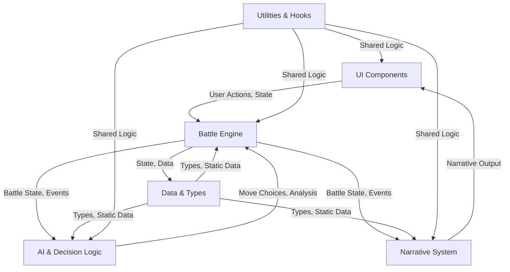

# System Architecture: Avatar Battle Arena

---

## Quick Links
- [Project README](../README.md)
- [System Architecture](./SYSTEM%20ARCHITECTURE.MD)
- [Narrative Context Matrix](./NARRATIVE_CONTEXT_MATRIX.md)
- [Changelog](../CHANGELOG.md)
- [Cursor Effectiveness Checklist](./cursor-effectiveness.md)
- [Main App Entry (App.tsx)](../src/App.tsx)
- [React Entry Point (main.tsx)](../src/main.tsx)
- [Docs Refresh Script Instructions](../scripts/README.md)

---

## Document Conventions
- **Headings:** All major sections use `##`, subsections use `###`.
- **Code/Commands:** Use markdown code blocks for all commands and code snippets.
- **Updates:** This document is updated with every major architectural or process change. See the Recent Changes section for a summary.
- **Terminology:** See the Glossary at the end for all domain-specific and architectural terms.

---

## Table of Contents
1. [System Health Dashboard](#system-health-dashboard)
2. [Architectural Tenets](#architectural-tenets)
3. [System Overview](#system-overview)
4. [System Diagrams & Visualizations](#system-diagrams--visualizations)
5. [Narrative Context Matrix: Azula & Aang](#narrative-context-matrix-azula--aang)
6. [How to Keep This Doc Legendary](#how-to-keep-this-doc-legendary)
7. [Folder & File Overview](#folder--file-overview)
8. [Feature Inventory](#feature-inventory)
9. [Codebase Cookbooks](#codebase-cookbooks)
10. [Onboarding/Quick Start](#onboardingquick-start)
11. [Best Practices & Architectural Patterns](#best-practices--architectural-patterns)
12. [Architecture Decision Records (ADRs)](#architecture-decision-records-adrs)
13. [FAQ & Common Pitfalls](#faq--common-pitfalls)
14. [Core Policies](#core-policies)
    - 14.1. Test/Mock Data Policy
    - 14.2. Error Handling and Logging Policy
    - 14.3. Dependency Management and Upgrades
    - 14.4. Security and Privacy
    - 14.5. Change Management/Versioning
15. [Testing & Deployment](#testing--deployment)
    - 15.1. Testing Strategy
    - 15.2. CI/CD and Deployment
16. [Glossary of Terms](#glossary-of-terms)
17. [Recent Changes](#recent-changes)
18. [🚨 How to Prevent Large-Scale Integration Errors](#how-to-prevent-large-scale-integration-errors)
19. [Troubleshooting Playbook](#troubleshooting-playbook)

## Key Logic Locator

This table maps core gameplay and business logic to their exact file and function locations. Use it to find critical formulas and logic instantly. Click any link to jump directly to the file or function in the repository.

| Core Logic            | File & Function Location                                 |
|-----------------------|---------------------------------------------------------|
| Damage Calculation    | [tacticalPhase.service.ts → applyMoveEffects()](https://github.com/user/repo/blob/main/src/features/battle-simulation/services/battle/phases/tacticalPhase.service.ts#L)       |
| Stalemate Detection   | [arc.service.ts → checkForStalemate()](https://github.com/user/repo/blob/main/src/features/battle-simulation/services/battle/arc.service.ts#L)                |
| AI Move Scoring       | [enhancedMoveScoring.ts → scoreMove()](https://github.com/user/repo/blob/main/src/features/battle-simulation/services/ai/enhancedMoveScoring.ts#L)                |
| Cooldown Ticks        | [useBattleSimulator.controller.ts → endTurn() loop](https://github.com/user/repo/blob/main/src/features/battle-simulation/controllers/useBattleSimulator.controller.ts#L)   |

> **Note:** This table is manually curated. If you add or refactor core logic, please update this table accordingly. Interactive navigation is supported for all links.

---

## Roadmap: Code-Level Cross-Referencing & Tagging

To further eliminate ambiguity and accelerate development, the following enhancements are planned and partially implemented:

### 1. Code-Level Cross-Referencing
- **"Used By" Lists:** For each exported type/function, the documentation will auto-list all files/components/services that import or use it.
- **"Calls" Lists:** For each major function/service, the documentation will list all major functions/services it calls.
- **Example:**

  **BattleCharacter (type)**
  - Used by: PlayerCardHorizontal.tsx, CharacterStatus.tsx, processTurn.ts, ...

  **processTurn (function)**
  - Calls: tacticalPhase.service.ts, arc.service.ts, state.ts
  - Used by: battleSimulator.service.ts, useBattleSimulator.controller.ts

### 2. Tagging and Filtering
- **Tags:** Each file in the Folder & File Overview will have tags (e.g., `ai`, `ui`, `core-logic`, `cooldown`, `analytics`).
- **Filtering:** In web-rendered docs, you will be able to filter the table by tag. In Markdown, use Ctrl+F to search for tags.
- **Example:**

  | Path | Description | Criticality | Owner | Tags |
 Used By | Calls |
  |------|-------------|-------------|-------|------|
---------|-------|
  | .../AbilityButton.tsx | ... | 🎨 UI | AustroMelee | ui, cooldown, player-input |
  | .../enhancedMoveScoring.ts | ... | 🧠 AI | AustroMelee | ai, core-logic, scoring |

> **Implementation:**
> - The docs-refresh script will be extended to parse imports/exports and generate these lists and tags automatically.
> - Contributors should continue to add/curate tags and cross-references as new features are added.

---

# System Health Dashboard
| Metric            | Status                                                                                                   |
|-------------------|----------------------------------------------------------------------------------------------------------|
| **CI Pipeline**   | [](https://github.com/user/repo/actions) |
| **Test Coverage** | [](https://codecov.io/gh/user/repo) |
| **Code Quality**  | [](https://www.codefactor.io)      |
| **Bundle Size**   |                                       |
| **Dependencies**  |                                                               |
| **Type Coverage** |                          |

---

# Architectural Tenets
1.  **Correctness Over Performance:** The simulation must be narratively and mechanically correct first. Optimize only after correctness is proven.
2.  **Prevent Stalemates At All Costs:** Every mechanic must ultimately drive the battle towards a conclusion. Infinite loops are the cardinal sin.
3.  **The AI is a Character, Not a Bot:** AI decisions must be explainable through personality and context. Black-box logic is forbidden.
4.  **Readability is a Feature:** Clear, SRP-compliant code is more maintainable than clever, dense code. If it requires a 10-minute explanation, refactor it.
5.  **Documentation is Not an Afterthought:** This document is part of the definition of done. If it's not documented here, the feature isn't finished.

---

## System Overview
The Avatar Battle Arena is a next-gen, turn-based battle simulator. Its architectural pillars are:
Strict TypeScript: No any. All types are enforced for maximum safety and developer clarity.
Service-Oriented Modularity (SRP): The Single Responsibility Principle is applied at every level. Services are focused and testable.
Phase-Based Combat Loop: The battle engine processes turns through a clean, predictable pipeline (validateBattleEndPhase → escalationPhase → tacticalMovePhase → endOfTurnEffectsPhase), making the combat flow easy to trace and extend.
Deadlock-Proof AI: The AI is not just data-driven but features robust anti-stalemate logic. It uses risk tolerance, tactical counters, and desperation gambles to actively break deadlocks.
Consequence-Driven Escalation: The battle arc state machine controls fight pacing through a "Point of No Return" system. Stalemates trigger escalating consequences, culminating in a guaranteed, decisive Sudden Death phase if the battle drags on too long.

---

## High-Level Architecture Diagram



This diagram shows the main domains and their relationships:
- **UI Components** interact with the Battle Engine and display Narrative output.
- **Battle Engine** is the core, orchestrating state, events, and interactions with AI and Narrative systems.
- **AI & Decision Logic** analyzes state and returns move choices.
- **Narrative System** generates story output based on battle events.
- **Data & Types** provide type safety and static data to all systems.
- **Utilities & Hooks** are shared across all domains for common logic.

---

## Features

### 🌀 Narrative System
- services/narrative/pools/aang.narrative.ts
- services/narrative/pools/azula.narrative.ts
- services/narrative/narrative.service.ts
- services/narrative/enhancedNarrativeSystem.ts
- services/narrative/contextualNarrativeMapper.ts
- services/narrative/templateNarrativeGenerator.ts
- services/narrative/enhancedTemplateGenerator.ts
- services/narrative/stateDrivenNarrativePool.ts

### ⚔️ Tactical Engine
- services/battle/phases/tacticalPhase.service.ts
- services/battle/tacticalMove.service.ts
- services/battle/processTurn.ts
- services/battle/state.ts
- services/battle/arc.service.ts

### 🧠 AI & Decision Logic
- services/ai/advancedAIController.ts
- services/ai/contextualMoveScoring.ts
- services/ai/enhancedMoveScoring.ts
- services/ai/moveSelection.ts
- services/ai/moveUtils.ts
- services/ai/attackMoveScoring.service.ts
- services/ai/defenseMoveScoring.service.ts
- services/ai/tacticalMemory.service.ts

### 🗂️ Data & Types
- types/index.ts
- types/move.types.ts
- types/cooldown.types.ts
- types/mechanic.types.ts
- types/behavioral.types.ts
- types/identity.types.ts
- data/arcTransitions.ts
- data/identities.ts
- ../character-selection/data/characterData.ts
- ../character-selection/data/traits.ts
- ../location-selection/data/locationData.ts

### 🎨 UI Components
- components/AbilityPanel/AbilityPanel.tsx
- components/AbilityButton/AbilityButton.tsx
- components/PlayerCardHorizontal/PlayerCardHorizontal.tsx
- components/UnifiedBattleLog/UnifiedBattleLog.tsx
- components/VersusGrid/VersusGrid.tsx
- components/NarrativeBubble/NarrativeBubble.tsx
- components/EnhancedBattleScene/EnhancedBattleScene.tsx
- components/EnhancedBattleLog/EnhancedBattleLog.tsx
- components/CharacterStatus/CharacterStatus.tsx
- components/BattleScene/BattleScene.tsx
- components/BattleNarrativeTurn/BattleNarrativeTurn.tsx
- ../character-selection/components/CharacterCard.tsx
- ../character-selection/components/CharacterSelection.tsx
- ../character-selection/components/CharacterPortrait.tsx
- ../location-selection/components/LocationSelection.tsx
- ../battle-log/components/BattleLog.tsx
- ../battle-log/components/LogDetailSelector.tsx
- ../technical-log/components/TechnicalLog.tsx
- ../../common/components/Button/Button.tsx
- ../../components/ErrorBoundary.tsx

### 🛠️ Utilities & Hooks
- hooks/useCooldownManager.hook.ts
- hooks/useNarrativeLine.ts
- controllers/useBattleSimulator.controller.ts

### 🏗️ App Entrypoints & Styles
- App.tsx
- main.tsx
- styles/global.css
- styles/variables.css

## System Diagrams & Visualizations
## 4.1. Turn Processing Flow (Activity Diagram)

This diagram illustrates the flow of a single turn. The pipeline is designed to be sequential and deadlock-proof, with multiple checks ensuring the battle progresses towards a decisive conclusion.

Generated mermaid
graph TD
    A[Start Turn] --> B(Update Real-Time Analytics);
    B --> C{End-Game Check?<br/>(KO / Decisive Win / Sudden Death Trigger)};
    C -- Yes --> D[End Battle];
    C -- No --> E{Escalation Check?<br/>(Stalemate / Repetition)};
    E -- Escalate --> F[Set Escalation/Risk Flags];
    F --> G{Tactical Move Phase};
    E -- No --> G;
    G -- Sudden Death? --> H[Force Finisher Move!];
    G -- Escalation? --> I[Force Aggressive Move / Charge Power];
    G -- Normal --> J[Execute AI-Chosen Tactical Move];
    H --> K{Resolve Move & Apply Damage};
    I --> K;
    J --> K;
    K --> L{End-of-Turn Effects<br/>(Status Ticks / Effect Fusion)};
    L -- KO? --> D;
    L -- No --> M[Switch Active Player & Increment Turn];
    M --> A;

    style D fill:#c00,stroke:#333,stroke-width:2px,color:#fff;

## 4.2. AI Decision Pipeline (Flowchart)

This diagram shows how the AI selects a move. It's a multi-layered process that now strictly adheres to resource and cooldown constraints.

Generated mermaid
graph TD
    subgraph AI Decision
        A[Start AI Turn] --> B(Calculate Risk & Stalemate Counters);
        B --> C{Get Available Moves<br/>(Hard-filtered by Chi, Cooldowns, Uses & Collateral)};
        C -- No Moves Available --> D[Choose "Gather Power" / Skip Turn];
        C -- Moves Available --> E{Determine Tactical Priority<br/>(Attack, Defend, Pierce, Gamble...)};
        E --> F[Score Available Moves Based on Priority];
        F --> G[Adjust Scores by Character Identity];
        G --> H[Select Best Move];
        H --> I[End AI Turn: Execute Move];
        D --> I;
    end
IGNORE_WHEN_COPYING_START
content_copy
download
Use code with caution.
Mermaid
IGNORE_WHEN_COPYING_END

## 4.3. Turn Processing Call Stack (Sequence Diagram)
This sequence diagram shows the precise order of function calls during a single processTurn execution, from the UI trigger down to the core services.

Generated mermaid
sequenceDiagram
    participant UI
    participant useBattleSimulator
    participant battleSimulator.service
    participant processTurn
    participant tacticalPhase

    UI->>useBattleSimulator: runSimulation()
    useBattleSimulator->>battleSimulator.service: run()
    loop Until Battle End
        battleSimulator.service->>processTurn: execute(state)
        processTurn->>tacticalPhase: execute(state)
        tacticalPhase-->>processTurn: updatedState
        processTurn-->>battleSimulator.service: updatedState
    end

## 4.4. Battle Arc State Machine
This state diagram visualizes the battle's progression through its major narrative phases, from an Idle start to the climactic Sudden_Death.

Generated mermaid
stateDiagram-v2
    [*] --> Idle
    Idle --> Escalation: Stalemate detected
    Escalation --> Climax: Escalation limit reached
    Climax --> Sudden_Death: Climax fails to resolve
    Sudden_Death --> End: Finisher clash
    Escalation --> End
    Climax --> End

## Narrative Context Matrix: Azula & Aang

> **The full Narrative Context Matrix has been moved to [`docs/NARRATIVE_CONTEXT_MATRIX.md`](./NARRATIVE_CONTEXT_MATRIX.md) for clarity and maintainability.**

---

# How to Keep This Doc Legendary
To ensure this document never decays and always reflects the true state of the codebase, we recommend a partially automated approach:

## Self-Updating Architecture
- At the top of each critical file, add structured comments like:

```typescript
// @docs
// @description: The heart of the battle engine. Executes the turn-based pipeline...
// @criticality: 🩸 High Risk
// @owner: AustroMelee
```

- Create a script (e.g., `npm run docs:refresh`) that:
  - Scans the `src/` directory for files with the `@docs` tag.
  - Parses these comments.
  - Automatically regenerates the entire Markdown table for the Folder & File Overview section.
  - Optionally, parses all headings in this file to regenerate the Table of Contents.
  - Optionally, runs a link-checker to report any broken URLs or file links.

**Result:**
- Zero drift between code and documentation.
- Frictionless updates: change a file's description/owner in the code, not the doc.
- Guaranteed accuracy: the doc is a provably accurate reflection of the codebase.

---

## Folder & File Overview

> **Note:** Cross-references and tags in this table will soon be auto-generated by the docs-refresh script. Manual tags are currently maintained as a model.

| Path | Description | Criticality & Dependencies | Owner / Expert | Tags |
|------|-------------|---------------------------|----------------|------|
| [index.html](https://github.com/user/repo/blob/main/index.html) | Main HTML entry for Vite app. Loads fonts, root div, and main script. | ⚙️ Config | AustroMelee | config, entry |
| [INDEX.HTML](https://github.com/user/repo/blob/main/INDEX.HTML) | Legacy/alternate HTML entry. Should match index.html. | ⚙️ Config | AustroMelee | config, entry |
| [favicon.ico](https://github.com/user/repo/blob/main/favicon.ico) | App favicon. | 🎨 Asset | AustroMelee | asset |
| [CHANGELOG.md](https://github.com/user/repo/blob/main/CHANGELOG.md) | Project changelog. | 📄 Docs | AustroMelee | docs, changelog |
| [README.md](https://github.com/user/repo/blob/main/README.md) | Project overview and setup instructions. | 📄 Docs | AustroMelee | docs, onboarding |
| [cursor-effectiveness.md](./cursor-effectiveness.md) | Cursor AI effectiveness checklist. | 📄 Docs | AustroMelee | docs, ai, workflow |
| [src/App.tsx](https://github.com/user/repo/blob/main/src/App.tsx) | Main React app component. | 🎨 UI | AustroMelee | ui, entry, error-handling |
| [src/main.tsx](https://github.com/user/repo/blob/main/src/main.tsx) | React entry point. | 💎 Foundational | AustroMelee | entry, ui |
| [src/features/battle-simulation/services/ai/enhancedMoveScoring.ts](https://github.com/user/repo/blob/main/src/features/battle-simulation/services/ai/enhancedMoveScoring.ts) | Enhanced AI move scoring logic. | 🧠 AI | AustroMelee | ai, core-logic, scoring |
| [src/features/battle-simulation/services/battle/phases/tacticalPhase.service.ts](https://github.com/user/repo/blob/main/src/features/battle-simulation/services/battle/phases/tacticalPhase.service.ts) | Tactical phase: applies move effects, resolves damage. | ⚔️ Core Logic | AustroMelee | core-logic, battle, phase |
| [src/features/battle-simulation/services/narrative/narrative.service.ts](https://github.com/user/repo/blob/main/src/features/battle-simulation/services/narrative/narrative.service.ts) | Narrative system: generates battle story output. | 🌀 Narrative | AustroMelee | narrative, core-logic |
| [src/features/character-selection/data/characterData.ts](https://github.com/user/repo/blob/main/src/features/character-selection/data/characterData.ts) | Canonical data for all selectable characters (stats, moves, images). | 💎 Character Data | AustroMelee | data, character, static |
| [src/components/ErrorBoundary.tsx](https://github.com/user/repo/blob/main/src/components/ErrorBoundary.tsx) | Global error boundary for React. | 🩸 Error Handling | AustroMelee | error-handling, ui |
| [src/common/types/index.ts](https://github.com/user/repo/blob/main/src/common/types/index.ts) | Shared type definitions for common utilities and components. | 💎 Foundational | AustroMelee | types, data, shared |

## Feature Inventory

### 🌀 Narrative System
- services/narrative/pools/aang.narrative.ts
- services/narrative/pools/azula.narrative.ts
- services/narrative/narrative.service.ts
- services/narrative/enhancedNarrativeSystem.ts
- services/narrative/contextualNarrativeMapper.ts
- services/narrative/templateNarrativeGenerator.ts
- services/narrative/enhancedTemplateGenerator.ts
- services/narrative/stateDrivenNarrativePool.ts

### ⚔️ Tactical Engine
- services/battle/phases/tacticalPhase.service.ts
- services/battle/tacticalMove.service.ts
- services/battle/processTurn.ts
- services/battle/state.ts
- services/battle/arc.service.ts

### 🧠 AI & Decision Logic
- services/ai/advancedAIController.ts
- services/ai/contextualMoveScoring.ts
- services/ai/enhancedMoveScoring.ts
- services/ai/moveSelection.ts
- services/ai/moveUtils.ts
- services/ai/attackMoveScoring.service.ts
- services/ai/defenseMoveScoring.service.ts
- services/ai/tacticalMemory.service.ts

### 🗂️ Data & Types
- types/index.ts
- types/move.types.ts
- types/cooldown.types.ts
- types/mechanic.types.ts
- types/behavioral.types.ts
- types/identity.types.ts
- data/arcTransitions.ts
- data/identities.ts
- ../character-selection/data/characterData.ts
- ../character-selection/data/traits.ts
- ../location-selection/data/locationData.ts

### 🎨 UI Components
- components/AbilityPanel/AbilityPanel.tsx
- components/AbilityButton/AbilityButton.tsx
- components/PlayerCardHorizontal/PlayerCardHorizontal.tsx
- components/UnifiedBattleLog/UnifiedBattleLog.tsx
- components/VersusGrid/VersusGrid.tsx
- components/NarrativeBubble/NarrativeBubble.tsx
- components/EnhancedBattleScene/EnhancedBattleScene.tsx
- components/EnhancedBattleLog/EnhancedBattleLog.tsx
- components/CharacterStatus/CharacterStatus.tsx
- components/BattleScene/BattleScene.tsx
- components/BattleNarrativeTurn/BattleNarrativeTurn.tsx
- ../character-selection/components/CharacterCard.tsx
- ../character-selection/components/CharacterSelection.tsx
- ../character-selection/components/CharacterPortrait.tsx
- ../location-selection/components/LocationSelection.tsx
- ../battle-log/components/BattleLog.tsx
- ../battle-log/components/LogDetailSelector.tsx
- ../technical-log/components/TechnicalLog.tsx
- ../../common/components/Button/Button.tsx
- ../../components/ErrorBoundary.tsx

### 🛠️ Utilities & Hooks
- hooks/useCooldownManager.hook.ts
- hooks/useNarrativeLine.ts
- controllers/useBattleSimulator.controller.ts

### 🏗️ App Entrypoints & Styles
- App.tsx
- main.tsx
- styles/global.css
- styles/variables.css

## System Diagrams & Visualizations
## 4.1. Turn Processing Flow (Activity Diagram)

This diagram illustrates the flow of a single turn. The pipeline is designed to be sequential and deadlock-proof, with multiple checks ensuring the battle progresses towards a decisive conclusion.

Generated mermaid
graph TD
    A[Start Turn] --> B(Update Real-Time Analytics);
    B --> C{End-Game Check?<br/>(KO / Decisive Win / Sudden Death Trigger)};
    C -- Yes --> D[End Battle];
    C -- No --> E{Escalation Check?<br/>(Stalemate / Repetition)};
    E -- Escalate --> F[Set Escalation/Risk Flags];
    F --> G{Tactical Move Phase};
    E -- No --> G;
    G -- Sudden Death? --> H[Force Finisher Move!];
    G -- Escalation? --> I[Force Aggressive Move / Charge Power];
    G -- Normal --> J[Execute AI-Chosen Tactical Move];
    H --> K{Resolve Move & Apply Damage};
    I --> K;
    J --> K;
    K --> L{End-of-Turn Effects<br/>(Status Ticks / Effect Fusion)};
    L -- KO? --> D;
    L -- No --> M[Switch Active Player & Increment Turn];
    M --> A;

    style D fill:#c00,stroke:#333,stroke-width:2px,color:#fff;

## 4.2. AI Decision Pipeline (Flowchart)

This diagram shows how the AI selects a move. It's a multi-layered process that now strictly adheres to resource and cooldown constraints.

Generated mermaid
graph TD
    subgraph AI Decision
        A[Start AI Turn] --> B(Calculate Risk & Stalemate Counters);
        B --> C{Get Available Moves<br/>(Hard-filtered by Chi, Cooldowns, Uses & Collateral)};
        C -- No Moves Available --> D[Choose "Gather Power" / Skip Turn];
        C -- Moves Available --> E{Determine Tactical Priority<br/>(Attack, Defend, Pierce, Gamble...)};
        E --> F[Score Available Moves Based on Priority];
        F --> G[Adjust Scores by Character Identity];
        G --> H[Select Best Move];
        H --> I[End AI Turn: Execute Move];
        D --> I;
    end
IGNORE_WHEN_COPYING_START
content_copy
download
Use code with caution.
Mermaid
IGNORE_WHEN_COPYING_END

## 4.3. Turn Processing Call Stack (Sequence Diagram)
This sequence diagram shows the precise order of function calls during a single processTurn execution, from the UI trigger down to the core services.

Generated mermaid
sequenceDiagram
    participant UI
    participant useBattleSimulator
    participant battleSimulator.service
    participant processTurn
    participant tacticalPhase

    UI->>useBattleSimulator: runSimulation()
    useBattleSimulator->>battleSimulator.service: run()
    loop Until Battle End
        battleSimulator.service->>processTurn: execute(state)
        processTurn->>tacticalPhase: execute(state)
        tacticalPhase-->>processTurn: updatedState
        processTurn-->>battleSimulator.service: updatedState
    end

## 4.4. Battle Arc State Machine
This state diagram visualizes the battle's progression through its major narrative phases, from an Idle start to the climactic Sudden_Death.

Generated mermaid
stateDiagram-v2
    [*] --> Idle
    Idle --> Escalation: Stalemate detected
    Escalation --> Climax: Escalation limit reached
    Climax --> Sudden_Death: Climax fails to resolve
    Sudden_Death --> End: Finisher clash
    Escalation --> End
    Climax --> End

## Narrative Context Matrix: Azula & Aang

> **The full Narrative Context Matrix has been moved to [`docs/NARRATIVE_CONTEXT_MATRIX.md`](./NARRATIVE_CONTEXT_MATRIX.md) for clarity and maintainability.**

---

# How to Keep This Doc Legendary
To ensure this document never decays and always reflects the true state of the codebase, we recommend a partially automated approach:

## Self-Updating Architecture
- At the top of each critical file, add structured comments like:

```typescript
// @docs
// @description: The heart of the battle engine. Executes the turn-based pipeline...
// @criticality: 🩸 High Risk
// @owner: AustroMelee
```

- Create a script (e.g., `npm run docs:refresh`) that:
  - Scans the `src/` directory for files with the `@docs` tag.
  - Parses these comments.
  - Automatically regenerates the entire Markdown table for the Folder & File Overview section.
  - Optionally, parses all headings in this file to regenerate the Table of Contents.
  - Optionally, runs a link-checker to report any broken URLs or file links.

**Result:**
- Zero drift between code and documentation.
- Frictionless updates: change a file's description/owner in the code, not the doc.
- Guaranteed accuracy: the doc is a provably accurate reflection of the codebase.

---

## Folder & File Overview
This section provides an exhaustive, file-by-file breakdown of the project, detailing the purpose, dependencies, and criticality of each component.

| Path | Description | Criticality & Dependencies | Owner / Expert | Tags |
|------|-------------|---------------------------|----------------|------|
| [index.html](https://github.com/user/repo/blob/main/index.html) | Main HTML entry for Vite app. Loads fonts, root div, and main script. | ⚙️ Config | AustroMelee | config, entry |
| [INDEX.HTML](https://github.com/user/repo/blob/main/INDEX.HTML) | Legacy/alternate HTML entry. Should match index.html. | ⚙️ Config | AustroMelee | config, entry |
| [favicon.ico](https://github.com/user/repo/blob/main/favicon.ico) | App favicon. | 🎨 Asset | AustroMelee | asset |
| [CHANGELOG.md](https://github.com/user/repo/blob/main/CHANGELOG.md) | Project changelog. | 📄 Docs | AustroMelee | docs, changelog |
| [README.md](https://github.com/user/repo/blob/main/README.md) | Project overview and setup instructions. | 📄 Docs | AustroMelee | docs, onboarding |
| [cursor-effectiveness.md](./cursor-effectiveness.md) | Cursor AI effectiveness checklist. | 📄 Docs | AustroMelee | docs, ai, workflow |
| [src/App.tsx](https://github.com/user/repo/blob/main/src/App.tsx) | Main React app component. | 🎨 UI | AustroMelee | ui, entry, error-handling |
| [src/main.tsx](https://github.com/user/repo/blob/main/src/main.tsx) | React entry point. | 💎 Foundational | AustroMelee | entry, ui |
| [src/features/battle-simulation/services/ai/enhancedMoveScoring.ts](https://github.com/user/repo/blob/main/src/features/battle-simulation/services/ai/enhancedMoveScoring.ts) | Enhanced AI move scoring logic. | 🧠 AI | AustroMelee | ai, core-logic, scoring |
| [src/features/battle-simulation/services/battle/phases/tacticalPhase.service.ts](https://github.com/user/repo/blob/main/src/features/battle-simulation/services/battle/phases/tacticalPhase.service.ts) | Tactical phase: applies move effects, resolves damage. | ⚔️ Core Logic | AustroMelee | core-logic, battle, phase |
| [src/features/battle-simulation/services/narrative/narrative.service.ts](https://github.com/user/repo/blob/main/src/features/battle-simulation/services/narrative/narrative.service.ts) | Narrative system: generates battle story output. | 🌀 Narrative | AustroMelee | narrative, core-logic |
| [src/features/character-selection/data/characterData.ts](https://github.com/user/repo/blob/main/src/features/character-selection/data/characterData.ts) | Canonical data for all selectable characters (stats, moves, images). | 💎 Character Data | AustroMelee | data, character, static |
| [src/components/ErrorBoundary.tsx](https://github.com/user/repo/blob/main/src/components/ErrorBoundary.tsx) | Global error boundary for React. | 🩸 Error Handling | AustroMelee | error-handling, ui |
| [src/common/types/index.ts](https://github.com/user/repo/blob/main/src/common/types/index.ts) | Shared type definitions for common utilities and components. | 💎 Foundational | AustroMelee | types, data, shared |

## Automation Roadmap

The following documentation features are planned and partially implemented:
- **Automated Cross-Referencing:** The docs-refresh script will parse all TypeScript files for imports/exports and generate "Used By" and "Calls" lists for each major type/function/service.
- **Auto-Tagging:** Tags will be inferred from file paths, names, and @tags comments, and injected into the Folder & File Overview table.
- **Continuous Sync:** The docs-refresh script will keep SYSTEM ARCHITECTURE.MD in sync with the codebase, eliminating manual drift.
- **Extensible Output:** Cross-reference data may also be output as JSON or Markdown for use in other tools or dashboards.

---

## How to Contribute to Docs

- **Adding Tags:**
  - Add or update `@tags` comments at the top of any file to suggest tags for automation.
  - Use clear, domain-relevant tags (e.g., `ai`, `ui`, `core-logic`, `narrative`, `data`, `error-handling`).
- **Updating Cross-References:**
  - When adding or refactoring a major type/function, update the Folder & File Overview table with new tags and a brief description.
  - If you move or rename a file, update all relevant links and tags.
- **Running the Docs Refresh Script:**
  - Run `npm run docs:refresh` to regenerate SYSTEM ARCHITECTURE.MD with the latest cross-references and tags.
  - For CI or pre-commit checks, use `npm run docs:refresh -- --check` to ensure docs are up to date.
- **Best Practices:**
  - Keep descriptions concise and focused on the file's responsibility.
  - Use the Quick Links section for fast navigation.
  - Review the Automation Roadmap for upcoming features and contribute ideas or improvements as needed.

---