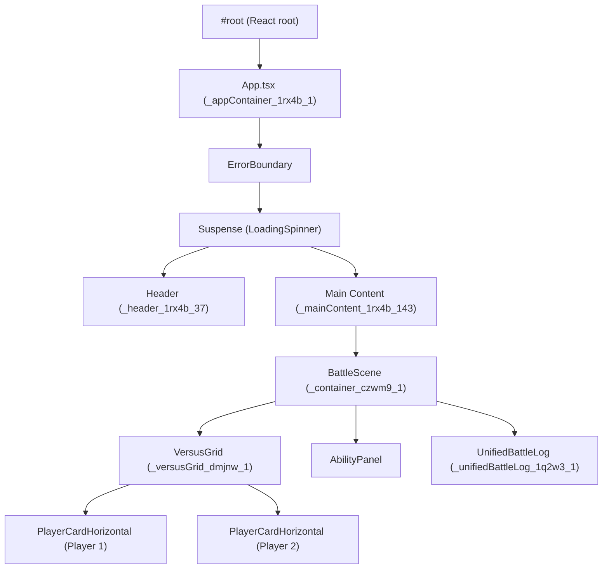

# UI & Frontend Guide

This guide covers the architecture, conventions, and implementation details for the React-based user interface.

## UI DOM Architecture & Insights

### High-Level React/DOM Tree

### CSS, Theming, and Accessibility
- **CSS Modules:** All UI components use locally-scoped CSS modules to prevent class name collisions.
- **CSS Variables:** Theming is controlled by CSS variables in styles/variables.css for colors, spacing, and fonts.
- **Layout:** Flexbox and grid are used for main layouts. All spacing uses explicit gap or padding values from variables.
- **Accessibility:** Root-level UI is wrapped in ErrorBoundary and Suspense with accessible fallbacks. All interactive elements have ARIA labels and are keyboard accessible.
- **Defensive UI:** Log rendering is guarded against undefined/null data, with warnings logged and placeholders shown for malformed data.

### Key CSS Variables
| Variable                | Value                    | Usage Context                |
|-------------------------|-------------------------|------------------------------|
| --font-heading          | 'Poppins', sans-serif   | Headings, titles             |
| --font-mono             | 'JetBrains Mono', monospace | Code, technical log     |
| --background-color-dark | #0F172A                 | Main app background          |
| --text-color-primary    | #F8FAFC                 | Main text color              |
| --border-color-soft     | #475569                 | Soft borders, dividers       |
| --player-1-color        | #3B82F6                 | Player 1 highlights, borders |
| --player-2-color        | #EF4444                 | Player 2 highlights, borders |
| --highlight-color       | #F59E0B                 | Highlights, buttons, accents |
| --spacing-medium        | 16px                    | Medium gaps, padding         |

### Battle Log View Modes & Dropdown
- **July 9th, 2025 Overhaul:**
  - Log/narrative/mechanics changes ensure that dramatic, escalation, and forced ending events always produce unique, cinematic lines in the UI.
  - Global anti-repetition and cadence logic: at least one dialogue/scene line every 2 turns in dramatic phases, always visible in the log.
  - Narrative pools expanded to 8–10 unique lines per phase/character, with fallback to contextual lines.
  - Forced endings always output unique, cinematic lines in the log.
- **Log View Dropdown:** The battle log UI now features a persistent dropdown at the top, allowing instant toggling between multiple log view modes.
- **Modes:**
  - **[DEV] Grouped by Turn – Full battle transcript:** Shows all log entries grouped and ordered by turn, with headers for each turn. For developers and testers.
  - **[DEV] Latest Turn Only – Just current turn:** Shows only the most recent turn's entries. For rapid debugging and step-by-step analysis.
  - **[DEV] All Entries (Raw) – Unfiltered log:** Shows every log entry in order, with no grouping. For log system debugging.
  - **[PUBLIC] Story View – For players/spectators:** (Currently same as grouped, but intended for user-facing release. Only this mode is shown in production.)
- **Dropdown Placement:** The dropdown is always rendered at the very top of the log area, before any log content, and is never hidden or delayed.
- **Educational Labels:** Each dropdown option includes a one-line summary for clarity. [DEV] modes are only visible in development; [PUBLIC] is the only option in production.
- **Rationale:** This design ensures maximum clarity for both developers and users, prevents UI drift, and makes the tool self-explanatory.

### Log UI Update Best Practices & File Map
- **Log pipeline and UI are now robust, type-safe, and future-proof.**
- **Renderer:** UnifiedBattleLog.tsx uses an exhaustive switch to render only true dialogue as bubbles, with unknown types rendered as neutral gray.
- **Unit Test:** UnifiedBattleLog.test.tsx covers all core log types and ensures exhaustive rendering.
- **Lint Rule:** Custom ESLint plugin prevents stray imports of DialogueLogEntry outside the canonical context.
- **Type Helper:** assertNever enforces compile-time exhaustiveness for log type switches.
- **Log Creation:** All logs are created via robust helpers (logTechnical, logStory, logDialogue, logSystem), never null, and strictly typed. All tactical subtypes are mapped to canonical types at the source. Duplicate log entries are prevented with a hash/set utility.
- **Checklist for Log UI Updates:**
    - [x] Update log text in helpers/templates as needed
    - [x] Update styles in log entry components or CSS modules
    - [x] Update dropdown options/labels and logic
    - [x] Update/add log action buttons
    - [x] Update SYSTEM ARCHITECTURE.MD and ALL_FILES_INDEX.md to reflect changes
    - [x] Run and visually verify all log modes (DEV and PUBLIC)
- **File Map for Log UI:**
    - Log text: mechanicLogUtils.ts, narrative pools/templates
    - Log styles: DialogueLogEntry.tsx, NarrativeLogEntry.tsx, TechnicalLogEntry.tsx, variables.css
    - Dropdown: UnifiedBattleLog.tsx, logViewModes.ts
    - Buttons: UnifiedBattleLog.tsx (or subcomponents)
- **Policy:** All log UI changes must be reflected in this document and in ALL_FILES_INDEX.md to prevent drift.
