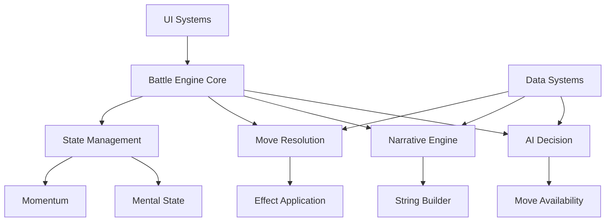

# Avatar: The Last Airbender Battle Arena - Documentation Overview

## 🎯 Project Overview

This is a comprehensive JavaScript-based battle simulation system that recreates Avatar: The Last Airbender combat scenarios. The system features advanced AI decision-making, dynamic narrative generation, environmental interactions, and complex character state management.

## 📁 Project Structure

### Core System Architecture

```
GITHUB PROJECT/
├── js/                          # All JavaScript modules
│   ├── engines/                 # Core battle simulation engines
│   ├── data/                    # Game data and configuration
│   ├── ui/                      # User interface components
│   └── utils/                   # Utility functions and helpers
├── CSS/                         # Styling and visual presentation
├── img/                         # Character portraits and backgrounds
└── INDEX.HTML                   # Main application entry point
```

## 🔧 Core System Components

### 1. Battle Engine Core (`engine_battle-engine-core.js`)
**Responsibility**: Main orchestrator of battle simulation
- Manages turn-based combat loop
- Coordinates all sub-systems (AI, narrative, state management)
- Handles battle initialization and termination
- Integrates environmental effects and phase transitions

### 2. AI Decision System (`engine_ai-decision.js`)
**Responsibility**: Intelligent move selection and adaptation
- Analyzes battle state and opponent patterns
- Selects optimal moves based on current conditions
- Maintains memory of previous encounters
- Adapts personality based on battle progression

### 3. Narrative Engine (`engine_narrative-engine.js`)
**Responsibility**: Dynamic story generation and character dialogue
- Generates contextual dialogue based on battle state
- Creates environmental descriptions and flavor text
- Manages character-specific voice and personality
- Handles escalation and dramatic timing

### 4. State Management System
**Components**: 
- `engine_state_initializer.js` - Initial state setup
- `engine_mental-state.js` - Character psychological state
- `engine_momentum.js` - Battle momentum tracking
- `engine_battle-phase.js` - Combat phase management

### 5. Move Resolution System (`engine_move-resolution.js`)
**Responsibility**: Combat action calculation and effects
- Processes attack/defense interactions
- Calculates damage, energy costs, and status effects
- Handles move effectiveness and critical hits
- Manages environmental interactions

### 6. Effect Application System (`engine_effect_application.js`)
**Responsibility**: Applies all game effects consistently
- Handles damage, healing, status effects
- Manages stuns, momentum changes, energy modifications
- Ensures effect stacking and duration tracking
- Provides detailed logging for all effect applications

## 🎮 Key Game Systems

### Battle Phases
1. **Opening** - Initial positioning and testing
2. **Mid-Battle** - Main combat engagement
3. **Late Battle** - Escalated conflict with environmental damage
4. **Critical** - Desperate final exchanges

### Character Archetypes
- **Aang**: Air Nomad - Defensive, evasive, spiritual
- **Azula**: Fire Nation - Aggressive, precise, ruthless

### Environmental Systems
- **Location Effects**: Terrain-based modifiers and opportunities
- **Collateral Damage**: Environmental destruction from powerful moves
- **Weather/Time**: Atmospheric conditions affecting combat

### AI Personality System
- **Adaptive Behavior**: AI learns from player patterns
- **Emotional States**: Characters react to battle progression
- **Memory System**: Persistent knowledge between encounters

## 🔍 Special Logic Notes

### Critical Implementation Details

1. **Deterministic Randomness**: Uses seeded random generation for reproducible battles
2. **Curbstomp Prevention**: Anti-snowball mechanics prevent one-sided battles
3. **Energy Management**: Stamina system prevents infinite powerful moves
4. **Stun Resistance**: Progressive immunity to prevent stun-locks
5. **Environmental Escalation**: Battles become more destructive over time

### Memory-Based AI Adaptation
The AI system maintains detailed logs of:
- Move effectiveness patterns
- Player preferences and habits
- Successful counter-strategies
- Environmental exploitation opportunities

### Narrative Consistency Engine
- Tracks character voice and personality consistency
- Ensures dialogue matches battle context and character state
- Manages dramatic pacing and escalation
- Prevents repetitive or contradictory narrative elements

## 🚨 Common Gotchas and Edge Cases

### State Synchronization
- Battle state must be consistently shared across all engines
- Environmental changes affect multiple systems simultaneously
- Character state changes trigger cascading updates

### Effect Stacking
- Multiple effects can modify the same properties
- Order of application matters for certain combinations
- Some effects have diminishing returns or caps

### AI Decision Edge Cases
- AI must handle situations with no valid moves
- Energy depletion scenarios require special handling
- Stun states and forced actions need careful management

### Narrative Generation Challenges
- Dialogue must match current character emotional state
- Environmental descriptions must reflect accumulated damage
- Phase transitions require appropriate dramatic escalation

## 📊 Data Architecture

### Character Data Structure
```javascript
{
  id: string,           // Unique identifier
  name: string,         // Display name
  hp: number,           // Health points (0-100)
  energy: number,       // Action points (0-100)
  momentum: number,     // Battle advantage (-100 to 100)
  mentalState: object,  // Psychological condition
  moveHistory: array,   // Recent actions taken
  aiLog: array         // AI decision reasoning
}
```

### Battle State Structure
```javascript
{
  turn: number,                    // Current turn number
  currentPhase: string,            // Battle phase identifier
  environmentState: object,        // Environmental conditions
  locationConditions: object,      // Terrain effects
  opponentId: string              // Current opponent reference
}
```

## 🛠️ Development Guidelines

### Code Organization Principles
1. **Single Responsibility**: Each module handles one core concern
2. **Dependency Injection**: Systems receive dependencies rather than importing directly
3. **Event-Driven Architecture**: Systems communicate through structured events
4. **Immutable State Updates**: State changes create new objects rather than mutations

### Debugging Philosophy
- Every significant action logs its intent and result
- State changes include before/after snapshots
- Error conditions provide context and recovery suggestions
- Performance-critical sections include timing measurements

### Testing Considerations
- Battle simulations should be deterministic when using seeded random
- AI decisions should be reproducible given identical state
- Narrative generation should maintain character consistency
- Environmental effects should stack predictably

## 🔗 Inter-System Dependencies



## 📚 Further Documentation

- `/js/README.md` - Detailed JavaScript module documentation
- `/CSS/README.md` - Styling and visual design guide
- `/img/README.md` - Asset management and character portraits
- Individual module documentation within each file

---

**Last Updated**: [Current Date]
**Version**: 2.1
**Maintainer**: Battle Arena Development Team 