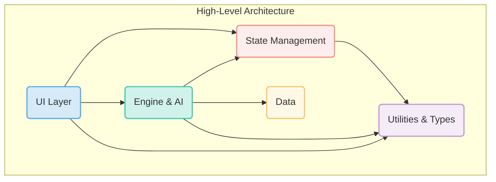

# Modularity Report: Avatar Battle Arena

## Overall Architecture

The codebase demonstrates a strong, domain-driven architectural foundation. The modularity is well-considered, which is crucial for a project of this scale.

**Strengths:**

*   **Clear, Domain-Driven Structure:** The project is organized into logical, high-level modules like `engine`, `ai`, `ui`, `data`, `state`, and `narrative`. This separation of concerns makes the codebase easier to understand, navigate, and maintain.
*   **Centralized Type Definitions:** The `types` directory serves as a single source of truth for data structures. This is a best practice that enforces clear contracts between different modules, reducing integration errors and improving developer experience.
*   **Utility and Configuration Separation:** Common functionalities are grouped into `utils`, and configuration is separated into `config_` files. This prevents code duplication and separates logic from configuration, making the application more flexible.
*   **Consistent Naming Conventions:** The file naming convention (e.g., `engine_battle-engine-core.js`, `ui_character-selection.js`) clearly communicates the purpose and belonging of each file.

**Areas for Continued Attention:**

*   **Dependency Management:** With a large number of files, it's important to be vigilant about managing dependencies between modules to prevent tight coupling and circular references. The core logic in `engine` should ideally not depend on presentation logic in `ui`.

## High-Level Module Dependencies

This diagram represents a healthy, idealized dependency flow for your application's architecture. It visualizes a clean separation where high-level modules depend on low-level ones, but not vice-versa.



## Key Modules Analysis

*   **`engine`**: Appears highly cohesive, correctly focusing on the core logic of the battle system. Its primary responsibility is executing game rules without knowledge of the UI.
*   **`ui`**: This module's responsibility is to render the game state and handle user input. It is correctly dependent on the `engine` and `state` for data and should not be a dependency for any core logic modules.
*   **`ai`**: The AI logic is well-encapsulated. It acts as a programmatic player, making decisions based on the game state provided by the `engine`.
*   **`state`**: A centralized state management module is a superb choice for this application's complexity. It ensures a single source of truth, which simplifies data flow and debugging. Your existing work on `state_manager.js` and the type system provides a rock-solid foundation.
*   **`utils`**: This module contains shared, reusable functions. While useful, it's important to prevent it from becoming a "junk drawer." The current pattern of grouping utilities by functionality (e.g., `utils_math.js`, `utils_random.js`) is a great way to maintain cohesion.
*   **`data`**: Separating static game data (characters, moves, locations) from application logic is a best practice that you've followed well. It makes the data easy to manage and modify without touching the code.

## Recommendations

1.  **Formalize Module APIs with `index.js`:** For major modules (`engine`, `ai`, `ui`), consider adding an `index.js` file at the root of each directory. This file would explicitly export only the public-facing functions and classes of that module. Other modules would then only import from this `index.js` file. This enforces encapsulation, reduces coupling, and makes dependency chains very clear.

    *Example for `src/js/engine/index.js`*:
    ```javascript
    export { BattleEngine } from './engine_battle-engine-core.js';
    export { resolveMove } from './engine_move-resolution.js';
    // ... other public exports
    ```

2.  **Conduct a Dependency Audit:** While the high-level structure is sound, a detailed dependency audit would be beneficial. You can use a tool like `dependency-cruiser` (`npx dependency-cruiser src/js`) to automatically scan your codebase and generate a report. This would help you spot:
    *   **Circular Dependencies:** (e.g., `A -> B -> C -> A`), which can cause subtle bugs.
    *   **Unintended Dependencies:** (e.g., `engine` importing from `ui`).

3.  **Refine `utils` Cohesion:** Periodically review the various `utils` files. If a utility is only used by a single module, consider moving it into that module's directory to improve locality. If several utilities serve a common, specific purpose, continue grouping them as you have been.

## Conclusion

The Avatar Battle Arena codebase is built on a robust and scalable modular architecture. The clear separation of concerns, consistent naming, and centralized typing provide an excellent foundation for future development.

The primary recommendation is to be proactive in managing dependencies as the project grows. By formalizing module boundaries and periodically auditing dependencies, you can ensure the codebase remains maintainable, testable, and a pleasure to work on. 