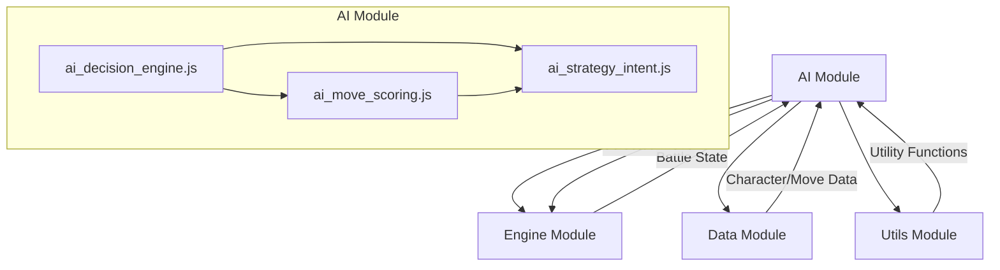

# AI Module

## Overview

The AI module is responsible for all non-player character (NPC) decision-making in the Avatar Battle Arena. It features a modular architecture that separates different aspects of AI logic—such as personality, memory, strategy, and move selection—into distinct, testable components. This design allows for complex and believable AI behavior that can be easily extended and debugged.

The primary entry point for this module is `selectMove()` from `ai_decision_engine.js`, which orchestrates the various sub-modules to produce a final, reasoned move selection.

## Architectural Constraints

This module adheres to the following rules defined in `.cursorcontext`:
- **CAN** import from `/data`, `/utils`, and `/engine`.
- **MUST NOT** import from `/ui` or `/css`.
- All logic is pure JavaScript (ES2020) with JSDoc type annotations.

## Module Interaction



- **Engine**: The AI module is primarily called by the `engine` during an AI-controlled character's turn. It receives the current `BattleState` and returns the chosen `Move`.
- **Data**: It reads from the `/data` modules to get information about character archetypes, movesets, and other static game data.
- **Utils**: It uses shared functions from `/utils` for tasks like cloning and validation.

## Files

### Core AI Logic (`/src/js/ai/`)

-   **`index.js`**: The main entry point for the AI module. It provides barrel exports for all other files, offering both flat and namespaced access patterns (e.g., `AiStrategy.determineIntent()`).
-   **`ai_decision_engine.js`**: The central orchestrator. Its `makeAIDecision()` function coordinates all sub-modules to analyze the battle, score potential moves, and select the final action.
-   **`ai_memory.js`**: Manages the AI's "working memory." It tracks move effectiveness, opponent patterns, and cooldowns to enable learning and adaptation. Exports `updateAiMemory()`, `getMoveEffectivenessScore()`, and `getOpponentProfile()`.
-   **`ai_move_scoring.js`**: Pure scoring logic. It calculates weights for available moves based on personality, strategic intent, and contextual modifiers without any randomness. Exports `calculateMoveWeights()`.
-   **`ai_move_selection.js`**: Handles all randomness and probability. It converts move weights into probabilities (using softmax) and selects the final move. Exports `selectMoveFromWeights()`.
-   **`ai_personality.js`**: Manages AI personality profiles. It handles dynamic traits that adapt based on battle events (e.g., aggression, risk tolerance). Exports `getDynamicPersonality()` and `adaptPersonality()`.
-   **`ai_scoring_utils.js`**: Contains helper functions for the scoring process, such as applying personality/memory modifiers and generating human-readable reasons for a decision.
-   **`ai_strategy_intent.js`**: Determines the AI's high-level goal for the current turn (e.g., "PressAdvantage", "DesperateGambit"). This "intent" guides the move scoring process. Exports `determineStrategicIntent()`.
-   **`ai_utils.js`**: A collection of shared utility functions used across the AI module, such as `getElementalEffectiveness()` and `getAvailableMoves()`.

### Sub-modules

#### `/analysis/`
- **`threat_assessment.js`**: Provides functions to analyze the opponent's threat level and the overall risk of the current situation. Exports `assessThreatLevel()`.

#### `/decision/`
This sub-module contains the building blocks for constructing and validating a decision.
- **`analysis.js`**: Analyzes the decision context to create a strategic approach. Exports `analyzeDecisionContext()`.
- **`bias.js`**: Defines character-specific biases (e.g., Azula's tendency for overkill) to add flavor to AI decisions. Exports `getCharacterBias()`.
- **`condition_evaluator.js`**: Centralizes complex conditional logic, like determining if a character is "in control" or "desperate."
- **`context.js`**: Builds the comprehensive `DecisionContext` object that is passed through the AI system. Exports `buildDecisionContext()`.
- **`fallback.js`**: Provides a safe fallback decision (`Struggle` or the first available move) if the main AI logic fails. Exports `createFallbackDecision()`.
- **`phase.js`**: Determines the current battle phase (e.g., "opening", "mid", "late"). Exports `determineBattlePhase()`.
- **`threat_analysis.js`**: Quantifies the immediate survival risk for the AI to trigger defensive pivots. Exports `analyzeThreatLevel()`.
- **`validation.js`**: Contains functions to validate the inputs and outputs of the decision engine, preventing invalid data flow. Exports `validateInputs()` and `validateDecision()`.

#### `/evaluation/`
- **`move_evaluator.js`**: Evaluates all available moves and assigns a score to each, now driven by simulation. Exports `evaluateAvailableMoves()`.
- **`scoring_calculators.js`**: Provides functions to calculate individual components of a move's score (damage, accuracy, risk).

#### `/goals/`
- **`goal_setting.js`**: Determines the AI's primary goal for the turn (e.g., "survive", "finish_opponent") and calculates decision weights. Exports `determinePrimaryGoal()`.

#### `/simulation/`
- **`turn_simulator.js`**: Provides functionality to predict the outcome of a move by simulating a future turn, allowing for more strategic lookahead. Exports `simulateTurn()`.

## Usage

Here is a typical example of how the `engine` would use this module:

```javascript
import { makeAIDecision } from './ai/index.js';

// Inside the battle loop, when it's the AI's turn...
async function processAiTurn(aiFighter, opponentFighter, battleState) {
    try {
        const decisionOptions = {
            timeLimit: 3000,
            enableDebug: true,
        };
        
        const decision = await makeAIDecision(
            aiFighter,
            opponentFighter,
            battleState,
            decisionOptions
        );

        console.log(`AI chose: ${decision.moveId} with ${decision.confidence.toFixed(2)} confidence.`);
        console.log(`Reasoning: ${decision.reasoning}`);

        // The engine would then apply the chosen move...
        // applyMove(decision.moveId);

    } catch (error) {
        console.error("AI decision process failed:", error);
        // Handle error, maybe use a fallback move
    }
} 