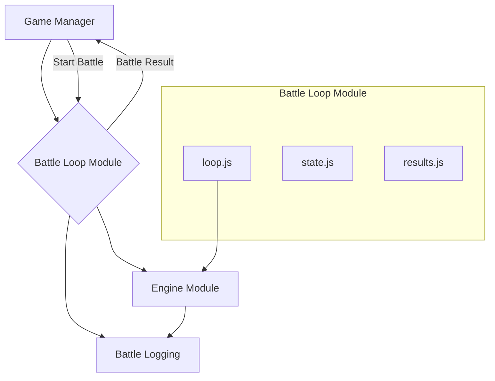

# Battle Loop Module

## Overview

The Battle Loop module is the high-level orchestrator for a single battle simulation. It is responsible for managing the turn-by-turn execution of the battle, checking for win/loss/stalemate conditions, and producing a final, comprehensive battle result.

This module is a wrapper around the core `engine` logic, providing a stateful manager that runs a battle from start to finish. It is primarily used by systems that need to run a full simulation, such as the main game manager or a development-mode batch simulator.

## Architectural Constraints

- This module acts as a high-level manager and is expected to import from the `engine` and `battle_logging` modules.
- It should remain self-contained and not have dependencies on `ui` or `ai` directly. The `engine` it calls is responsible for invoking the `ai` module.

## Module Interaction



- **Game Manager**: An external system initiates a battle by calling this module, providing the initial fighters and configuration.
- **Engine**: The `loop.js` file repeatedly calls the `engine`'s `processTurn()` function to execute each turn of the battle.
- **Battle Logging**: It collects all events generated by the `engine` into a comprehensive log.
- **Result**: Once the battle concludes, `results.js` formats the final state and log into a `BattleResult` object, which is returned to the original caller.

## Files

-   **`loop.js`**: Contains the core `executeMainLoop()` function. This is the heart of the module, featuring a `for` loop that iterates through turns, calls the `engine` to process each one, and checks for terminal conditions.
-   **`state.js`**: Manages the state of the battle loop itself (not the battle state). `initializeLoopState()` creates the initial state object, which tracks metadata like turn count, status (`running`, `completed`, `error`), winner, and the event log.
-   **`config.js`**: Defines the configuration for a battle loop, such as `maxTurns` and the `stalemateThreshold`. It provides a `validateAndMergeConfig` function to ensure all settings are valid.
-   **`results.js`**: Responsible for packaging the final data once the loop has completed. `generateBattleResult()` takes the final battle state and the loop state and combines them into a clean, comprehensive `BattleResult` object.
-   **`metrics.js`**: Handles the collection of performance data about the loop. `initializeMetrics()` and `updateFinalMetrics()` track statistics like total execution time, average turn time, and the number of events logged.
-   **`error_handler.js`**: Provides a centralized function, `handleLoopError()`, to gracefully manage any exceptions that occur during the battle execution, preventing crashes and ensuring the loop state is properly updated with error information.

## Usage

Here is a typical example of how a game manager would run a complete battle simulation.

```javascript
import { executeMainLoop } from './js/battle_loop/loop.js';
import { initializeLoopState } from './js/battle_loop/state.js';
import { validateAndMergeConfig } from './js/battle_loop/config.js';
import { generateBattleResult } from './js/battle_loop/results.js';
import { initializeBattleState } from './js/engine_state_initializer.js';

async function runFullBattle(fighter1, fighter2) {
    // 1. Set up configuration for the battle
    const config = validateAndMergeConfig({
        maxTurns: 100,
        enableDebugLogging: false,
    });

    // 2. Initialize the state for the battle loop itself
    const loopState = initializeLoopState(fighter1, fighter2);
    
    // 3. Initialize the core battle state (from the engine)
    const initialBattleState = initializeBattleState(fighter1, fighter2, 'some_location');

    try {
        // 4. Run the battle loop to completion
        const finalBattleState = await executeMainLoop(initialBattleState, config, loopState);

        // 5. Generate the final, clean result object
        const result = generateBattleResult(finalBattleState, loopState);

        console.log(`Battle finished in ${result.turnCount} turns. Winner: ${result.winnerId}`);
        return result;

    } catch (error) {
        console.error("A critical error occurred during the battle:", error);
        // The loopState will contain partial information for debugging
        return null;
    }
} 