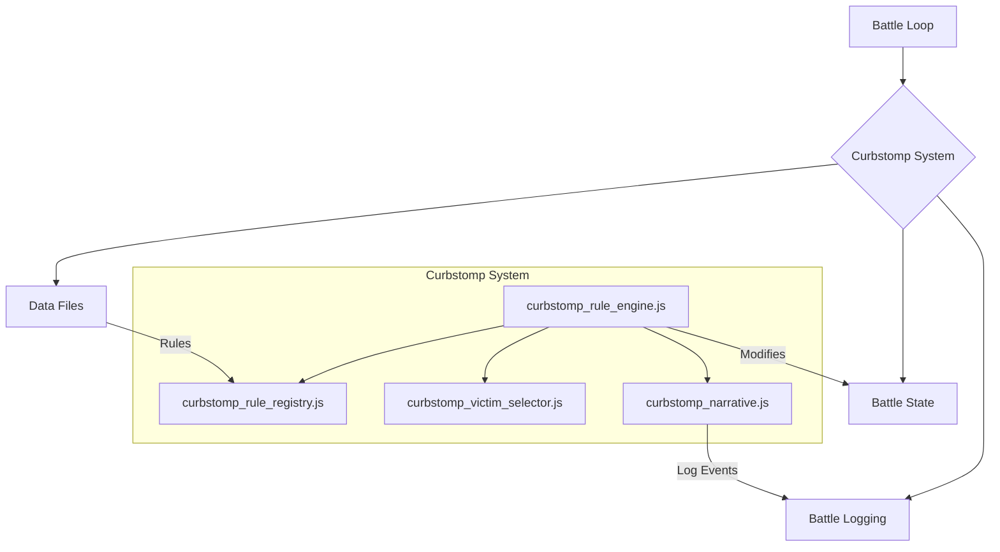

# Curbstomp System Module

## Overview

The Curbstomp System is a specialized narrative and mechanics module designed to handle one-sided battles. It implements a set of rules that can trigger instant-win/loss conditions, apply significant buffs or debuffs, or introduce other dramatic, battle-altering events when a fight is determined to be a mismatch.

This system ensures that predictable or uninteresting battles are resolved quickly and narratively, preventing long, drawn-out fights where the outcome is already clear. It is a key component for managing game pacing and enhancing storytelling.

## Architectural Constraints

- This module sits alongside the `engine` and is typically called by a higher-level manager (`battle_loop` or the main game manager).
- It reads rule data from `/src/js/data_mechanics_*.js` files.
- It writes events to the log using the `battle_logging` module (or a provided callback).
- It should not have dependencies on `ai` or `ui`.

## Module Interaction


- **Battle Loop**: The loop manager calls `applyCurbstompRules()` at the start of a turn or before the battle begins.
- **Data Files**: The `curbstomp_rule_registry.js` loads all curbstomp rules from the static data files.
- **Battle State**: The `curbstomp_rule_engine.js` reads the current `BattleState` to evaluate rule conditions and modifies the state (e.g., by marking a character for defeat) when a rule is applied.
- **Battle Logging**: The `curbstomp_narrative.js` module generates descriptive log events that are passed back to the main battle log.

## Files

-   **`index.js`**: The main entry point for the module. It provides barrel exports for all other files, offering both flat and namespaced access patterns (e.g., `CurbstompRuleEngine.applyCurbstompRules()`).
-   **`curbstomp_rule_engine.js`**: The core logic engine. Its main function, `applyCurbstompRules()`, orchestrates the entire process. It gets applicable rules, evaluates their trigger conditions, applies their outcomes, and coordinates with the narrative and state modules.
-   **`curbstomp_rule_registry.js`**: Responsible for loading and organizing all curbstomp rules. It imports rules from `data_mechanics_characters.js` and `data_mechanics_locations.js` and provides helper functions like `getAllCurbstompRulesForBattle()` to filter them for a specific fight.
-   **`curbstomp_narrative.js`**: A pure narrative generation module. It contains functions that create detailed, human-readable log events for every possible curbstomp outcome (e.g., `generateInstantWinNarrative()`, `generateSurvivalMiracleNarrative()`). It keeps all text and logging separate from the core rule logic.
-   **`curbstomp_state.js`**: Manages the state of which characters have been marked for defeat. It uses a `Set` to track victims and provides simple, pure functions like `markCharacterForDefeat()` and `isCharacterMarkedForDefeat()` to modify and query this state.
-   **`curbstomp_victim_selector.js`**: Handles the complex logic of deciding *who* is affected by a rule. It supports weighted randomness, probability distributions, and miraculous survival checks (`checkMiraculousSurvival()`), ensuring that outcomes have a degree of unpredictability.

## Usage

Here is a typical example of how the system would be used within a battle loop.

```javascript
import { applyCurbstompRules, isCharacterMarkedForDefeat, resetCurbstompState } from './js/curbstomp/index.js';

// Before a battle begins
resetCurbstompState();

async function runBattleTurn(battleState, battleLog) {
    // At the start of a turn, check for curbstomp conditions
    applyCurbstompRules(
        battleState.fighters.fighter1,
        battleState.fighters.fighter2,
        battleState,
        battleLog,
        false // This is not a pre-battle check
    );

    // Check if the rules resulted in a character being defeated
    if (isCharacterMarkedForDefeat(battleState.fighters.fighter1.id)) {
        // End the battle, fighter1 has lost
        endBattle(battleState.fighters.fighter2, battleState.fighters.fighter1);
        return;
    }
    if (isCharacterMarkedForDefeat(battleState.fighters.fighter2.id)) {
        // End the battle, fighter2 has lost
        endBattle(battleState.fighters.fighter1, battleState.fighters.fighter2);
        return;
    }

    // ... proceed with the normal turn logic if no one was defeated.
}
```

## Benefits of Modular Architecture

### 🧪 **Testability**
- Each module can be unit tested in isolation
- Victim selection logic is now easily testable
- Mock dependencies for focused testing

### 🔧 **Maintainability**
- Single Responsibility Principle enforced
- Changes to narrative don't affect rule logic
- Clear ownership boundaries for team development

### 🚀 **Extensibility**
- Easy to add new rule types
- New narrative generators can be added without touching core logic
- Alternative victim selection algorithms can be swapped in

### 🎯 **AI/Cursor Friendly**
- Smaller, focused files
- Clear module boundaries
- Self-documenting structure

### ⚡ **Performance**
- Tree-shaking support
- Selective imports
- Hot-swappable modules for A/B testing

### 🔄 **Backward Compatibility**
- Original API preserved through compatibility layer
- Gradual migration path
- No breaking changes

## Migration Notes

The existing `engine_curbstomp_manager.js` has been converted to a compatibility layer that:
1. Imports from the new modular system
2. Re-exports the original API
3. Provides enhanced functions for advanced usage
4. Maintains 100% backward compatibility

## Testing

Each module can be tested independently:

```javascript
// Test state management
import { markCharacterForDefeat, isCharacterMarkedForDefeat } from './curbstomp_state.js';

// Test rule filtering
import { filterApplicableRules } from './curbstomp_rule_registry.js';

// Test victim selection
import { selectCurbstompVictim } from './curbstomp_victim_selector.js';

// Test narrative generation
import { generateInstantWinNarrative } from './curbstomp_narrative.js';
```

## Future Enhancements

The modular architecture enables:
- **Rule Editor UI** - Visual rule creation/editing
- **Analytics Dashboard** - Rule effectiveness tracking
- **A/B Testing Framework** - Different victim selection algorithms
- **Save/Load System** - Battle state persistence
- **CLI Tools** - Batch rule analysis
- **Plugin System** - Third-party rule extensions

## File Structure
```
js/curbstomp/
├── README.md                    # This documentation
├── index.js                     # Barrel exports
├── curbstomp_state.js          # State management
├── curbstomp_rule_registry.js  # Rule data & filtering
├── curbstomp_rule_engine.js    # Core logic engine
├── curbstomp_victim_selector.js # Victim selection
└── curbstomp_narrative.js      # Narrative generation
```

This architecture transforms the curbstomp system from a maintenance burden into a flexible, extensible foundation for complex battle mechanics. 