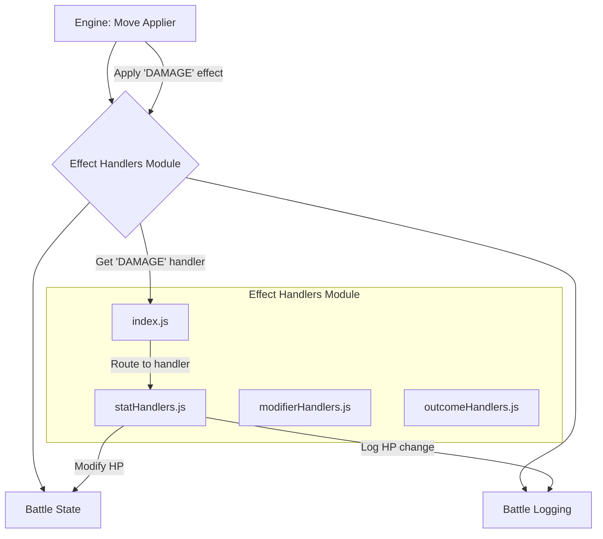

# Effect Handlers Module

## Overview

The Effect Handlers module is a core part of the game engine, responsible for applying the outcome of all character moves and abilities. It is a highly modular system where each specific effect (e.g., `DAMAGE`, `STUN`, `HEAL`) is managed by its own dedicated handler function.

This system is designed for extensibility, allowing new and complex effects to be added to the game with minimal changes to the core engine logic. All handlers are centrally registered in a `Map` in `index.js`, which acts as the main entry point for the module.

## Architectural Constraints

- This is a mid-level `engine` subsystem. It is called by the `move_applier.js` and other engine components.
- It can have dependencies on low-level `utils` and other `engine` components (like `engine_momentum`).
- It must **not** have dependencies on `ai` or `ui`.
- Handlers should be pure functions where possible, receiving a `context` object and returning a result. All side effects (like modifying the battle state or logging events) should be done through the provided context object.

## Module Interaction



- **Engine**: The `engine_move-applier.js` iterates through the effects of a move and calls this module to apply each one.
- **index.js**: Acts as a router, looking up the correct handler function in the `effectHandlers` map based on the effect's `type`.
- **Handler Files**: The actual logic for applying the effect resides in one of the specialized handler files (e.g., `statHandlers.js` for damage/healing).
- **Battle State/Log**: The handler function receives a `context` object which gives it safe access to modify the `battleState` and add new events to the `battleLog`.

## Files

-   **`index.js`**: The central hub of the module. It exports the main `effectHandlers` map, which associates effect type strings (like `DAMAGE`) with their corresponding handler functions. It also provides functions for dynamically registering and unregistering handlers (`registerEffectHandler`).
-   **`context.js`**: Provides a factory function, `createEffectContext()`, that creates a standardized context object. This object is passed to every handler, giving it access to everything it needs (the actor, target, battle state, etc.) and helper methods (`addEvent`, `log`) in a controlled way.
-   **`statHandlers.js`**: Contains handlers for effects that directly modify a character's core stats. This includes `handleDamage` (HP), `handleHeal` (HP), `handleEnergyChange`, `handleStun`, and `handleMomentumChange`.
-   **`modifierHandlers.js`**: Contains a single, generic `handleModifier` function that manages all temporary buffs and debuffs. It adds modifier objects to a character's `activeModifiers` array.
-   **`outcomeHandlers.js`**: Manages effects that lead to decisive, often battle-ending, outcomes. This includes `handleInstantKo` and handlers for more complex conditional knockouts.
-   **`narrativeHandlers.js`**: Manages effects that don't directly impact game mechanics but drive the story or influence AI behavior. This includes `handleTriggerNarrativeEvent` and `handleAdjustAiProfile`.
-   **`compositeHandler.js`**: A special handler, `handleCompositeEffect`, that processes effects composed of multiple sub-effects. It iterates through the sub-effects and calls their respective handlers recursively.
-   **`statChangeConfig.js`**: A configuration-driven approach for simple stat changes. Instead of writing a new handler for every stat, this file defines the behavior (min/max values, log messages) in a configuration object, and the generic `handleStatChange` function uses it.
-   **`test.js`**: An integrated testing framework for the module. It provides functions like `testEffectHandler` and `runAllEffectHandlerTests` to validate that each handler works as expected.

## Usage

The `engine` uses this module to apply the effects listed on a move object.

```javascript
import { effectHandlers, createEffectContext } from './js/effect_handlers/index.js';

function applyMoveEffects(move, actor, target, battleState) {
    const generatedEvents = [];

    for (const effect of move.effects) {
        // Find the correct handler for this effect type
        const handler = effectHandlers.get(effect.type);

        if (handler) {
            // Create a context object for the handler to use
            const context = createEffectContext(
                effect,
                actor,
                target,
                target, // primaryTarget
                battleState,
                {}, // oldValues
                generatedEvents
            );

            // Call the handler with the context
            const result = handler(context);

            if (!result.success) {
                console.warn(`Effect handler for ${effect.type} failed: ${result.message}`);
            }
        }
    }

    // The generatedEvents array now contains all log events created by the handlers.
    return generatedEvents;
}
```

## Adding New Effects

1. **Simple stat effect**: Add configuration to `statChangeConfig.js`
2. **Complex effect**: Create handler in appropriate module
3. **Register**: Add to `index.js` effectHandlers Map
4. **Test**: Use testing framework to validate

## Benefits of Modular Structure

- **Maintainability**: Each file has a single responsibility
- **Extensibility**: Easy to add new effect types
- **Testability**: Isolated handlers are easier to test
- **Performance**: Faster imports, better tree-shaking
- **Team Development**: Multiple developers can work on different effect types
- **Code Discovery**: Clear file structure makes finding code intuitive

## Migration Notes

The old monolithic `engine_effect_handlers.js` has been split into this modular system while maintaining full backward compatibility. All existing effects continue to work unchanged. 