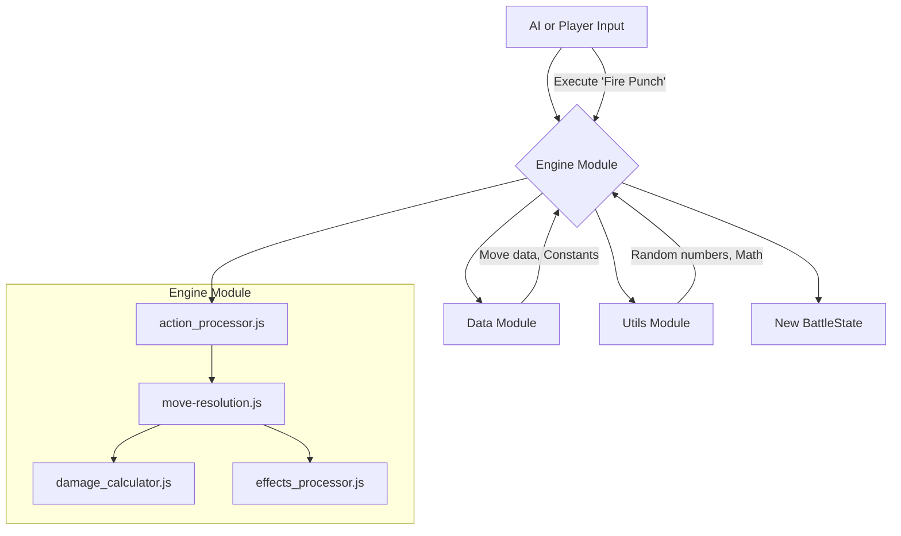

# Engine Module

## Overview

The Engine module is the heart of the Avatar Battle Arena's simulation. It is responsible for executing the core game logic, including processing turns, resolving moves, calculating damage and accuracy, and applying status effects. It is a pure, state-in-state-out system with no direct knowledge of the UI or high-level game loops.

The engine takes the current `BattleState`, a selected action, and returns a new, updated `BattleState`. This immutable approach makes the engine predictable, testable, and easy to integrate with other systems.

## Architectural Constraints

- **CAN** import from `/data` and `/utils`.
- **MUST NOT** import from `/ui`, `/css`, or `/ai`. The `ai` module calls the `engine` to simulate turns, but the `engine` does not call the `ai`.
- The engine operates on the `BattleState` object and should treat it as immutable. All functions that modify the state should return a new state object.

## Module Interaction


- **Input**: The engine is driven by an external action, which can come from the `ai` module or from player input routed by the `ui`.
- **Processing**: The `action_processor.js` is the main entry point, which coordinates the other sub-modules to resolve the action.
- **Data/Utils**: The engine relies on the `/data` module for character and move definitions and the `/utils` module for common functions like random number generation.
- **Output**: The result of any engine operation is a new `BattleState` object, which is then passed to the `StateManager` to update the application.

## Files and Subdirectories

### Root Files
-   **`index.js`**: The main entry point for the module. It provides barrel exports for the most commonly used, high-level engine functions like `resolveMove` and `executePlayerAction`.
-   **`action_processor.js`**: Orchestrates a single fighter's action. It takes a decision (e.g., from the AI), finds the corresponding move, resolves it using `engine_move-resolution.js`, and applies the result.
-   **`damage_calculator.js`**: Contains the `calculateMoveDamage` function, which computes the final damage of a move based on base power, attacker/defender stats, elemental effectiveness, and random variance.
-   **`accuracy_calculator.js`**: Contains `calculateHitSuccess`, which determines if a move hits or misses by combining base accuracy with various modifiers.
-   **`effects_processor.js`**: Manages all status effects and passive state changes. It applies effects that trigger at the start and end of a turn, like poison damage or energy regeneration.
-   **`move_applier.js`**: Applies the direct results of a move (damage, energy cost) to the fighters and generates a standardized `MoveResult` object.
-   **`incapacitation_impact.js`**: A utility module for determining the visual "impact level" of a move for animations, based on its effectiveness and type.

### `/core` Subdirectory
This directory contains the logic for running a full battle loop from start to finish.
-   **`loop.js`**: Contains `runBattleLoop`, which iterates through turns, calls `processTurn`, and checks for win/loss conditions.
-   **`results.js`**: Provides `createBattleResult` to package the final outcome of a battle into a clean, comprehensive object.
-   **`termination.js`**: Contains `checkBattleTermination`, the logic for determining if a fighter has been incapacitated and the battle should end.
-   **`validation.js`**: Provides functions to validate battle parameters before the simulation starts.

### `/phases` Subdirectory
This directory manages the narrative pacing of a battle, transitioning it through different phases (e.g., "Poking", "Early", "Mid", "Late").
-   **`index.js`**: Barrel exports for all phase-related files.
-   **`constants.js`**: Defines the names of the different battle phases.
-   **`pre_banter.js`, `poking.js`, `early.js`, `mid.js`**: Each file contains the specific logic and trigger conditions for transitioning from one phase to the next.
-   **`phase_utils.js`**: Provides utility functions, most notably `getPhaseAIModifiers`, which adjusts AI behavior based on the current battle phase.

## Usage

The most common use case is to resolve a single move.

```javascript
import { resolveMove } from './js/engine/engine_move-resolution.js';
import { safeClone } from './js/utils/cloning.js';

async function performPlayerMove(move, battleState) {
    // Clone the state to ensure immutability
    const clonedState = safeClone(battleState);
    const actor = clonedState.fighters.fighter1;
    const target = clonedState.fighters.fighter2;

    // Resolve the move using the engine
    const moveResult = await resolveMove(
        move,
        actor,
        target,
        clonedState,
        {
            turnNumber: clonedState.turn,
            phase: 'combat',
            environment: clonedState.environment,
        }
    );

    // The moveResult contains the new state of the fighters
    // and a log of events that occurred.
    console.log(`Move hit: ${moveResult.hit}`);
    console.log(`Damage dealt: ${moveResult.damage}`);

    // The new state can now be passed to the state manager
    // to update the application.
    return {
        ...clonedState,
        fighters: {
            fighter1: moveResult.newAttackerState,
            fighter2: moveResult.newDefenderState,
        },
        events: [...clonedState.events, ...moveResult.events],
    };
} 