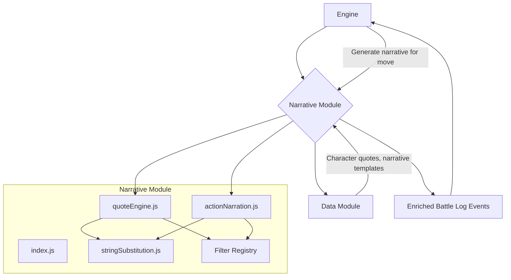

# Narrative Module

## Overview

The Narrative module is responsible for generating all the descriptive text, dialogue, and flavor that brings a battle to life. It translates the raw, mechanical events from the `engine` (like "HP -10") into engaging, story-driven content (like "Aang unleashes a powerful gust of wind, staggering Azula!").

This module is a collection of specialized sub-systems, each handling a different aspect of narration, from character quotes to environmental descriptions. The core of the module is the `stringSubstitution.js` engine, which takes template strings and dynamically populates them with context-aware data.

## Architectural Constraints

- This is a high-level module that is primarily called by the `engine` to enrich the battle log with narrative events.
- It can have dependencies on `/data` (for quote and narrative text) and `/utils`.
- It must **not** have dependencies on `ai` or `ui`.

## Module Interaction


- **Engine**: The `engine` calls this module at various points (e.g., after resolving a move, when a character's state changes) to generate descriptive log events.
- **Data**: The module heavily relies on the `/data` directory, pulling from `data_narrative_*` files that contain templates for quotes, action descriptions, and more.
- **Output**: The module produces structured `log_event` objects, which are added to the `battleLog`. These events contain both plain text and pre-formatted HTML for display in the UI.

## Files

-   **`index.js`**: The main barrel export for the module. It re-exports all functions from the other files, providing flat and namespaced access patterns.
-   **`stringSubstitution.js`**: The core utility of the module. Its `substituteTokens` function replaces placeholders like `{actorName}` or `{opponentName}` in a template string with the correct character names and pronouns.
-   **`quoteEngine.js`**: Finds and formats character dialogue. `findNarrativeQuote` searches through a character's archetype data for contextually appropriate quotes (e.g., a specific line to say to a specific opponent during the "Climax" phase).
-   **`actionNarration.js`**: Generates the main description of a move being used, like "Aang attacks Azula with a blast of air."
-   **`statusChange.js`**: Generates narrative for changes in a character's stats, such as "Azula's energy is draining!" or "Aang recovers some health."
-   **`environmentNarrative.js`**: Describes how the battle is affecting the location, generating text for collateral damage like "A stray fire blast scorches the nearby temple wall."
-   **`escalationNarrative.js`**: Creates narrative when a character's overall state changes, for example, from "Healthy" to "Injured."
-   **`victoryNarrative.js` & `curbstompNarrative.js`**: These handle the end-of-battle descriptions, providing different text for a close victory versus a one-sided "curbstomp."
-   **Narrative Filters (`narrative_filter_*.js`)**: A collection of files implementing a Chain of Responsibility pattern. When a move has multiple possible descriptions, these filters (`strictContextFilter`, `personalityFilter`, etc.) are used in sequence to select the most appropriate one based on the current battle context. `narrative_filter_registry.js` assembles the chain.

## Usage

The `engine` uses this module to create a narrative event.

```javascript
import { generateActionDescriptionObject } from './js/narrative/actionNarration.js';
import { findNarrativeQuote, formatQuoteEvent } from './js/narrative/quoteEngine.js';

function narrateMoveAction(move, actor, defender, moveResult, battleState) {
    const narrativeEvents = [];

    // 1. Find a pre-action quote
    const quote = findNarrativeQuote(actor, defender, 'before_attack', battleState.currentPhase);
    if (quote) {
        narrativeEvents.push(formatQuoteEvent(quote, actor, defender, { battleState }));
    }

    // 2. Generate the description of the action itself
    const actionDescription = generateActionDescriptionObject(
        move,
        actor,
        defender,
        moveResult,
        battleState
    );
    narrativeEvents.push(actionDescription);

    // These events are now ready to be added to the battle log.
    return narrativeEvents;
}
```

## Key Benefits

### 1. **Single Responsibility Principle**
- Each file handles one narrative concern
- Easy to locate specific functionality
- Reduced cognitive load when editing

### 2. **Team Development Friendly**
- Multiple developers can work on different narrative types
- Merge conflicts minimized
- Clear ownership boundaries

### 3. **Performance Optimized**
- Faster imports (only load what you need)
- Better tree-shaking in bundlers
- Reduced memory footprint

### 4. **AI-Editing Friendly**
- Smaller, focused files are easier for AI to understand
- Clear context boundaries
- Predictable file structure

### 5. **Testing & Maintenance**
- Each module can be tested independently
- Easier to mock dependencies
- Clear error isolation

### 6. **Discovery & Documentation**
- File names clearly indicate functionality
- Easier to navigate codebase
- Self-documenting architecture

## Function Migration Guide

| Old Location | New Location | Notes |
|-------------|-------------|--------|
| `substituteTokens()` | `stringSubstitution.js` | No changes |
| `findNarrativeQuote()` | `quoteEngine.js` | No changes |
| `formatQuoteEvent()` | `quoteEngine.js` | No changes |
| `generateActionDescriptionObject()` | `actionNarration.js` | No changes |
| `generateTurnNarrationObjects()` | `actionNarration.js` | No changes |
| `getEnvironmentImpactLine()` | `environmentNarrative.js` | **Now exported** (was private) |
| `generateCollateralDamageEvent()` | `environmentNarrative.js` | No changes |
| `generateEnvironmentalSummaryEvent()` | `environmentNarrative.js` | No changes |
| `generateEscalationNarrative()` | `escalationNarrative.js` | No changes |
| `generateCurbstompNarration()` | `curbstompNarrative.js` | No changes |
| `getFinalVictoryLine()` | `victoryNarrative.js` | No changes |
| `generateStatusChangeEvent()` | `statusChange.js` | No changes |

## Adding New Narrative Types

### Step 1: Create New Module
```javascript
// js/narrative/newNarrativeType.js
export function generateNewNarrative(/* params */) {
    // Implementation
}
```

### Step 2: Update Barrel Export
```javascript
// js/narrative/index.js
export * from './newNarrativeType.js';

import * as NewNarrativeType from './newNarrativeType.js';
export { NewNarrativeType };
```

### Step 3: Update Documentation
Add entry to this README and function migration guide.

## Performance Considerations

- **Prefer specific imports** over barrel imports when only using 1-2 functions
- **Use namespaced imports** when using multiple functions from the same module
- **Avoid importing unused modules** - the old monolithic approach loaded everything

## Migration Timeline

- **Phase 1** ✅ - Modular system created, backward compatibility maintained
- **Phase 2** 🔄 - Update existing imports to use new modules
- **Phase 3** 📋 - Remove deprecated compatibility layer
- **Phase 4** 📋 - Performance optimizations and tree-shaking

## Examples

### Generating a Complete Turn Narrative
```javascript
import { 
    generateTurnNarrationObjects 
} from './narrative/actionNarration.js';
import { 
    findNarrativeQuote, 
    formatQuoteEvent 
} from './narrative/quoteEngine.js';

// Get pre-action quote
const quote = findNarrativeQuote(actor, opponent, 'beforeAttack', phase, context);
const events = quote ? [{ quote, actor }] : [];

// Generate complete turn narrative
const narrativeEvents = generateTurnNarrationObjects(
    events, move, actor, opponent, result, 
    environmentState, locationConditions, currentPhaseKey
);
```

### Environmental Impact Chain
```javascript
import { 
    generateCollateralDamageEvent,
    generateEnvironmentalSummaryEvent,
    getEnvironmentImpactLine 
} from './narrative/environmentNarrative.js';

// Generate individual impact
const collateralEvent = generateCollateralDamageEvent(move, actor, result, envState, battleState);

// Get specific impact line
const impactLine = getEnvironmentImpactLine(locationId, envState, isCrit);

// Generate phase summary
const summaryEvent = generateEnvironmentalSummaryEvent(battleState, envState);
```

This modular architecture transforms the narrative system from a monolithic "kitchen sink" into a maintainable, scalable, and developer-friendly codebase. 