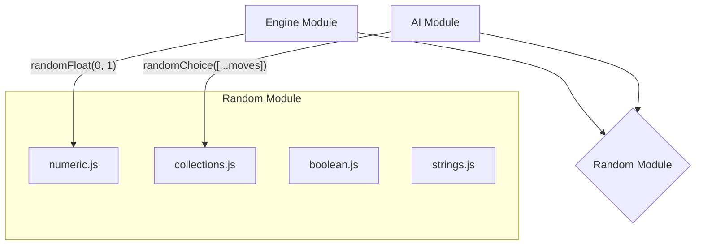

# Random Module

## Overview

The Random module is a low-level utility library that provides a comprehensive suite of functions for generating random data. It is a pure, stateless module designed to be a centralized source for all randomness in the application, supporting everything from dice rolls to unique ID generation.

This module is a foundational component of the `/utils` layer and is expected to have no dependencies on any other part of the codebase.

## Architectural Constraints

- This module should be completely self-contained and have **no external dependencies**.
- All functions should be pure and stateless, except for the `seeded.js` module which maintains a seed (and is marked as deprecated).
- It is a sub-module of `/utils` and follows all `utils` layer rules.

## Module Interaction

This module is a utility library and does not interact with other systems in a complex way. It is simply a collection of functions that are imported and used by other modules.



## Files

-   **`numeric.js`**: Contains functions for generating random numbers.
    -   `randomInt(min, max)`: Generates a random integer within a specified range (inclusive).
    -   `randomFloat(min, max)`: Generates a random floating-point number.
    -   `randomNormal(mean, stdDev)`: Generates a normally distributed random number (useful for more natural-feeling randomness).
-   **`collections.js`**: Contains functions for randomly interacting with arrays.
    -   `randomChoice(array)`: Selects a single random element from an array.
    -   `randomShuffle(array)`: Shuffles the elements of an array in place.
    -   `randomSample(array, count)`: Selects a specified number of unique random elements from an array.
    -   `weightedRandomChoice(choices, weights)`: Selects an element from an array based on a corresponding array of weights, making some choices more likely than others.
-   **`boolean.js`**: Contains the `randomChance(probability)` function, which returns `true` or `false` based on a given probability (a number between 0 and 1). This is fundamental for dice rolls and success checks.
-   **`strings.js`**: Provides functions for generating random strings and IDs.
    -   `randomString(length, charset)`: Generates a random string of a given length from a specified set of characters.
    -   `randomUUID()`: Generates a standard v4 UUID, useful for creating unique identifiers for game objects.
-   **`seeded.js`**: A deprecated placeholder for seeded random number generation. It is not truly deterministic and should be replaced by a dedicated library if consistent, repeatable randomness is required.

## Usage

Different modules use the random utilities for various purposes.

### Engine: Accuracy Check

```javascript
import { randomChance } from './js/random/boolean.js';

function isMoveSuccessful(moveAccuracy) {
    // moveAccuracy is a value like 0.85 (for 85%)
    return randomChance(moveAccuracy);
}
```

### AI: Move Selection

```javascript
import { randomChoice } from './js/random/collections.js';

function selectRandomMove(availableMoves) {
    if (availableMoves.length === 0) return null;
    return randomChoice(availableMoves);
}
```

### Data: ID Generation

```javascript
import { randomUUID } from './js/random/strings.js';

function createNewCharacter(template) {
    return {
        ...template,
        instanceId: randomUUID(), // e.g., "a4b1c2d3-e4f5-4a6b-8c7d-9e8f7a6b5c4d"
    };
}
``` 