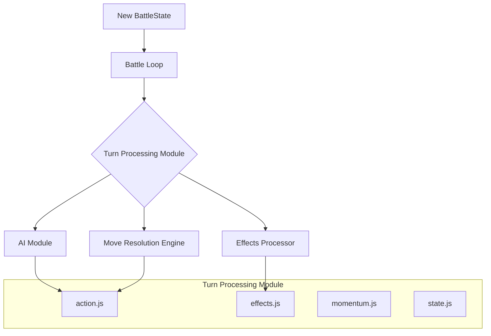

# Turn Processing Module

## Overview

The Turn Processing module is a high-level `engine` component responsible for orchestrating all the events that happen within a single turn of a battle. It follows a strict sequence of operations:

1.  Apply any "pre-turn" effects (like poison damage or stun recovery).
2.  Determine the active fighter's action (e.g., by calling the AI).
3.  Execute the chosen action and resolve its outcome.
4.  Apply any "post-turn" effects (like regeneration).
5.  Update game-wide states like momentum and escalation.

This module acts as a "mini-engine" for a single turn, ensuring that all state changes are applied in the correct order.

## Architectural Constraints

- This module is part of the `engine` layer.
- It **can** import from `ai`, `data`, and `utils`.
- It **must not** import from `ui` or `css`.
- It operates on the `BattleState` object and is responsible for returning a new, updated `BattleState`.

## Module Interaction


- **Battle Loop**: The main `battle_loop` calls this module once per turn.
- **AI Module**: The `action.js` file calls the `ai` module to get a decision for the active fighter.
- **Engine Sub-modules**: It calls other `engine` components like `move-resolution` and `effects_processor` to carry out the specific parts of the turn.
- **Output**: The module returns a new `BattleState` object to the `battle_loop`, which then checks for win conditions or starts the next turn.

## Files

-   **`action.js`**: Determines and executes the main action for the turn. `determineAndExecuteAction` calls the AI for a decision, finds the chosen move, and then uses the `engine_move-resolution` module to apply it.
-   **`effects.js`**: Handles the application of status effects. `applyPreTurnEffects` and `applyPostTurnEffects` are called at the beginning and end of the turn, respectively, to process effects like poison, regeneration, or stun.
-   **`momentum.js`**: Manages the ebb and flow of the battle's momentum. `updateMomentumAndEscalation` adjusts the fighters' momentum scores based on the outcome of the turn's action.
-   **`state.js`**: Contains utility functions for managing the state within a single turn. `createWorkingBattleState` creates a safe, mutable copy of the battle state for the turn to operate on, and `validateTurnEndState` uses state invariants to ensure the turn didn't leave the battle in a corrupted state.

## Usage

This module is primarily used by the `battle_loop_manager.js` or a similar high-level coordinator.

```javascript
import { processTurn } from './js/engine_turn-processor.js'; // Assuming turn_processor is the main entry

async function runBattle(initialBattleState) {
    let currentState = initialBattleState;
    let turnNumber = 1;

    while (!isBattleOver(currentState)) {
        const turnResult = await processTurn(currentState, { turnNumber });

        // The turnResult is the new, updated battle state
        currentState = turnResult.newState;

        // The turnResult might also contain a log of events that occurred
        // during the turn, which can be appended to the main battle log.
        mainBattleLog.push(...turnResult.events);

        turnNumber++;
    }

    return generateFinalResult(currentState);
} 