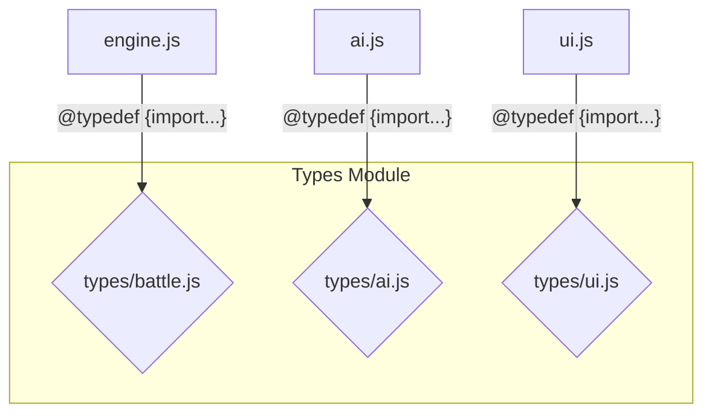

# Types Module

## Overview

The Types module is the central repository for all JSDoc `@typedef` definitions used across the Avatar Battle Arena application. It establishes a canonical, single source of truth for the data structures that are passed between different modules.

By centralizing type definitions, we ensure consistency and make it easier for developers (and the AI) to understand the shape of the data they are working with. This module contains no executable code; it is purely for documentation and to enable static analysis and type checking via `jsconfig.json`.

## Architectural Constraints

- This module must contain **only** JSDoc `@typedef` definitions.
- It must **not** contain any executable code or `export` any functions or variables (except for an empty `export {}` to satisfy ES module requirements).
- Files within this module should be organized by domain (e.g., `battle.js`, `ai.js`, `ui.js`).
- Types can import other types from within this module to build more complex, composite types.

## Module Interaction

This module does not interact with other modules at runtime. Instead, other modules import its definitions for annotation purposes at development time.



Any `.js` file in the project can import a type definition from this module to annotate its functions and variables.

## Files

-   **`ai.js`**: Contains all type definitions related to the Artificial Intelligence engine, such as `AiDecision`, `AiMemory`, and `StrategicIntent`.
-   **`analysis.js`**: Defines the data structures for post-battle analysis, including `BattleResult`, `BattleStatistics`, and `PerformanceMetrics`.
-   **`battle.js`**: Defines the core data structures for the battle itself. This is one of the most critical files, containing definitions for `Fighter`, `BattleState`, `Move`, and `Effect`.
-   **`character.js`**: Contains types related to character creation and definition, such as `CharacterTemplate` and `CharacterStats`.
-   **`composite.js`**: Defines complex, high-level types that are composed of other types from across the module. The most important is `GameState`, the root object for the entire application's state. It also defines common function signatures.
-   **`engine.js`**: Contains types specific to the inner workings of the battle engine's mechanics, such as `PhaseState`, `DamageCalculation`, and `AccuracyCalculation`.
-   **`ui.js`**: Defines all data structures related to the user interface, including `UIState`, `SelectionState`, and `AnimationState`.
-   **`utility.js`**: Contains a wide variety of helper types used for validation (`ValidationResult`), logging (`LogEntry`), configuration (`ConfigOptions`), and more.

## Usage

To use a type in another file, you add a JSDoc import statement at the top of the file, and then use the type in your annotations.

**Example from `src/js/engine/damage_calculator.js`:**

```javascript
/**
 * @fileoverview Calculates damage for moves.
 */

// --- TYPE IMPORTS ---
/**
 * @typedef {import('../types/battle.js').Fighter} Fighter
 * @typedef {import('../types/battle.js').Move} Move
 * @typedef {import('../types/engine.js').DamageCalculation} DamageCalculation
 */

// --- FUNCTION DEFINITION ---

/**
 * Calculates the final damage of a move.
 *
 * @param {Move} move The move being used.
 * @param {Fighter} attacker The fighter performing the move.
 * @param {Fighter} defender The fighter receiving the move.
 * @returns {DamageCalculation} A detailed breakdown of the damage calculation.
 */
export function calculateMoveDamage(move, attacker, defender) {
    // ... function implementation
}
``` 